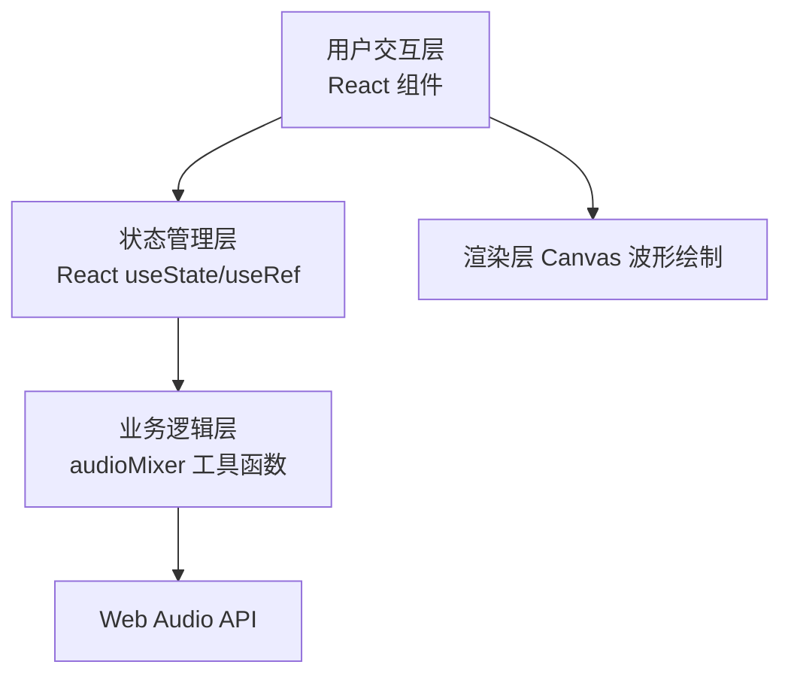

## 1. 架构设计



## 2. 技术栈
- 前端框架：React 18 + TypeScript
- 构建工具：Vite
- 音频处理：Web Audio API（AudioContext、AudioBuffer、GainNode、StereoPannerNode
- 波形绘制：Canvas 2D

## 3. 项目文件结构与数据流向

```
package.json
vite.config.js
tsconfig.json
index.html
src/
├── main.tsx              # React 渲染入口
├── App.tsx                 # 主应用，管理轨道列表与混音状态，文件加载，触发导出
│   │
│   ├── components/
│   │   └── MixerPanel.tsx  # 混音面板，接收轨道 props，回调到 App
│   │
│   └── utils/
│   │   └── audioMixer.ts    # 核心混音工具，Web Audio API 合成
│   │
│   └── styles/
│       └── index.css
```

**数据流向**：
- 向上（用户操作 → MixerPanel → App → audioMixer）
- 向下（状态更新 → App → MixerPanel 渲染）

## 4. 核心数据模型

### 4.1 Track 类型定义
```typescript
interface Track {
  id: string;
  name: string;
  fileName: string;
  buffer: AudioBuffer;
  volume: number;       // 0 - 1
  pan: number;          // -1 ~ 1
  muted: boolean;
  solo: boolean;
  color: string;
}
```

### 4.2 文件调用关系
- `main.tsx → 渲染 `<App />`
- `App.tsx → 引入 MixerPanel 组件，调用 audioMixer 工具函数
- `MixerPanel.tsx` → 从 App 接收 tracks + onVolumeChange/onPanChange 等回调
- `audioMixer.ts` → 纯工具函数，接收 AudioBuffer[] + 参数 → 输出 Blob
