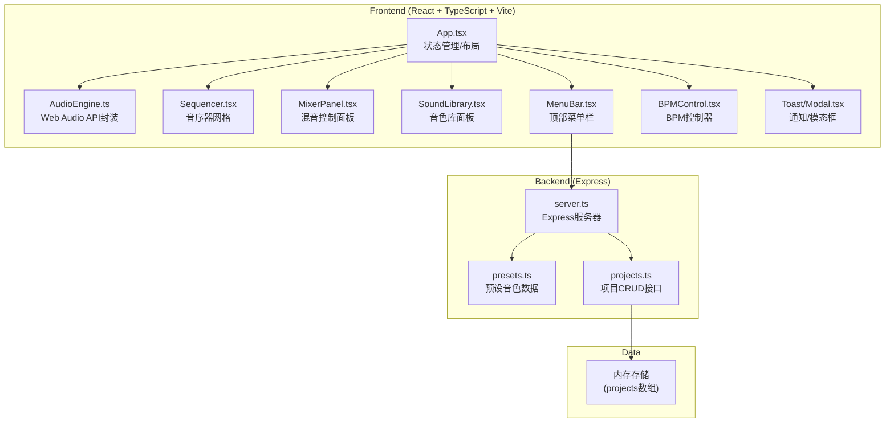
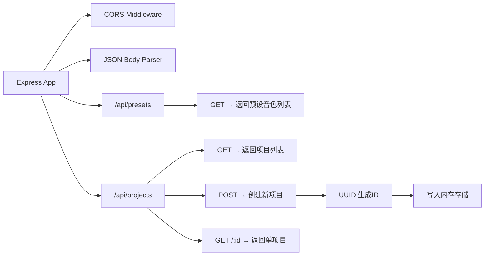
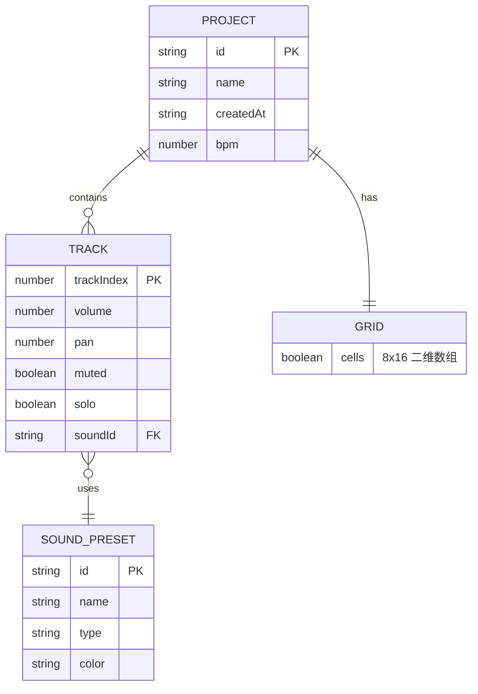

## 1. 架构设计



## 2. 技术说明

- **前端框架**: React 18 + TypeScript（无外部状态管理，使用 useState/useReducer/useRef）
- **构建工具**: Vite 5
- **音频引擎**: Web Audio API（原生，零依赖）
- **后端**: Express 4 + CORS + UUID
- **数据存储**: 后端内存存储（开发阶段，项目数据保存在内存中）
- **样式方案**: 原生 CSS + CSS Modules（不使用 Tailwind，用户要求精确像素尺寸和颜色）

## 3. 路由定义

| 路由 | 类型 | 用途 |
|------|------|------|
| / | 前端页面 | Vite SPA 入口，渲染主工作站 |
| GET /api/presets | API | 获取预设音色列表 |
| GET /api/projects | API | 获取所有保存的项目列表 |
| POST /api/projects | API | 保存新项目 |
| GET /api/projects/:id | API | 获取单个项目详情 |

## 4. API 定义

### 类型定义

```typescript
// 音色类型
interface SoundPreset {
  id: string;
  name: string;
  type: 'sine' | 'sawtooth' | 'square' | 'triangle' | 'noise' | 'bass' | 'hihat' | 'snare';
  color: string;
  oscillatorConfig?: OscillatorOptions;
  envelopeConfig?: EnvelopeOptions;
}

// 音轨混音参数
interface TrackParams {
  volume: number;       // 0-100
  pan: number;          // -100 到 100 (左到右)
  muted: boolean;
  solo: boolean;
  soundId: string | null;
}

// 音序器网格 (8轨 x 16步)
type SequencerGrid = boolean[][];

// 项目数据
interface Project {
  id: string;
  name: string;
  createdAt: string;
  bpm: number;
  tracks: TrackParams[];
  grid: SequencerGrid;
}

// 创建项目请求
interface CreateProjectRequest {
  name: string;
  bpm: number;
  tracks: TrackParams[];
  grid: SequencerGrid;
}
```

### 响应格式

```typescript
// GET /api/presets
interface PresetsResponse {
  presets: SoundPreset[];
}

// GET /api/projects
interface ProjectsListResponse {
  projects: Array<Pick<Project, 'id' | 'name' | 'createdAt'>>;
}

// POST /api/projects (201 Created)
interface CreateProjectResponse {
  id: string;
  message: string;
}

// GET /api/projects/:id
interface ProjectResponse {
  project: Project;
}

// 错误响应
interface ErrorResponse {
  error: string;
}
```

## 5. 服务器架构



## 6. 数据模型

### 6.1 数据关系



### 6.2 初始数据

预设音色初始化数据：

```typescript
const DEFAULT_PRESETS: SoundPreset[] = [
  { id: 'sine', name: '正弦波', type: 'sine', color: '#00E5FF' },
  { id: 'sawtooth', name: '锯齿波', type: 'sawtooth', color: '#FF6B6B' },
  { id: 'square', name: '方波', type: 'square', color: '#FFD93D' },
  { id: 'triangle', name: '三角波', type: 'triangle', color: '#6BCB77' },
  { id: 'noise', name: '噪音', type: 'noise', color: '#9D4EDD' },
  { id: 'bass', name: '低音拨弦', type: 'bass', color: '#FF8C42' },
  { id: 'hihat', name: '踩镲', type: 'hihat', color: '#E0AAFF' },
  { id: 'snare', name: '军鼓', type: 'snare', color: '#06D6A0' },
];
```

## 7. 前端核心模块说明

### AudioEngine.ts
- 封装 Web Audio API: AudioContext, OscillatorNode, GainNode, StereoPannerNode
- 调度逻辑: 使用 `AudioContext.currentTime` 做精确时序调度，实现 <50ms 延迟
- 节奏同步: Lookahead 调度模式，提前 100ms 调度音频事件
- 混音总线: 每轨独立 GainNode + StereoPannerNode，连接到主输出 GainNode
- 音色生成: 根据预设类型生成不同 oscillator/noise 配置 + ADSR 包络

### 状态管理（App.tsx 内部）
由于要求无外部状态管理，使用 React 内置 hooks:
- `useState`: UI 状态（当前音轨、模态框、Toast）
- `useReducer`: 复杂状态（网格、音轨参数）
- `useRef`: AudioEngine 实例、播放状态、动画帧 ID

## 8. 性能保障

- 音频调度: Web Audio API 原生高精度时钟，误差 <10ms
- UI 更新: requestAnimationFrame 同步当前步指示
- 状态更新: 网格变更批量更新，避免不必要的 re-render
- 后端存储: 内存读写，无 IO 延迟
