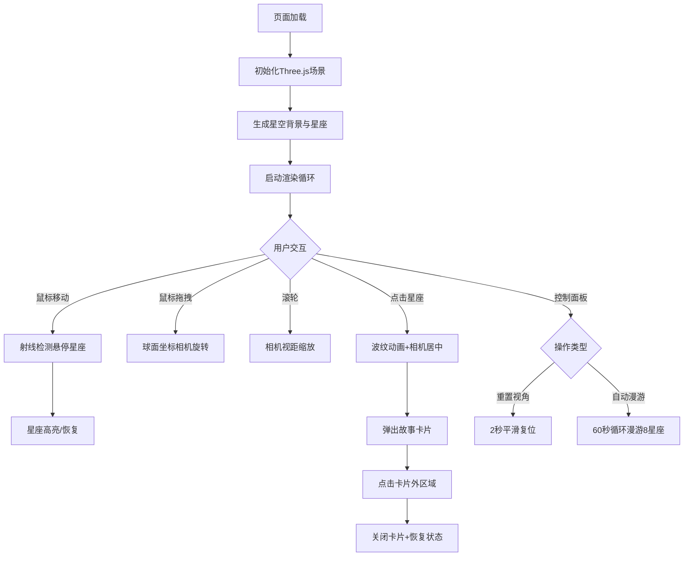

## 1. 产品概述

沉浸式古代星座神话3D星图可视化应用，为博物馆展览观众提供交互式星空探索体验。通过Three.js构建全景3D星空，用户可旋转探索8个著名星座，点击触发神话故事动画与文字叙述。

- 目标用户：博物馆观众、天文爱好者、学生群体
- 产品价值：以沉浸式交互方式传播星座文化与神话知识，增强科普教育趣味性

## 2. 核心功能

### 2.1 功能模块

1. **3D星空场景**：随机分布2000颗背景星、银河带粒子效果、流星随机划过动画
2. **8大星座展示**：猎户座、仙后座、大熊座、天鹅座、天鹰座、天蝎座、小熊座、仙女座，含主星与连线
3. **相机控制**：鼠标拖拽旋转（球面坐标）、滚轮缩放、平滑阻尼运动
4. **悬停交互**：星座高亮、主星放大发光、连线高亮
5. **点击交互**：波纹闪烁动画、相机平滑居中、神话故事卡片弹出
6. **控制面板**：重置视角按钮、自动漫游开关
7. **故事面板**：星座名称、神话描述、Canvas简笔星图插画

### 2.2 页面详情

| 页面名称 | 模块名称 | 功能描述 |
|-----------|-------------|---------------------|
| 主场景页 | 3D星空渲染 | 渲染2000颗背景星、8个星座、银河带、流星 |
| 主场景页 | 相机交互 | 鼠标拖拽旋转、滚轮缩放、平滑阻尼、自动居中 |
| 主场景页 | 悬停反馈 | 星座连线高亮、主星放大光晕、鼠标指针变化 |
| 主场景页 | 点击交互 | 波纹闪烁动画、相机居中、故事卡片弹出 |
| 主场景页 | 控制面板 | 重置视角按钮（2秒平滑复位）、自动漫游开关（60秒循环） |
| 主场景页 | 故事卡片 | 毛玻璃圆角卡片、星座名称、4行神话描述、Canvas简笔星图 |

## 3. 核心流程

## 4. 用户界面设计

### 4.1 设计风格

- **主色调**：纯黑 #000000 背景，深蓝 #0a0a2e 到深紫 #1a0a2e 径向渐变
- **辅助色**：半透明深色 #1a1a2e（控制面板）、白色 #FFFFFF、亮蓝 #4A90D9、亮红 #FF4444
- **卡片样式**：毛玻璃效果（backdrop-filter: blur）、圆角16px、8px模糊阴影
- **按钮样式**：圆角12px、半透明深色背景、hover高亮反馈
- **字体**：sans-serif，星座名称20px粗体白色，神话描述14px浅灰色
- **动效**：所有动画使用ease-in-out或ease-out曲线，无突变

### 4.2 页面设计概述

| 页面名称 | 模块名称 | UI元素 |
|-----------|-------------|-------------|
| 主场景页 | 3D星空 | 黑色深空背景、径向渐变、2000颗白点、彩色主星、半透明蓝色连线、淡紫色银河带 |
| 主场景页 | 控制面板（右上角） | #1a1a2e半透明背景、圆角12px、12px内边距、重置按钮、自动漫游开关 |
| 主场景页 | 故事卡片（左下角） | 320px宽、圆角16px、毛玻璃效果、8px阴影、Canvas星图插画、20px标题、14px描述 |
| 主场景页 | 交互反馈 | 悬停连线变白色加粗、主星放大1.5倍发光、点击波纹扩散闪烁 |

### 4.3 响应式设计

- 桌面端优先设计（1920x1080）
- Canvas自适应窗口大小
- 控制面板固定右上角，故事卡片固定左下角
- 支持触摸设备拖拽与点击

### 4.4 3D场景指导

- **环境氛围**：深空黑色背景，星星周围微弱的深蓝到深紫径向渐变
- **光照设置**：无外部光源，星星自发光材质
- **相机设置**：PerspectiveCamera，初始距离15单位，俯角30度，球面坐标控制（水平±180°，垂直±60°）
- **运动控制**：OrbitControls自定义实现，阻尼系数0.85，ease-out平滑
- **交互特效**：悬停发光材质、点击波纹动画、粒子系统跟随
- **后处理**：无需后处理，使用原生Three.js材质实现发光效果
- **性能预算**：帧率≥45fps（1080p），总粒子数约3500（2000背景星+1000银河+~100主星）
