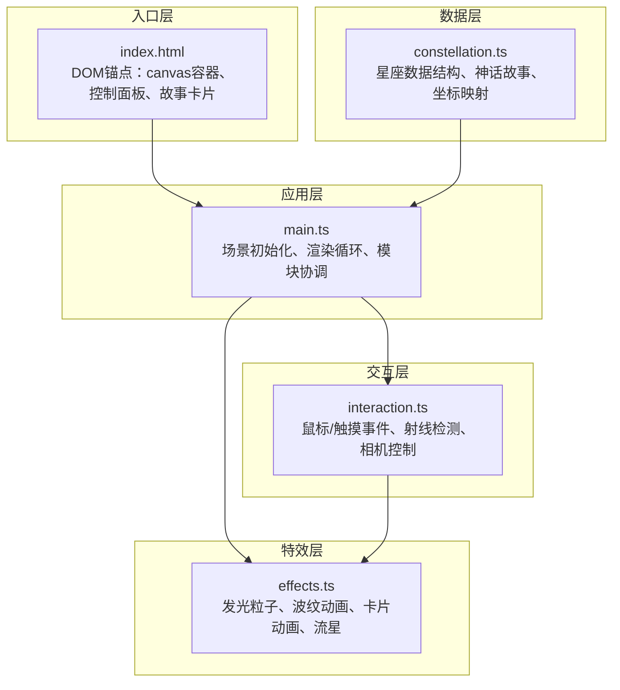

## 1. 架构设计



**模块调用关系与数据流向：**
1. `index.html` 提供3个DOM锚点：Three.js canvas容器、右上角控制面板、左下角故事卡片
2. `main.ts` 作为入口协调者，导入 `constellation.ts` 数据创建3D对象，初始化场景/相机/渲染器
3. `main.ts` 将场景引用传递给 `interaction.ts`，由其处理输入事件并回调 `main.ts` 更新相机
4. `interaction.ts` 检测到悬停/点击时调用 `effects.ts` 触发视觉反馈与卡片动画
5. `effects.ts` 直接操作DOM故事卡片，同时向3D场景添加粒子特效

## 2. 技术描述

- **前端框架**：原生HTML/CSS + TypeScript
- **构建工具**：Vite 5.x
- **3D引擎**：Three.js 0.160.x + @types/three
- **类型系统**：TypeScript 5.x，严格模式
- **无后端、无数据库、无路由**，纯前端单页应用

## 3. 项目文件结构

| 文件路径 | 职责 |
|----------|------|
| `package.json` | 项目依赖与脚本（three、@types/three、typescript、vite） |
| `vite.config.js` | Vite构建配置，入口index.html，开发端口8080 |
| `tsconfig.json` | TS严格模式，esnext模块，dom类型 |
| `index.html` | 入口页面，全屏canvas容器、控制面板锚点、故事卡片锚点 |
| `src/main.ts` | Three.js场景/相机/渲染器初始化、星空背景生成、动画循环 |
| `src/constellation.ts` | 8个星座数据（坐标、连线、神话、颜色）、数据类型定义 |
| `src/interaction.ts` | 鼠标/触摸事件、Raycaster射线检测、球面相机控制、平滑动画 |
| `src/effects.ts` | 星座发光粒子、波纹闪烁、故事卡片滑入/滑出、流星生成 |

## 4. 核心数据模型

### 4.1 星座数据结构

```typescript
interface Star {
  x: number;
  y: number;
  z: number;
  size?: number;
}

interface Constellation {
  id: string;
  name: string;
  color: string;
  stars: Star[];
  lines: [number, number][];
  myth: string;
  animationParams: {
    glowIntensity: number;
    rippleSpeed: number;
  };
}
```

### 4.2 相机状态

```typescript
interface CameraState {
  theta: number;
  phi: number;
  radius: number;
  targetTheta: number;
  targetPhi: number;
  targetRadius: number;
}
```

## 5. 关键技术实现点

### 5.1 3D星空渲染
- **背景星**：`BufferGeometry` + `PointsMaterial`，2000个随机分布点，大小0.3-0.8
- **银河带**：沿天球赤道分布的环形粒子云，使用高斯分布控制密度梯度
- **星座主星**：`SphereGeometry` + 自发光 `MeshBasicMaterial`，每个星座独立颜色
- **星座连线**：`BufferGeometry` + `LineBasicMaterial`，半透明蓝色，线宽1.5px

### 5.2 相机控制系统
- 自定义球面坐标系统（theta水平角、phi垂直角、radius距离）
- 鼠标拖拽更新target值，每帧按阻尼系数0.85插值到当前值
- 角度限制：theta ±180°，phi ±60°，radius 5-30单位
- 相机始终看向原点(0,0,0)

### 5.3 射线检测交互
- `THREE.Raycaster` 每帧检测鼠标位置
- 将星座的主星Mesh和连线Line统一放入一个Group并标记userData.constellationId
- 悬停时切换材质属性（颜色、不透明度、线宽、scale）

### 5.4 动画系统
- **波纹闪烁**：点击后两条波纹沿连线扩散，使用ShaderMaterial或顶点动画，闪烁两次各0.3s
- **相机居中**：计算目标星座中心点球面坐标，1.2s ease-in-out插值
- **卡片动画**：CSS transform translateY + opacity transition，0.5s ease-in-out
- **星空自转**：整个starGroup每帧绕Y轴旋转0.01弧度/秒
- **流星**：随机时间生成抛物线运动Line，0.8s后销毁

### 5.5 性能优化
- 使用BufferGeometry而非Geometry
- 背景星使用单个Points批量渲染
- 射线检测限制为星座Group层级，不检测每个子mesh
- 故事卡片Canvas绘制一次后缓存
