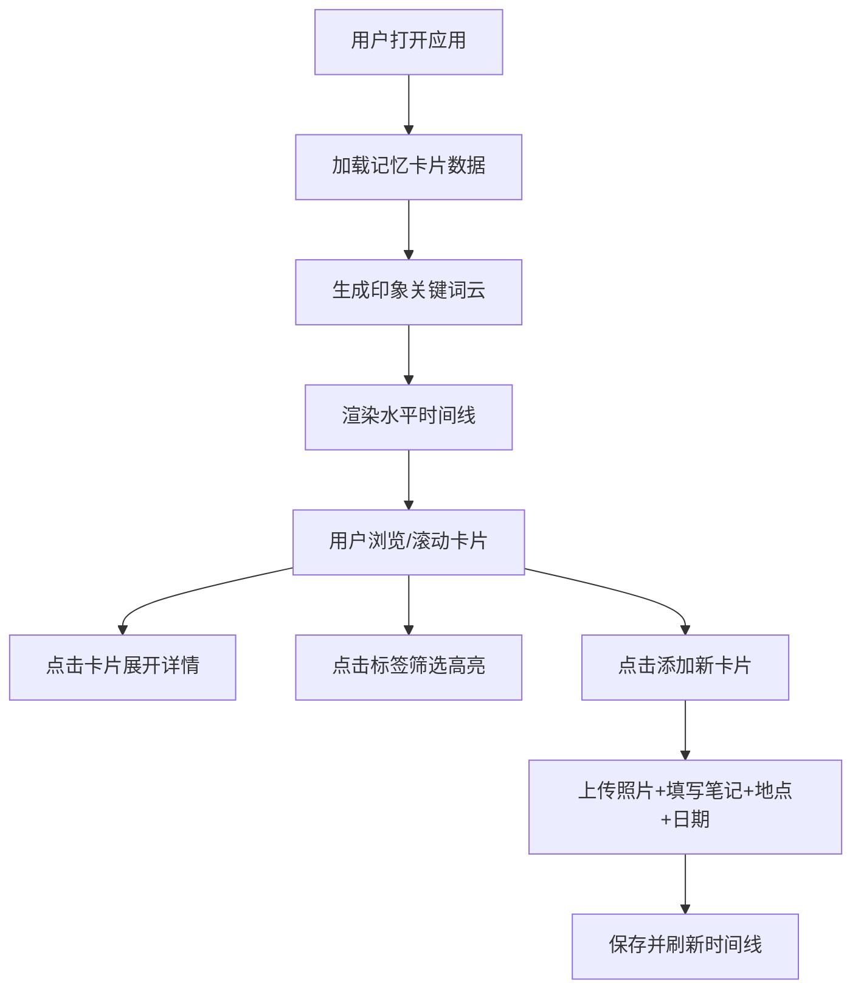

## 1. 产品概述

旅行记忆时光轴——帮助旅行者整理和可视化旅途照片与笔记的全栈Web应用，解决旅行后照片散乱、回忆碎片化以及难以按时间线重温旅途体验的问题。

- 核心用户：旅行爱好者、摄影爱好者、回忆记录者
- 产品价值：通过时间线可视化+关键词标签云，让旅行回忆变得有序、可交互、可重温

## 2. 核心功能

### 2.1 用户角色
| 角色 | 注册方式 | 核心权限 |
|------|----------|----------|
| 普通用户 | 无需注册，本地存储 | 创建、查看、删除记忆卡片 |

### 2.2 功能模块
1. **记忆卡片管理**：添加照片、笔记、地点标签、日期，支持展开查看详情
2. **时间线浏览**：水平滚动时间线展示卡片，连接线动画，弹性滚动
3. **印象云标签**：自动提取关键词生成词云，支持点击高亮筛选

### 2.3 页面详情
| 页面名称 | 模块名称 | 功能描述 |
|----------|----------|----------|
| 主页面 | 印象云区域 | 根据笔记文本自动提取Top15关键词，胶囊形状，颜色/大小映射词频，点击高亮 |
| 主页面 | 时间线区域 | 水平滚动展示卡片，卡片间金色连接线动画，弹性滚动，渐变遮罩 |
| 主页面 | 记忆卡片 | 320x240px卡片，照片60%区域+毛玻璃信息区，点击展开查看完整笔记和大图 |

## 3. 核心流程

用户打开应用 → 查看印象云（自动生成）→ 浏览时间线卡片 → 点击卡片展开详情 → 添加新卡片（上传照片+笔记+地点+日期）→ 点击标签筛选相关卡片

## 4. 用户界面设计

### 4.1 设计风格
- **主色调**：深色背景 #121212
- **强调色**：金色 #D4AF37（连接线、高亮）
- **标签色**：深蓝 #2C3E50（高频）、灰蓝 #5D6D7E（中频）、浅灰 #AEB6BF（低频）
- **文字色**：地点标签 #888888（12px）、日期 #555555（11px）
- **按钮风格**：圆角胶囊形状，毛玻璃半透明效果
- **字体**：系统无衬线字体（-apple-system, BlinkMacSystemFont, 'Segoe UI', sans-serif）
- **布局风格**：极简卡片式，顶部标签云 + 主体时间线，中间1px分隔线 #333333
- **视觉特效**：backdrop-filter: blur(8px) 毛玻璃、渐变遮罩 mask-image、发光边框

### 4.2 页面设计概览
| 页面名称 | 模块名称 | UI元素 |
|----------|----------|--------|
| 主页面 | 印象云 | 胶囊标签，颜色/大小随词频变化，hover发光效果，点击高亮 |
| 主页面 | 时间线 | 水平弹性滚动，左右渐变遮罩，金色连接线流动动画 |
| 主页面 | 卡片 | 320x240px，照片60%，毛玻璃底部信息区，淡入波浪动画，hover连接线高亮，2px发光边框（筛选时） |
| 主页面 | 展开态卡片 | 50ms快速展开，放大照片+完整笔记 |

### 4.3 响应式
- **桌面端（>768px）**：水平滚动时间线，卡片320x240px
- **移动端（<768px）**：垂直滚动时间线，卡片宽度100%，毛玻璃效果保留

### 4.4 性能要求
- 时间线滚动帧率 ≥ 45fps
- 卡片展开/收起动画 ≤ 50ms
- 50张卡片以内初始加载 ≤ 2秒
