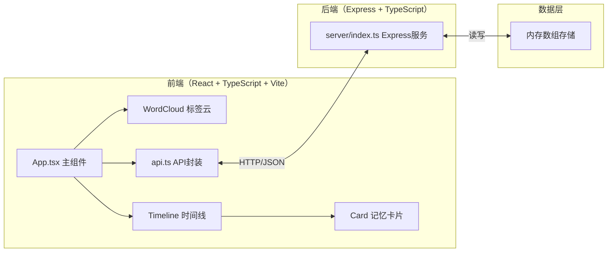
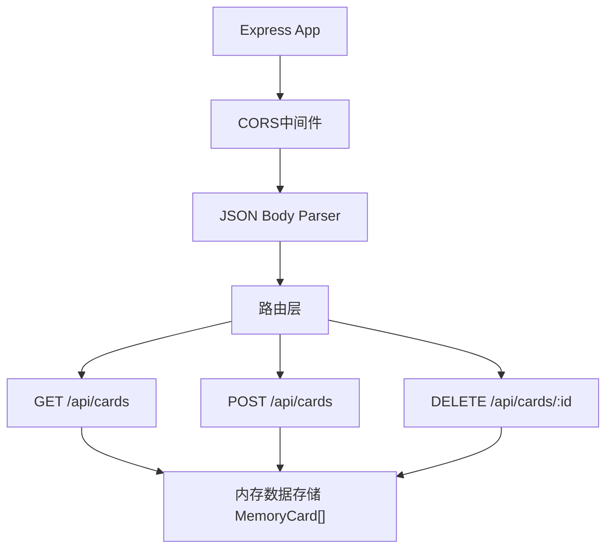
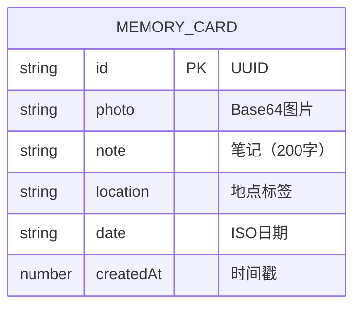

## 1. 架构设计



## 2. 技术说明

- **前端**：React 18 + TypeScript（严格模式），无外部状态管理库（使用React hooks）
- **构建工具**：Vite，端口8080
- **后端**：Express 4，内存数据存储
- **通信**：RESTful API + CORS
- **文件上传**：Base64编码嵌入JSON

## 3. 路由定义

| 路由 | 用途 |
|------|------|
| / | 主页面（应用入口） |

## 4. API定义

### 4.1 类型定义
```typescript
interface MemoryCard {
  id: string;           // UUID
  photo: string;        // Base64编码图片
  note: string;         // 文本笔记（最多200字）
  location: string;     // 地点标签
  date: string;         // ISO日期字符串
  createdAt: number;    // 时间戳
}
```

### 4.2 接口列表
| 方法 | 路径 | 请求 | 响应 |
|------|------|------|------|
| GET | /api/cards | - | MemoryCard[] 按日期升序 |
| POST | /api/cards | { photo, note, location, date } | MemoryCard |
| DELETE | /api/cards/:id | - | { success: true } |

## 5. 服务器架构图



## 6. 数据模型

### 6.1 数据模型定义



### 6.2 项目文件结构
```
auto186/
├── package.json
├── index.html
├── vite.config.js
├── tsconfig.json
├── src/
│   ├── App.tsx
│   ├── api.ts
│   └── components/
│       ├── Timeline.tsx
│       ├── Card.tsx
│       └── WordCloud.tsx
└── server/
    └── index.ts
```
