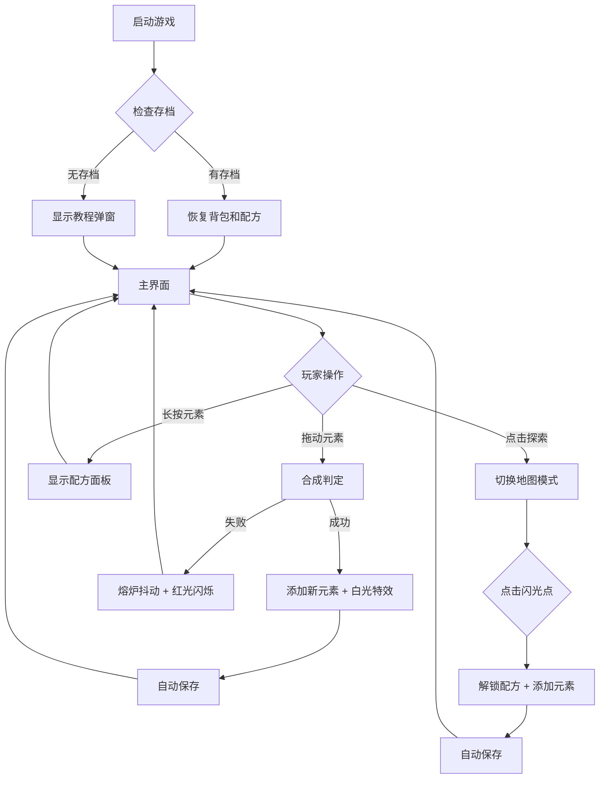

## 1. 产品概述

一款基于 Canvas 的像素风炼金术合成与探索游戏，玩家通过拖动元素到熔炉合成新物质，并在随机生成的像素地图上探索发现隐藏配方。

- 目标用户：休闲游戏爱好者，像素风格爱好者，解谜合成类游戏玩家
- 产品价值：提供轻松有趣的合成探索体验，通过收集配方获得成就感

## 2. 核心功能

### 2.1 功能模块
1. **炼金合成系统**：元素背包、熔炉合成、合成判定、成功/失败反馈
2. **地图探索系统**：随机像素地图生成、闪光点交互、隐藏配方发现
3. **配方预览系统**：长按元素展示相关合成配方（已知/未知）
4. **存档系统**：localStorage 自动保存/恢复游戏进度
5. **新手引导系统**：首次加载教程弹窗

### 2.2 页面详情

| 页面名称 | 模块名称 | 功能描述 |
|-----------|-------------|---------------------|
| 主游戏界面 | 元素背包区 | 左侧固定面板，显示已拥有元素，支持拖动、长按预览 |
| 主游戏界面 | 熔炉合成区 | 中央八角形旋转熔炉，接收拖入元素进行合成判定 |
| 主游戏界面 | 探索按钮 | 右下角按钮，切换到地图探索模式 |
| 主游戏界面 | 合成提示 | 画布上方弹出合成结果提示框 |
| 地图探索界面 | 像素地图 | 80x80 瓦片网格，按海拔着色，淡入动画 |
| 地图探索界面 | 闪光点 | 地图上闪烁的可交互点，点击解锁配方 |
| 配方面板 | 配方列表 | 半透明面板，显示元素相关的已知/未知配方 |

## 3. 核心流程

玩家进入游戏后，首先看到新手教程弹窗（3秒后淡出）。主界面左侧是元素背包（初始4种基础元素），中央是熔炉。玩家将元素拖入熔炉进行合成，成功则获得新元素并显示提示，失败则熔炉抖动。点击右下角探索按钮进入地图模式，点击闪光点发现隐藏配方。长按背包元素可查看相关配方。所有进度自动保存到 localStorage。

## 4. 用户界面设计

### 4.1 设计风格
- **主色调**：深色主题，背景 #1F1F2A，画布背景 #2D2D3A
- **元素颜色**：火#FF4444、水#4488FF、土#8B5E34、风#66DDAA
- **稀有度配色**：普通#A0A0A0、稀有#FFD700、史诗#FF6B6B
- **按钮风格**：像素风格，2px 实色边框 + inset 内阴影，点击缩放(0.95)
- **字体**：像素风格白色字体
- **特殊效果**：毛玻璃 (backdrop-filter: blur)、径向渐变光晕、淡入动画、粒子特效

### 4.2 页面设计概述

| 页面名称 | 模块名称 | UI 元素 |
|-----------|-------------|-------------|
| 主游戏界面 | 元素背包区 | 150px 宽半透明面板(#3A3A4A)，圆角 8px，32x32 像素元素图标 |
| 主游戏界面 | 熔炉区 | 旋转八角形凹槽，边框 #B8860B，160x160px，成功时白色径向光晕 |
| 主游戏界面 | 合成提示 | 毛玻璃效果，blur(6px)，白色 14px 像素字体 |
| 主游戏界面 | 探索按钮 | 80x28px，背景 #5A4A3A，悬停 #7A6A5A，点击缩放 0.95 |
| 地图探索界面 | 像素地图 | 80x80 瓦片网格，每瓦片 4x4px，海拔渐变色，每批20个瓦片延迟50ms淡入 |
| 配方面板 | 配方列表 | 240x160px，半透明 #2A2A3A，blur(4px)，可滚动，条目悬停高亮 |

### 4.3 响应式
- 桌面端优先设计，Canvas 固定尺寸 600x600px
- 支持鼠标拖动交互，触摸设备可适配

### 4.4 动画与特效
- 熔炉八角形缓慢旋转
- 合成成功：白色径向光晕 0.3秒 + 星形像素粒子
- 合成失败：X 轴抖动 ±3px 0.2秒 + 红色闪烁
- 地图瓦片：透明度 0→1 淡入，每批20个延迟50ms
- 闪光点：每秒闪烁一次，随机颜色
- 教程弹窗：3秒后淡出
