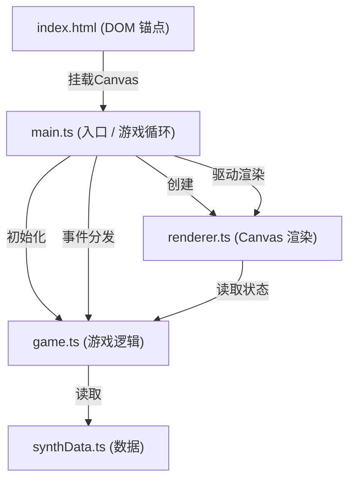

## 1. 架构设计



## 2. 技术栈说明
- 前端框架：原生 TypeScript + 原生 HTML/CSS + Vite
- 渲染方式：HTML5 Canvas 2D 原生 API
- 构建工具：Vite 5.x
- 开发语言：TypeScript 5.x（严格模式）
- 模块系统：ESNext
- 数据持久化：localStorage
- 无后端、无外部数据库

## 3. 文件结构

```
├── package.json          # 项目依赖与脚本
├── index.html          # 入口页面
├── vite.config.js     # Vite 构建配置
├── tsconfig.json    # TypeScript 配置
└── src/
    ├── main.ts         # 应用入口 + 游戏循环 + 事件分发
    ├── game.ts         # 状态管理 + 合成判定 + 地图生成 + 探索逻辑
    ├── renderer.ts     # Canvas 像素渲染 + 粒子特效
    └── synthData.ts      # 20 元素 + 30 配方数据
```

### 3.1 文件职责

| 文件 | 职责 |
|------|------|
| main.ts | 初始化游戏，创建 requestAnimationFrame 30FPS 游戏循环，管理鼠标/触摸事件，创建 Canvas 实例挂载 |
| game.ts | 元素状态管理（背包、熔炉槽位、已发现配方）、碰撞检测、合成规则匹配、地图生成（预计算噪声）、探索更新、存档读写 |
| renderer.ts | 像素风格渲染：元素图标、八角熔炉、地图瓦片、粒子系统、UI 面板、合成反馈特效
| synthData.ts | 常量数据：20 种元素定义（颜色、名称、稀有度） + 30 条合成配方（输入无序配对 → 产物） |

## 4. 核心数据结构

```typescript
// 元素类型
interface Element {
  id: string;
  name: string;
  color: string;
  rarity: 'common' | 'rare' | 'epic';
}

// 配方类型
interface Recipe {
  inputs: [string, string];
  output: string;
  discovered: boolean;
}

// 闪光点类型
interface Sparkle {
  x: number;
  y: number;
  recipeId: string;
  discovered: boolean;
}

// 游戏状态
interface GameState {
  mode: 'alchemy' | 'explore';
  inventory: string[];
  discoveredRecipes: string[];
  discoveredElements: string[];
  furnaceSlots: (string | null)[];
  mapTiles: number[][];
  sparkles: Sparkle[];
  particles: Particle[];
  dragging: { elementId: string; x: number; y: number } | null;
  effects: {
    furnaceGlow: number;
    furnaceShake: number;
    furnaceFail: number;
    toast: { text: string; alpha: number } | null;
    tutorialAlpha: number;
    recipePanel: { elementId: string; alpha: number } | null;
    mapFadeProgress: number;
  };
}
```

## 5. 关键算法

### 5.1 合成判定
- 输入：熔炉中 2 个元素 ID
- 排序后与配方表无序配对查询（O(1) Map 查找，响应 < 5ms）
- 匹配成功 → 产物加入背包、记录已发现
- 匹配失败 → 触发失败特效

### 5.2 地图生成
- 80x80 瓦片网格，每瓦片 4x4px，总尺寸 320x320px
- 使用简单值噪声（预计算，< 100ms）
- 按海拔值映射到 5 级颜色梯度
- 随机散布 5-8 个闪光点

### 5.3 性能要求
- 游戏循环：30 FPS，渲染 ≥ 28 FPS
- 背包上限：50 个元素
- 粒子系统上限：100 个并发粒子
