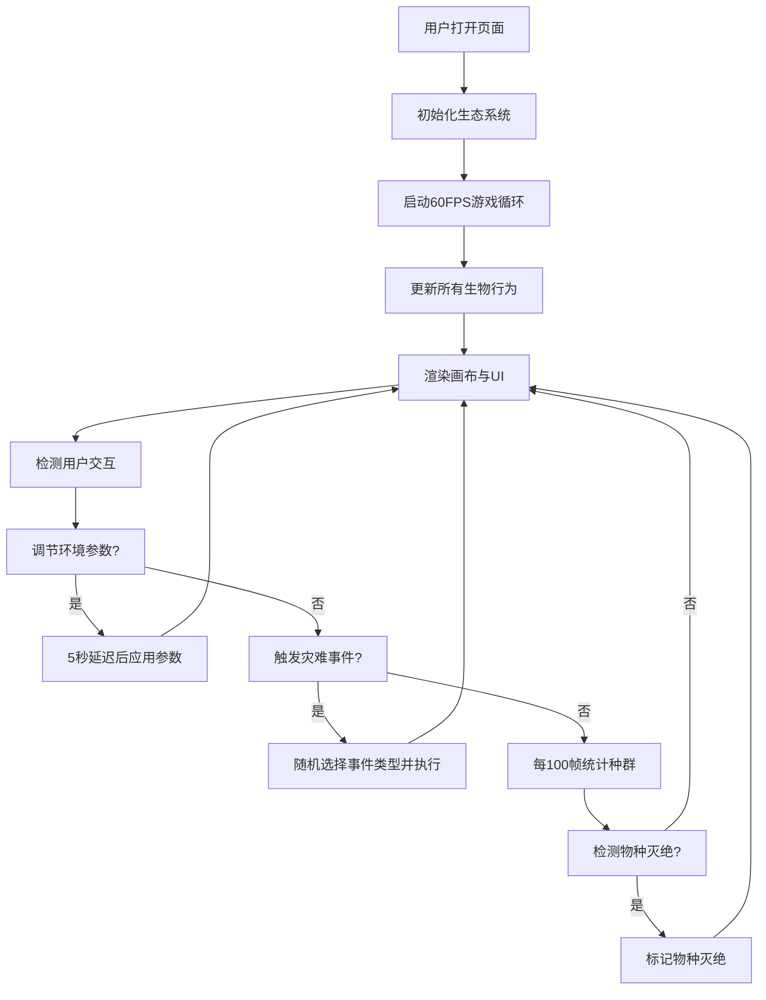

## 1. 产品概述

生态系统动态平衡与物种演化交互式模拟器，让用户直观观察生物种群在自然选择、资源竞争和随机事件影响下的演化与平衡过程。

- 面向学生、生物爱好者和教育工作者，提供沉浸式的生态演化可视化体验
- 通过交互式参数调节和随机灾难事件，揭示生态系统的脆弱性与恢复力

## 2. 核心功能

### 2.1 用户角色
| 角色 | 注册方式 | 核心权限 |
|------|----------|----------|
| 普通用户 | 无需注册 | 使用所有模拟功能、调节参数、触发事件 |

### 2.2 功能模块
1. **主模拟画布**：Canvas渲染的2D地形网格与生物种群实时动画
2. **控制面板**：温度、湿度、资源丰富度参数滑块调节
3. **灾难事件系统**：火灾、干旱、瘟疫随机事件触发
4. **状态栏**：帧率、演化代数、生物量、灭绝物种实时显示
5. **种群统计**：物种存活数量图标显示与灭绝检测

### 2.3 页面详情
| 页面名称 | 模块名称 | 功能描述 |
|----------|----------|----------|
| 模拟器主页 | 主画布 | 800x600px Canvas渲染森林地形网格（草地/树木/水域/岩石）及3种生物（草食动物三角形/肉食动物圆形/植物矩形），60FPS实时动画 |
| 模拟器主页 | 控制面板 | 半透明毛玻璃面板，温度滑块(-20°C~50°C)、湿度滑块(0%~100%)、资源丰富度滑块(1x~5x)，5秒延迟生效 |
| 模拟器主页 | 灾难按钮 | 右下角橙色按钮，点击触发火灾(50%)/干旱(30%)/瘟疫(20%)随机事件 |
| 模拟器主页 | 状态栏 | 底部20px白色半透明条，显示FPS、演化代数、总生物量、灭绝物种名称 |
| 模拟器主页 | 种群统计 | 左上角存活物种图标和数量，连续3次统计为0则宣告灭绝 |

## 3. 核心流程

用户打开页面 → 生态系统自动初始化并开始模拟 → 用户通过滑块调节环境参数（5秒延迟生效）→ 用户可点击灾难按钮触发随机事件 → 实时观察生物行为（移动、捕食、繁殖、生长）→ 状态栏持续更新统计数据 → 种群演化或灭绝

## 4. 用户界面设计

### 4.1 设计风格
- **主色调**：暗色自然主题，主背景#1A1A2E，森林绿渐变画布#2D5A27→#1A3A1A
- **辅助色**：草食动物绿#2ECC71，肉食动物红#E74C3C，植物浅绿#7EC850，灾难橙#E67E22
- **按钮风格**：圆角8px，悬停0.15s颜色过渡，点击0.1s缩放反馈，按下背景变暗20%
- **字体**：12px等宽字体用于状态栏，统一圆角组件风格，禁止锐角边缘
- **视觉特色**：半透明毛玻璃控制面板(backdrop-filter: blur(10px))，画布6px深绿色边框，灾难事件红色脉动边框

### 4.2 页面设计概览
| 页面名称 | 模块名称 | UI元素 |
|----------|----------|--------|
| 模拟器主页 | 主画布 | 居中布局，70%宽75%高，森林绿渐变背景，6px半透明深绿边框#1F4520，圆角8px |
| 模拟器主页 | 控制面板 | 画布右侧，宽200px，半透明毛玻璃，圆角12px，顶部5px渐变分隔线#E74C3C→#F39C12，控件间距10px |
| 模拟器主页 | 滑块 | 轨道高6px圆角3px颜色#34495E，滑块头直径16px白色#FFFFFF，悬停阴影扩大 |
| 模拟器主页 | 灾难按钮 | 右下角橙色#E67E22，悬停#D35400，圆角8px，点击脉冲缩放1.1倍0.2s |
| 模拟器主页 | 状态栏 | 底部20px高白色半透明，12px等宽字体居中对齐，FPS低于30变红 |

### 4.3 响应式设计
- 桌面优先，宽度<768px时控制面板移至画布下方、宽度100%
- 高度<500px时整体缩放至0.8倍
- 所有可点击元素cursor:pointer，悬停0.15s颜色过渡，点击0.1s缩放反馈

### 4.4 视觉特效
- 灾难事件期间画布边缘4px宽红色脉动边框(#C0392B，透明度0.5→0.2渐变)
- 火灾区域地面变黑#2C3E50，10秒后渐恢复绿色
- 按钮点击脉冲动画缩放1.1倍持续0.2s
- 滑块悬停阴影扩大效果
