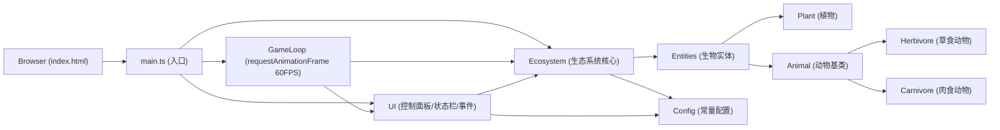

## 1. 架构设计



## 2. 技术描述

- **前端**：TypeScript + 原生 HTML/CSS + Vite
- **构建工具**：Vite 5.x
- **渲染**：HTML5 Canvas 2D API
- **状态管理**：Ecosystem 类集中管理，UI 层通过事件绑定驱动参数变化
- **无后端**：纯前端模拟，无需服务器

## 3. 项目文件结构

```
auto189/
├── package.json
├── index.html
├── vite.config.js
├── tsconfig.json
└── src/
    ├── main.ts        # 入口文件：初始化Canvas、GameLoop、Ecosystem、绑定UI事件
    ├── ecosystem.ts   # 生态系统核心类：管理生物创建/更新/销毁/种群统计
    ├── entities.ts    # 生物实体类：Animal基类、Herbivore、Carnivore、Plant
    ├── ui.ts          # UI组件：控制面板滑块、灾难按钮、状态栏、事件提示
    └── config.ts      # 常量配置：种群数量、属性范围、地形颜色、事件参数
```

## 4. 核心类设计

### 4.1 Config (config.ts)
```typescript
// 画布尺寸
// 地形网格参数与颜色
// 物种初始数量
// 生物属性范围（速度、体型、繁殖周期、攻击力）
// 行为参数（感知距离、饱腹度增量）
// 环境参数范围与影响系数
// 灾难事件概率与持续时间
// UI样式常量
```

### 4.2 Entities (entities.ts)
```typescript
class Plant {
  x, y: number
  size: number
  growTimer: number
  grow() {}
  render(ctx: CanvasRenderingContext2D) {}
}

class Animal {
  x, y: number
  speed: number
  size: number
  hunger: number
  maxHunger: number
  reproductionCycle: number
  reproductionTimer: number
  move(targetX?, targetY?) {}
  eat(food: Plant | Animal) {}
  reproduce() {}
  render(ctx: CanvasRenderingContext2D) {}
}

class Herbivore extends Animal {
  findNearestPlant(plants: Plant[]): Plant | null
  update(ecosystem: Ecosystem) {}
}

class Carnivore extends Animal {
  attackPower: number
  findNearestHerbivore(herbivores: Herbivore[]): Herbivore | null
  update(ecosystem: Ecosystem) {}
}
```

### 4.3 Ecosystem (ecosystem.ts)
```typescript
class Ecosystem {
  canvas: HTMLCanvasElement
  ctx: CanvasRenderingContext2D
  terrainGrid: TerrainCell[][]
  plants: Plant[]
  herbivores: Herbivore[]
  carnivores: Carnivore[]
  temperature: number
  humidity: number
  resourceRichness: number
  pendingTemperature: number
  pendingHumidity: number
  pendingResourceRichness: number
  paramApplyTimer: number
  frameCount: number
  generation: number
  populationHistory: { herbivores: number; carnivores: number; plants: number }[]
  extinctSpecies: string[]
  activeEvent: DisasterEvent | null
  burntAreas: BurntArea[]

  initTerrain()
  initPopulation()
  setTemperature(value: number)
  setHumidity(value: number)
  setResourceRichness(value: number)
  applyPendingParams()
  triggerDisaster()
  update()
  render()
  getPopulationStats()
  cleanupDestroyed()
}
```

### 4.4 UI (ui.ts)
```typescript
class UIController {
  ecosystem: Ecosystem
  temperatureSlider: HTMLInputElement
  humiditySlider: HTMLInputElement
  resourceSlider: HTMLInputElement
  disasterBtn: HTMLButtonElement
  statusBar: HTMLElement
  paramDisplay: HTMLElement
  eventAlert: HTMLElement

  bindEvents()
  updateParamDisplay()
  updateStatusBar(fps: number)
  showEventAlert(eventName: string)
}
```

## 5. 性能优化策略

### 5.1 帧率控制
- 使用 `requestAnimationFrame` 实现60FPS游戏循环
- 通过时间戳 delta-time 计算帧率
- 单帧内更新+渲染总耗时控制在16ms以内

### 5.2 对象池与GC
- 生物死亡后从数组中 `splice` 移除，解除引用便于GC
- 避免每帧创建新对象，复用Vector等临时计算变量
- 最大生物数量限制200只，超出时暂停繁殖

### 5.3 渲染优化
- 地形网格预渲染至离屏Canvas，仅在火灾区域变化时重绘
- 生物按类型批量绘制，减少Canvas状态切换
- 状态栏使用DOM而非Canvas，避免每帧重绘文本

## 6. 关键算法

### 6.1 最近邻搜索
- 每只动物在视野范围内（草食100px / 肉食150px）线性搜索最近目标
- 200只生物上限内线性搜索O(n²)可接受，性能瓶颈前暂不引入空间网格索引

### 6.2 遗传变异
- 后代属性 = 父本属性 × (0.8 ~ 1.2) 随机因子
- 属性值限制在配置的最小/最大值范围内

### 6.3 碰撞检测
- 圆形碰撞：距离 < 两者半径之和
- 草食吃植物：距离 < 草食体型 + 植物尺寸
- 肉食捕食：距离 < 肉食体型 + 草食体型 且 攻击力 > 草食体型

### 6.4 灾难事件
- 火灾：随机中心点，半径100px内植物/草食动物清除，记录烧伤区域10秒渐恢复
- 干旱：设置标志位，植物暂停生长，动物速度 × 0.7，持续15秒
- 瘟疫：随机选择物种，该物种数量减半（随机删除），持续10秒
