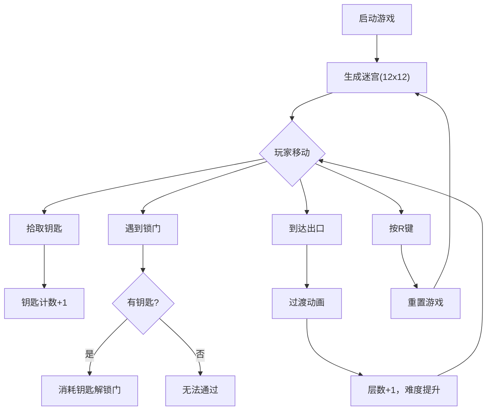

## 1. 产品概述

基于浏览器的像素风格地牢迷宫探索器，玩家控制角色在随机生成的迷宫中移动，收集钥匙、触发机关并找到通往下一层的出口。

- 核心目标：提供具有探索乐趣的随机迷宫探索体验，支持多层递进难度
- 目标用户：休闲游戏玩家、像素风格爱好者

## 2. 核心特性

### 2.1 功能模块

1. **迷宫生成器**：递归回溯算法生成随机连通迷宫，放置钥匙、锁门、出口
2. **角色控制**：WASD/方向键控制，网格移动，平滑过渡动画
3. **收集与解锁系统**：钥匙拾取动画，锁门消耗钥匙解锁
4. **楼层系统**：到达出口触发过渡动画，重新生成迷宫并提升难度
5. **状态显示**：实时显示层数、钥匙数、锁门数
6. **重置功能**：R键重置游戏

### 2.2 页面详情

| 页面名称 | 模块名称 | 功能描述 |
|---------|---------|---------|
| 游戏主界面 | 状态栏 | 顶部固定显示层数、钥匙数、锁门数 |
| 游戏主界面 | 迷宫画布 | 渲染迷宫、角色、钥匙、门、出口 |
| 游戏主界面 | 过渡动画层 | 楼层切换的渐暗渐亮效果 |

## 3. 核心流程

玩家启动游戏 → 随机生成12×12迷宫 → 使用WASD/方向键移动角色 → 拾取钥匙（缩放消失 → 用钥匙解锁门 → 到达绿色闪烁出口 → 过渡动画 → 进入下一层（迷宫尺寸+1，钥匙-锁门+1） → 重复探索 → 按R键重置

## 4. 用户界面设计

### 4.1 设计风格

- **主色调**：深褐色背景 (#2E1F14)
- **墙壁色**：深棕色 (#4A3B32)
- **地板色**：浅米色 (#C4A882)
- **角色色**：亮蓝色 (#3498DB) 带半透明光晕
- **钥匙色**：金色 (#FFD700) 菱形
- **出口色**：半透明绿色 (#2ECC71) 闪烁
- **字体**：16px 白色字体，带微弱投影
- **状态栏**：半透明毛玻璃效果 (backdrop-filter: blur(8px))

### 4.2 页面设计概述

| 页面名称 | 模块名称 | UI 元素 |
|---------|---------|---------|
| 游戏主界面 | 状态栏 | 毛玻璃背景，三列布局：层数(白)、钥匙(金)、锁门(灰) |
| 游戏主界面 | 迷宫画布 | 居中显示，四周30px边距，Canvas背景#8F7A66 |
| 游戏主界面 | 过渡层 | 全屏黑色遮罩，渐暗渐亮1秒 |

### 4.3 响应式设计

- 桌面端优先，迷宫居中显示
- Canvas尺寸根据迷宫大小自适应

### 4.4 动画效果

- 角色移动：0.15秒网格平滑过渡
- 墙壁碰撞：0.5秒角色抖动
- 钥匙拾取：缩放到0后消失
- 出口闪烁：绿色不透明度0.6-1.0交替
- 楼层切换：1秒渐暗渐亮
- 帧率稳定60FPS
