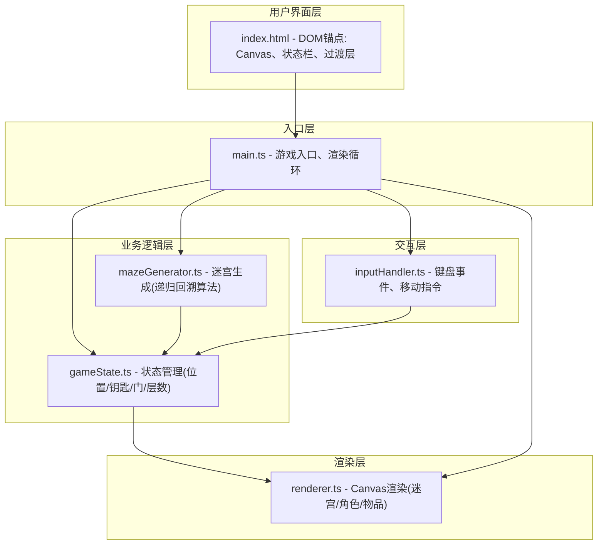
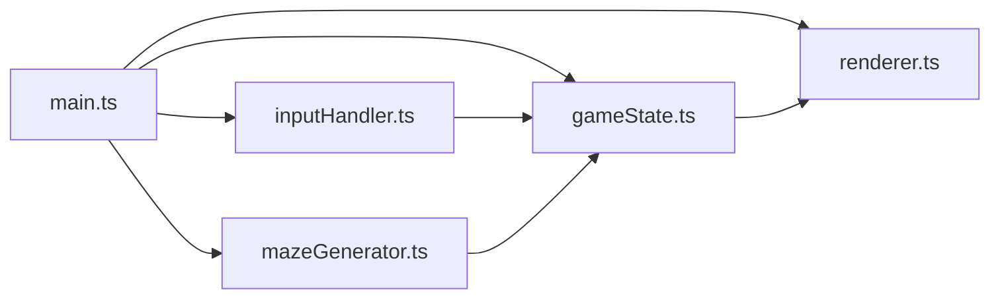

## 1. 架构设计



**数据流向说明：**
1. `main.ts` → 读取配置 → 调用 `mazeGenerator.ts` 生成迷宫 → 初始化 `gameState.ts`
2. `inputHandler.ts` → 监听键盘 → 映射方向 → 调用 `gameState.move()`
3. `gameState.ts` → 更新状态 → 通知 `renderer.ts` 重绘
4. `renderer.ts` → 读取 `gameState.ts` → 逐帧绘制到 Canvas

## 2. 技术描述

- **前端框架**：原生 TypeScript + HTML5 Canvas + CSS3
- **构建工具**：Vite 5.x
- **类型系统**：TypeScript 5.x (严格模式)
- **无后端、无数据库**：纯前端运行

## 3. 文件结构定义

```
auto191/
├── index.html                      # 入口页面
├── package.json                    # 项目依赖与脚本
├── vite.config.js                  # Vite构建配置
├── tsconfig.json                   # TypeScript配置
└── src/
    ├── main.ts                     # 游戏入口
    ├── mazeGenerator.ts            # 迷宫生成器
    ├── gameState.ts                # 游戏状态管理
    ├── renderer.ts                 # Canvas渲染器
    └── inputHandler.ts             # 键盘输入处理器
```

## 4. 核心模块与调用关系

### 4.1 模块调用图



### 4.2 各模块职责

| 模块 | 职责 | 对外接口 |
|-----|-----|---------|
| mazeGenerator.ts | 递归回溯算法生成迷宫，放置钥匙、锁门、出口 | `generateMaze(size, level)` |
| gameState.ts | 维护玩家位置、钥匙数、门状态、层数，提供移动/解锁接口 | `init(), move(dx, dy), hasKeyAt(x,y), unlockDoorAt(x,y), getState()` |
| renderer.ts | Canvas绑定、绘制迷宫网格/墙壁/地板/角色/钥匙/门/出口 | `init(canvas), render(state, time)` |
| inputHandler.ts | WASD/方向键监听，映射移动指令，触发R键重置 | `init(gameState, onReset)` |
| main.ts | 初始化所有模块、启动requestAnimationFrame循环、楼层过渡动画 | - |

## 5. 数据模型定义

```typescript
// 单元格类型
enum CellType {
  WALL = 0,
  FLOOR = 1,
  DOOR = 2,      // 锁住的门
  DOOR_OPEN = 3  // 已打开的门
}

// 坐标点
interface Point {
  x: number;
  y: number;
}

// 钥匙
interface Key {
  x: number;
  y: number;
  collected: boolean;
  scale: number;  // 拾取动画用
}

// 迷宫数据
interface MazeData {
  grid: CellType[][];
  size: number;
  playerStart: Point;
  exit: Point;
  keys: Key[];
  doors: Point[];
}

// 游戏状态
interface GameState {
  maze: MazeData;
  playerPos: Point;     // 网格坐标
  playerRenderPos: { x: number; y: number };  // 渲染坐标(像素)
  keysCollected: number;
  doorsRemaining: number;
  currentLevel: number;
  isMoving: boolean;
  isShaking: boolean;
  shakeStartTime: number;
  transitionActive: boolean;
  transitionProgress: number;
}
```

## 6. 性能约束

- 迷宫生成(12×12)：≤ 5ms，使用迭代式递归回溯避免栈溢出
- 渲染帧率：60FPS，使用 requestAnimationFrame
- 内存：单页应用，无资源泄漏，对象复用
