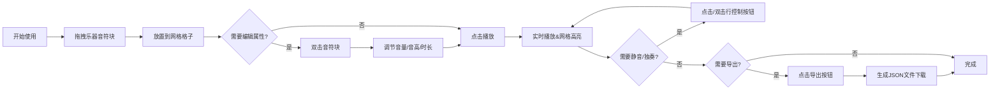

## 1. 产品概述

基于浏览器的可视化音乐节奏生成器，用户通过拖拽和连接不同类型的音符块来创作旋律并实时播放。目标用户为音乐爱好者、初学者和创意工作者，提供零门槛的音乐创作体验。

产品价值：降低音乐创作门槛，通过可视化交互让用户直观感受音乐节奏的编排过程，实现所见即所得的音乐创作体验。

## 2. 核心功能

### 2.1 用户角色

| 角色 | 注册方式 | 核心权限 |
|------|----------|----------|
| 普通用户 | 无需注册，直接使用 | 音符块拖拽、属性编辑、播放控制、导出JSON |

### 2.2 功能模块

1. **主画布**：8x8音符网格、拖拽放置、可视化渲染
2. **工具栏**：4种乐器音符块（鼓、贝斯、和弦、旋律）
3. **属性编辑面板**：音量、音高、时长调节
4. **播放控制栏**：播放/暂停、BPM调节、进度条、重置、导出
5. **行控制列**：每行静音/独奏切换
6. **音频引擎**：Web Audio API实时合成播放

### 2.3 页面详情

| 页面名称 | 模块名称 | 功能描述 |
|----------|----------|----------|
| 主页 | 主画布 | Canvas渲染8x8网格，支持音符块拖拽放置，实时播放高亮 |
| 主页 | 左侧工具栏 | 4个圆形乐器按钮，支持拖拽音符到网格 |
| 主页 | 行控制列 | 每行静音/独奏开关，单击静音、双击独奏 |
| 主页 | 属性编辑面板 | 双击音符块弹出，含音量滑块、音高下选、时长旋钮 |
| 主页 | 底部控制栏 | 播放/暂停、BPM滑块、进度条、重置、导出按钮 |

## 3. 核心流程

用户从左侧工具栏拖拽乐器音符块 → 放置到8x8网格的目标格子 → 双击音符块编辑音量/音高/时长 → 点击播放按钮按从左到右、从上到下逐列播放 → 通过行控制列静音或独奏特定行 → 点击导出按钮将编排导出为JSON文件

## 4. 用户界面设计

### 4.1 设计风格

- **主色调**：深色主题 #1A1A2E
- **强调色**：#E94560（鼓/播放按钮）、#533483（贝斯/滑块）、#E6B333（旋律/进度条）、#4E9F3D（独奏/成功提示）
- **辅助色**：#16213E（网格边框）、#0F3460（控制栏背景）
- **按钮风格**：圆形/圆角矩形，悬停缩放1.05倍，0.2s缓动过渡
- **字体**：使用现代无衬线字体，清晰易读
- **布局风格**：居中网格布局，画布占60%以上宽度，响应式适配
- **动画风格**：音符放置使用弹性动画（cubic-bezier(0.68, -0.55, 0.27, 1.55)），交互元素0.2s ease-in-out

### 4.2 页面设计概览

| 页面名称 | 模块名称 | UI元素 |
|----------|----------|--------|
| 主页 | 主画布 | 深色背景#1A1A2E，8x8网格60x60px格子，边框#16213E，间隔2px，播放高亮白色半透明 |
| 主页 | 工具栏 | 4个直径40px圆形按钮，颜色对应4种乐器，拖拽时半透明opacity 0.6 |
| 主页 | 属性面板 | 毛玻璃效果 backdrop-filter: blur(12px)，背景 rgba(22,33,62,0.85)，圆角16px |
| 主页 | 控制栏 | 高80px，背景#0F3460，顶部分隔线0.5px #533483 |
| 主页 | 播放按钮 | 直径50px圆形，#E94560，悬停缩放1.1倍0.2s |
| 主页 | BPM滑块 | 轨道高4px宽200px，滑钮直径18px，#533483 |
| 主页 | 进度条 | 高8px圆角4px，背景#16213E，填充#E6B333 |
| 主页 | 行控制按钮 | 20x20px圆角4px，默认#533483，静音#E94560，独奏#4E9F3D，0.3s过渡 |

### 4.3 响应式设计

- **桌面端（>768px）**：控制栏单行布局，网格格子60x60px，工具栏按钮直径40px
- **移动端（≤768px）**：控制栏折叠为两行（第一行：播放/暂停、BPM、进度条；第二行：重置、静音/独奏、导出），网格和按钮缩小20%

### 4.4 性能指标

- Web Audio合成延迟 ≤ 50ms
- 界面帧率保持 60fps
- 使用 requestAnimationFrame 渲染循环
- 拖拽和播放高亮流畅无卡顿
