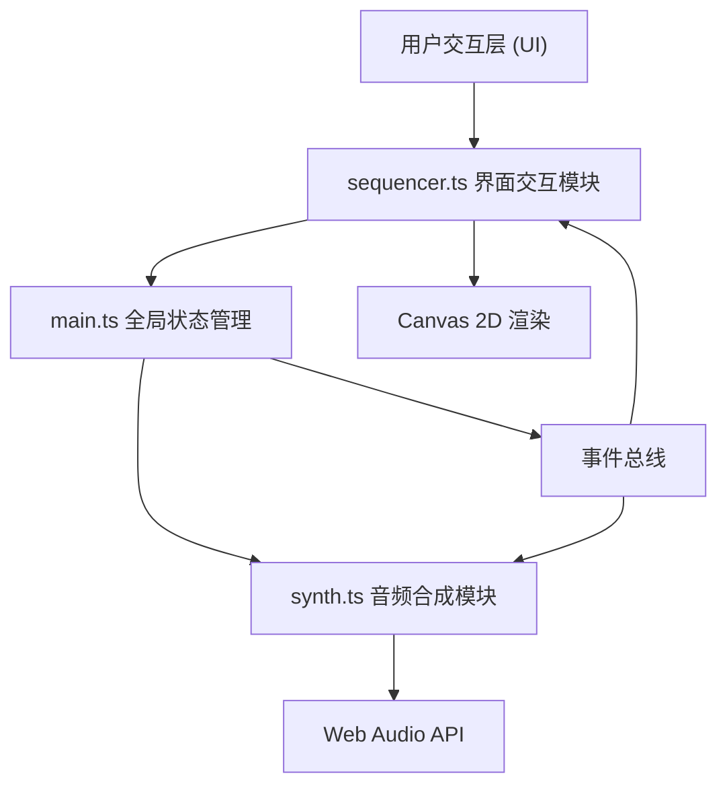

## 1. 架构设计



## 2. 技术说明

- **前端框架**：原生 HTML5 + CSS3 + TypeScript（无框架依赖）
- **构建工具**：Vite 5.x
- **音频引擎**：Web Audio API（原生浏览器支持）
- **渲染**：Canvas 2D API
- **模块规范**：ESNext
- **类型检查**：TypeScript 严格模式

## 3. 项目文件结构

```
auto194/
├── package.json
├── vite.config.js
├── tsconfig.json
├── index.html
└── src/
    ├── main.ts          # 应用入口，全局状态管理，事件总线
    ├── sequencer.ts     # 界面交互：网格渲染、拖拽、属性面板、播放控制UI
    └── synth.ts         # Web Audio API 音频合成
```

## 4. 核心数据模型

### 4.1 类型定义

```typescript
// 乐器类型
type InstrumentType = 'drum' | 'bass' | 'chord' | 'melody';

// 音符数据
interface NoteData {
  id: string;
  instrument: InstrumentType;
  pitch: string;      // C3-B5
  volume: number;     // 0-100
  duration: number;   // 0.25-2.0 拍
  row: number;        // 0-7
  col: number;        // 0-7
  animationStart?: number; // 放置动画时间戳
}

// 行状态
type RowState = 'normal' | 'muted' | 'solo';

// 应用状态
interface AppState {
  notes: Map<string, NoteData>;  // key: `${row}-${col}`
  rowStates: RowState[];         // 8行状态
  bpm: number;                   // 60-180
  isPlaying: boolean;
  currentStep: number;           // 当前播放列 0-7
  draggingNote: NoteData | null;
  editingNote: NoteData | null;
}

// 导出格式
interface ExportData {
  bpm: number;
  notes: Array<{
    pitch: string;
    volume: number;
    duration: number;
    instrument: InstrumentType;
    row: number;
    col: number;
  }>;
  rowStates: RowState[];
}
```

## 5. 模块职责

### 5.1 synth.ts — 音频合成模块

- 初始化 AudioContext（需用户交互后启动）
- 预构建振荡器/增益节点池以降低延迟
- `playNote(instrument, pitch, volume, duration, when)` 方法播放音符
- 为不同乐器配置不同的音色包络：
  - 鼓：短促噪声 + 低频正弦，快速衰减
  - 贝斯：低频率正弦/三角波，中等包络
  - 和弦：多谐波叠加，柔和 ADSR
  - 旋律：带轻微颤音的锯齿/方波

### 5.2 sequencer.ts — 界面交互模块

- Canvas 渲染循环（requestAnimationFrame）
- 8x8 网格绘制与命中检测
- 拖拽状态机：idle → dragging → placing
- 双击检测 → 属性面板 DOM 创建与事件
- 播放高亮动画（当前列）
- 控制栏 DOM 事件绑定
- 行控制按钮状态管理
- 导出 JSON 与文件下载

### 5.3 main.ts — 应用入口

- 全局 AppState 单例
- 事件总线（发布-订阅模式）
- 初始化 synth 与 sequencer
- 播放时钟调度（setTimeout / Web Audio scheduler）
- 窗口 resize 响应处理

## 6. 播放调度设计

- 使用 Web Audio 的精确调度，不依赖 setTimeout
- 每个 tick（一拍）预调度下一拍的所有音符
- `currentStep` 在 UI 中用 requestAnimationFrame 平滑更新
- 播放顺序：列优先（从左到右），每列 8 行同时播放

## 7. 性能优化策略

- Canvas 脏矩形重绘（仅重绘变化区域）
- 拖拽音符块使用离屏 Canvas 缓存
- Web Audio 节点池复用，避免频繁 create/dispose
- 事件委托：所有网格点击事件统一绑定到 Canvas
- requestAnimationFrame 驱动的统一渲染循环
- DOM 面板（属性编辑）惰性创建，不频繁销毁重建
