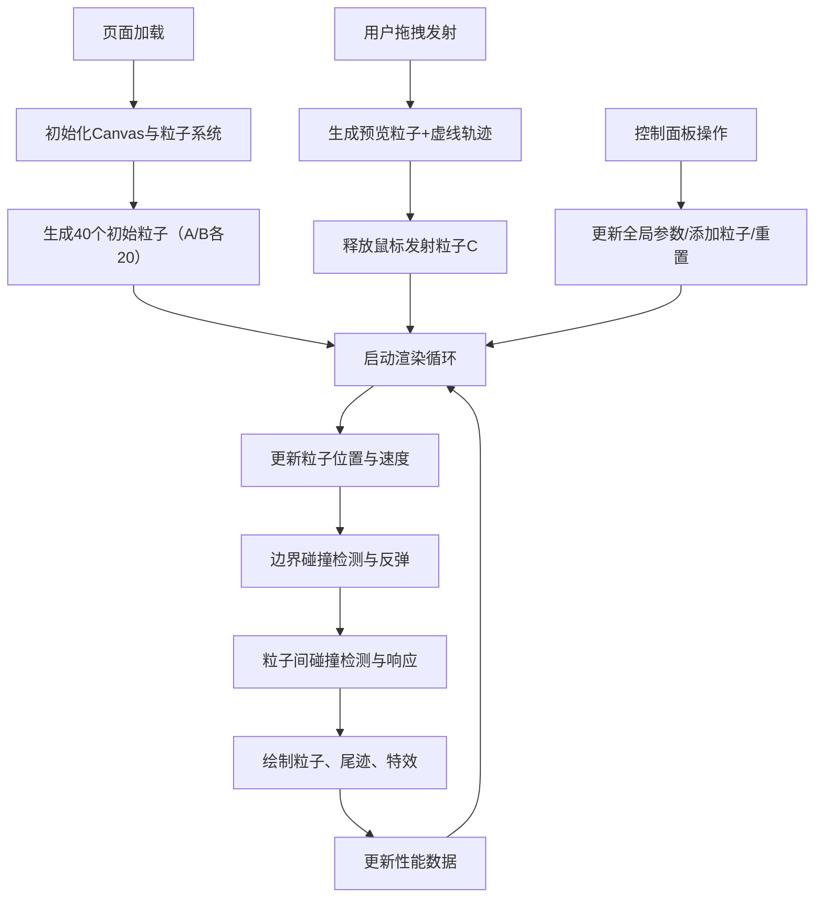

## 1. 产品概述

微观粒子碰撞与能量传递交互式沙盒，为学习者提供直观观察二维空间中粒子弹性碰撞、能量守恒和动量守恒的可视化实验平台。

- 目标用户：物理学习者、教育工作者、对粒子物理感兴趣的用户
- 核心价值：将抽象的物理概念通过可视化互动转化为可观察、可操作的直观体验

## 2. 核心功能

### 2.1 用户角色
无角色区分，所有用户拥有完整功能权限。

### 2.2 功能模块
1. **粒子画布**：800x600 Canvas，渲染粒子运动、尾迹、碰撞特效
2. **粒子系统**：随机生成粒子A/B、拖拽发射粒子C、边界弹性反弹
3. **碰撞物理引擎**：完全弹性碰撞计算（动量守恒+能量守恒）、碰撞检测
4. **视觉特效**：粒子尾迹、碰撞发光、爆炸扩散动画
5. **控制面板**：粒子计数显示、重置、添加粒子、速度/质量缩放
6. **性能监控**：FPS、粒子总数、碰撞次数/秒实时显示

### 2.3 页面详情
| 页面名称 | 模块名称 | 功能描述 |
|-----------|-------------|---------------------|
| 主页面 | 粒子画布 | 800x600px Canvas，深空蓝背景，1px发光描边，居中显示 |
| 主页面 | 控制面板 | 右侧固定220px宽，毛玻璃效果，圆角12px |
| 主页面 | 性能监控 | 左上角12px浅灰文字，显示FPS/粒子数/碰撞率 |
| 主页面 | 拖拽发射 | 鼠标按下生成预览粒子，拖拽显示虚线轨迹，释放发射 |

## 3. 核心流程

用户打开页面 → 自动生成40个初始粒子（A/B各20）在画布中运动 → 用户观察粒子碰撞与能量传递 → 用户可通过控制面板调节参数或点击按钮 → 用户可拖拽鼠标发射新粒子 → 所有粒子持续进行物理模拟和视觉渲染

## 4. 用户界面设计

### 4.1 设计风格
- **主色调**：深空蓝渐变背景 #0B0B1A → #1A1A3E
- **强调色**：青绿 #00E5FF（粒子A）、紫罗兰 #B388FF（粒子B）、橙色 #FF6B35（粒子C）
- **辅助色**：浅灰 #CCCCCC（文字）、灰色 #888888（虚线）、白色（爆炸特效）
- **按钮风格**：渐变填充（#00E5FF→#B388FF），圆角8px，宽180px高40px，悬停亮度×1.2+上移2px（0.2s ease），点击缩放到0.95（0.1s）
- **字体**：默认无衬线字体，12px性能数据
- **布局**：画布居中，右侧控制面板，左上角性能数据
- **视觉效果**：毛玻璃 backdrop-filter(8px blur)、Canvas发光描边、粒子尾迹、碰撞发光爆炸

### 4.2 页面设计概要
| 页面名称 | 模块名称 | UI元素 |
|-----------|-------------|-------------|
| 主页面 | 粒子画布 | 800x600 Canvas，深空蓝#0D1B2A背景，#00E5FF@0.3发光描边 |
| 主页面 | 粒子渲染 | 圆形粒子A(#00E5FF,m=1)、B(#B388FF,m=2)、C(#FF6B35,m=1.5)，半径8-18px随机 |
| 主页面 | 粒子尾迹 | 最近5帧位置，透明度0.3→0，半径递减到1px |
| 主页面 | 碰撞特效 | 亮度×1.5持续3帧，白色圆形爆炸5→20px，透明度0.8→0，持续10帧 |
| 主页面 | 拖拽交互 | 12px橙色预览粒子，灰色虚线（5px/3px），1px线宽 |
| 主页面 | 控制面板 | 220px宽，#1A1A2E@80%+毛玻璃，圆角12px，包含计数显示、3个按钮、2个滑动条 |
| 主页面 | 性能监控 | 左上角12px#CCCCCC文字，显示FPS、粒子总数、碰撞/秒 |

### 4.3 响应式
桌面端固定布局，不做移动端适配。

### 4.4 3D场景指引
不适用，本项目为2D Canvas应用。
