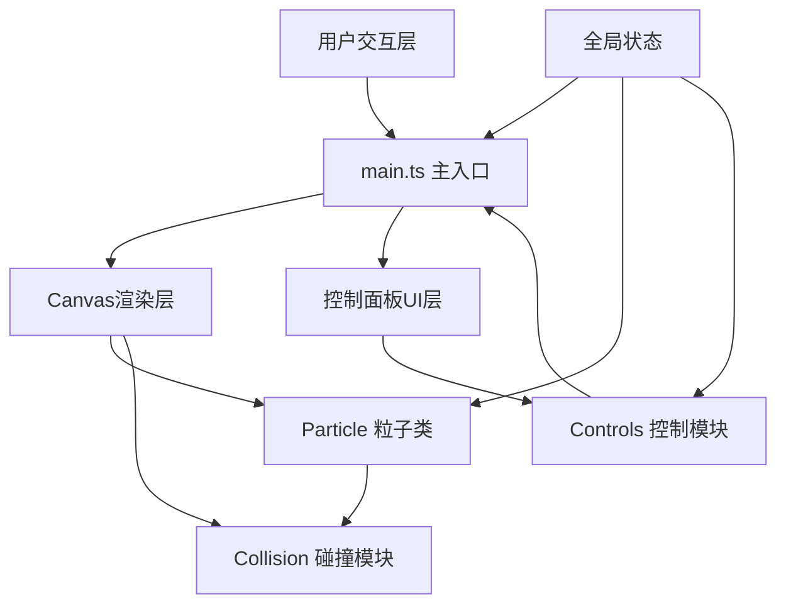

## 1. 架构设计



## 2. 技术描述
- **前端**：TypeScript + 原生HTML/CSS + Canvas 2D API
- **构建工具**：Vite 5.x
- **开发服务器端口**：8080
- **后端**：无，纯前端应用
- **数据库**：无

## 3. 项目文件结构
```
auto199/
├── package.json          # 项目依赖与脚本
├── vite.config.js        # Vite构建配置
├── tsconfig.json         # TypeScript配置
├── index.html            # 入口HTML
└── src/
    ├── main.ts           # 主程序入口
    ├── particle.ts       # Particle粒子类
    ├── collision.ts      # 碰撞处理模块
    └── controls.ts       # 控制面板UI逻辑
```

## 4. 核心模块设计

### 4.1 Particle 类 (src/particle.ts)
```typescript
interface TrailPoint { x: number; y: number; }

class Particle {
  x: number;
  y: number;
  vx: number;
  vy: number;
  radius: number;
  mass: number;
  color: string;
  baseColor: string;
  trail: TrailPoint[];
  glowFrames: number;
  
  update(canvasW: number, canvasH: number, speedScale: number): void;
  draw(ctx: CanvasRenderingContext2D): void;
  isCollidingWith(other: Particle): boolean;
}
```

### 4.2 Collision 模块 (src/collision.ts)
```typescript
interface ExplosionEffect {
  x: number;
  y: number;
  radius: number;
  maxRadius: number;
  alpha: number;
  frame: number;
  maxFrames: number;
}

export function handleCollision(
  p1: Particle,
  p2: Particle,
  explosions: ExplosionEffect[],
  massScale: number
): void;
```

### 4.3 Controls 模块 (src/controls.ts)
```typescript
export interface GlobalParams {
  speedScale: number;
  massScale: number;
}

export function initControls(
  container: HTMLElement,
  onReset: () => void,
  onAddParticlesA: () => void,
  onAddParticlesB: () => void,
  onSpeedChange: (v: number) => void,
  onMassChange: (v: number) => void
): { updateParticleCount: (n: number) => void };
```

### 4.4 Main 入口 (src/main.ts)
- 初始化Canvas获取2D上下文
- 创建粒子数组与爆炸特效数组
- 绑定鼠标拖拽事件
- 初始化控制面板
- requestAnimationFrame 主循环：更新→碰撞检测→绘制→性能统计

## 5. 数据模型

### 5.1 粒子类型常量
| 类型 | 质量 | 颜色 | 半径 |
|------|------|------|------|
| A | 1.0 | #00E5FF | 8-18px随机 |
| B | 2.0 | #B388FF | 8-18px随机 |
| C（用户发射）| 1.5 | #FF6B35 | 12px固定 |

### 5.2 全局参数
| 参数 | 范围 | 默认值 | 步长 |
|------|------|--------|------|
| speedScale | 0.1 - 3.0 | 1.0 | 0.1 |
| massScale | 0.5 - 3.0 | 1.0 | 0.5 |

## 6. 碰撞物理公式

完全弹性碰撞速度更新（二维）：

设两粒子质量m₁、m₂，碰撞前速度v₁、v₂，碰撞法线方向单位向量**n**：

相对法线速度：vₙ = (v₁ - v₂) · **n**

若 vₙ > 0 则正在分离，跳过。

冲量系数：j = 2(vₙ) / (m₁ + m₂)

碰撞后速度：
- v₁' = v₁ - j·m₂·**n**
- v₂' = v₂ + j·m₁·**n**
