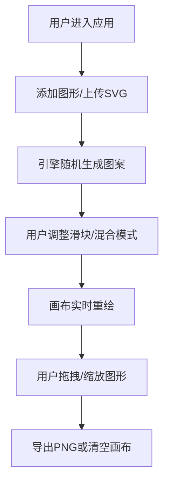

## 1. 产品概述

几何图案动态生成器是一款基于 Canvas API 的创意工具，帮助设计师和创意工作者快速生成视觉灵感素材和海报纹理。用户可通过上传 SVG 或添加基础几何图形，结合实时参数调节，探索无限的重叠图案可能性。

- 目标用户：平面设计师、创意工作者、视觉艺术爱好者
- 核心价值：降低创意探索门槛，快速产出高质量纹理素材

## 2. 核心功能

### 2.1 功能模块

1. **画布操作区**：几何图形渲染、拖拽、缩放、实时重绘
2. **控制面板**：参数滑块、混合模式选择、图形添加、导出功能
3. **图形引擎**：随机生成、变换计算、颜色混合、性能优化

### 2.2 功能详情

| 页面名称 | 模块名称 | 功能描述 |
|-----------|-------------|---------------------|
| 主页面 | 画布区域 | 3:2比例画布，支持200个以内图形的高性能渲染 |
| 主页面 | 图形添加 | 三种基础图形（矩形、圆形、三角形）按钮添加，SVG文件上传 |
| 主页面 | 密度滑块 | 范围5-50，控制图形分布数量，实时重绘 |
| 主页面 | 旋转滑块 | 范围0-360度，控制图形整体旋转范围 |
| 主页面 | 透明度滑块 | 范围0.1-1，控制图形透明度 |
| 主页面 | 混合模式 | multiply/screen/overlay等混合模式下拉切换 |
| 主页面 | 图形交互 | 拖拽移动、滚轮缩放、状态持久化 |
| 主页面 | 操作按钮 | 清空画布、导出PNG（与画布同分辨率） |

## 3. 核心流程

用户进入应用后，可通过按钮添加基础图形或上传SVG，系统随机生成重叠图案。通过滑块和下拉菜单实时调整参数，画布即时重绘。用户可拖拽单个图形微调位置，满意后导出PNG图片。

## 4. 用户界面设计

### 4.1 设计风格

- 主背景色：#1a1a2e（深邃夜空蓝）
- 霓虹强调色：#00d4ff（霓虹蓝）、#6c63ff（紫罗兰）
- 按钮风格：圆角胶囊形，脉冲光晕动画
- 控制面板：半透明毛玻璃效果（backdrop-filter），宽度300px
- 字体：现代无衬线字体，标题加粗，数值等宽

### 4.2 页面设计概览

| 页面名称 | 模块名称 | UI元素 |
|-----------|-------------|-------------|
| 主页面 | 画布区域 | 3:2比例，深色背景，图形带淡入弹性入场动画 |
| 主页面 | 控制面板 | 卡片式布局，滑块带霓虹高亮，按钮hover发光，混合模式切换颜色平滑过渡 |
| 主页面 | 响应式布局 | 桌面左右分栏，移动端控制面板折叠到底部 |

### 4.3 响应式

- 桌面端（≥768px）：左侧画布（flex:1）+ 右侧控制面板（300px固定宽度）
- 移动端（<768px）：画布占满上方，控制面板折叠到底部，画布自适应剩余高度
- 所有交互支持触摸操作

### 4.4 动画与动效

- 图形入场：淡入 + 轻微弹性伸缩（spring easing）
- 滑块交互：实时重绘无延迟，60fps流畅
- 按钮点击：脉冲光晕扩散动画
- 混合模式切换：图形颜色平滑过渡
