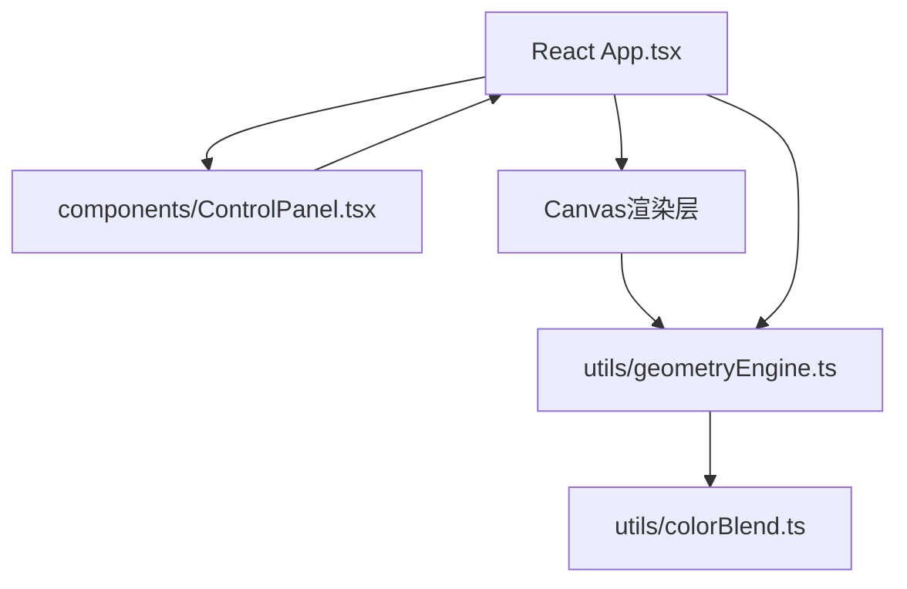

## 1. 架构设计



## 2. 技术说明

- 前端框架：React 18 + TypeScript
- 构建工具：Vite
- 渲染引擎：Canvas 2D API
- 状态管理：React useState/useRef（轻量场景，无需额外状态库）
- 样式方案：原生CSS + CSS变量（无UI库依赖）

## 3. 目录结构

```
project/
├── src/
│   ├── App.tsx              # 主组件，布局与状态管理
│   ├── components/
│   │   └── ControlPanel.tsx # 控制面板UI组件
│   └── utils/
│       ├── geometryEngine.ts # 图形生成、变换、渲染引擎
│       └── colorBlend.ts     # 颜色混合模式算法
├── index.html
├── package.json
├── vite.config.ts
└── tsconfig.json
```

## 4. 数据模型

### 4.1 图形数据结构

```typescript
interface Shape {
  id: string;
  type: 'rect' | 'circle' | 'triangle' | 'svg';
  x: number;           // 中心x坐标
  y: number;           // 中心y坐标
  width: number;
  height: number;
  rotation: number;    // 弧度
  scale: number;       // 缩放系数
  opacity: number;
  color: string;       // base color (hex/rgb)
  svgContent?: string; // SVG原始内容（如果是svg类型）
  animationPhase: number; // 入场动画进度 0-1
}
```

### 4.2 应用状态

```typescript
interface AppState {
  shapes: Shape[];
  density: number;       // 5-50
  rotationRange: number; // 0-360度
  opacity: number;       // 0.1-1
  blendMode: GlobalCompositeOperation; // multiply/screen/overlay等
  selectedShapeId: string | null;
}
```

## 5. 性能优化策略

1. **requestAnimationFrame**：所有重绘操作通过rAF调度，确保60fps
2. **脏矩形渲染**：滑块/拖拽时仅标记脏区域，但简单场景下全量重绘更优
3. **离屏Canvas**：预渲染静态SVG模板，避免重复解析
4. **防抖**：滑块快速变化时合并多次重绘请求（16ms窗口）
5. **对象池**：复用Shape对象，减少GC压力
6. **图形数量上限**：硬限制200个，超出时按密度缩减
