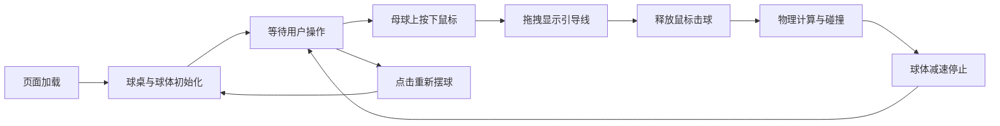

## 1. 产品概述

浏览器端2D台球对战游戏，基于Canvas实现真实物理碰撞模拟与交互式击球体验。
- 核心目的：在浏览器中实现多球体弹性碰撞、摩擦力减速及鼠标拖拽控制的真实台球物理模拟
- 目标用户：休闲游戏玩家、物理模拟爱好者
- 产品价值：无需安装，即开即玩的高品质网页台球游戏

## 2. 核心功能

### 2.1 功能模块

1. **游戏主界面**：球桌渲染、球体显示、碰撞光效、屏幕抖动反馈
2. **击球交互**：鼠标按下拖拽引导线、力度方向可视化、释放击球
3. **物理引擎**：弹性碰撞（动量守恒）、摩擦力衰减、边界反射
4. **数据统计**：实时碰撞次数计数、数字缩放动画
5. **重置控制**：重新摆球按钮，一键恢复初始状态

### 2.2 页面详情

| 页面名称 | 模块名称 | 功能描述 |
|-----------|-------------|---------------------|
| 游戏主页 | 球桌区域 | 绿色毛毡纹理背景的矩形球桌，木质边框包裹，容纳所有球体运动 |
| 游戏主页 | 顶部控制栏 | 半透明深色背景，左侧"重新摆球"按钮，右侧碰撞次数统计 |
| 游戏主页 | 球体系统 | 1个白色母球 + 8个彩色目标球，随机分布，独立半径/质量属性 |
| 游戏主页 | 交互反馈 | 半透明白色虚线引导线、碰撞白色闪光、击球屏幕抖动 |

## 3. 核心流程

用户打开页面 → 球桌与球体初始化完成 → 在母球上按下鼠标并拖拽 → 引导线实时显示方向和力度 → 释放鼠标触发击球 → 母球运动并与其他球体发生碰撞 → 所有球体在摩擦力作用下逐渐减速 → 用户可随时点击"重新摆球"重置游戏

## 4. 用户界面设计

### 4.1 设计风格
- **主色调**：深棕色 #4A2F1A（木质边框）、草绿色 #2E7D32（球桌毛毡）
- **强调色**：金色 #D4A017（按钮高光、统计数字）
- **辅助色**：白色 #FFFFFF（母球、引导线、碰撞光效）
- **按钮风格**：圆角矩形，金色边框，深棕底色，悬停金色高亮
- **布局风格**：全屏居中，最小宽度800px，移动端等比缩放
- **动画效果**：数字缩放动画（0.2s 1.2x→1x）、屏幕抖动（100ms）、碰撞闪光（150ms）

### 4.2 页面设计概述

| 页面名称 | 模块名称 | UI元素 |
|-----------|-------------|-------------|
| 游戏主页 | 球桌区域 | 深棕色木质边框+草绿色毛毡纹理背景，圆角矩形，居中显示 |
| 游戏主页 | 顶部控制栏 | 半透明深色背景（rgba(0,0,0,0.6)），左侧按钮，右侧统计 |
| 游戏主页 | 球体渲染 | 径向渐变填充，边缘高光，立体感呈现 |
| 游戏主页 | 引导线 | 半透明白色虚线（rgba(255,255,255,0.6)），末端小圆点标记 |
| 游戏主页 | 碰撞光效 | 白色径向渐变闪光，150ms渐隐 |

### 4.3 响应式设计
- 桌面端优先，页面最小宽度800px
- 移动端使用viewport等比缩放，保持游戏比例
- 鼠标事件与触摸事件兼容
