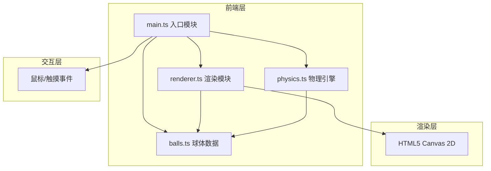

## 1. 架构设计



## 2. 技术描述
- **前端**：TypeScript + HTML5 Canvas + Vite
- **构建工具**：Vite 5.x
- **语言**：TypeScript（严格模式）
- **模块标准**：ESNext
- **无外部物理库**：所有碰撞逻辑手写实现
- **依赖**：vite、typescript（仅开发依赖）

## 3. 项目文件结构

| 文件路径 | 用途 |
|---------|------|
| `package.json` | 项目配置与依赖声明（vite、typescript） |
| `vite.config.js` | Vite构建配置，入口指向index.html |
| `tsconfig.json` | TypeScript严格模式配置，module为ESNext |
| `index.html` | 入口页面，全屏canvas容器与UI元素 |
| `src/balls.ts` | 球体数据类，定义位置/速度/半径/颜色/质量属性 |
| `src/physics.ts` | 物理引擎，弹性碰撞、摩擦力、边界反射 |
| `src/renderer.ts` | 渲染模块，球桌/球体/引导线/光效绘制 |
| `src/main.ts` | 应用入口，事件绑定，requestAnimationFrame主循环 |

## 4. 核心数据模型

### 4.1 球体数据结构

```typescript
interface Ball {
  x: number;           // 球心X坐标
  y: number;           // 球心Y坐标
  vx: number;          // X方向速度
  vy: number;          // Y方向速度
  radius: number;      // 半径（10-15像素）
  mass: number;        // 质量（与半径正相关）
  color: string;       // 球体颜色
  isCue: boolean;      // 是否为母球
}
```

### 4.2 碰撞光效结构

```typescript
interface CollisionEffect {
  x: number;
  y: number;
  startTime: number;
  duration: number;    // 150ms
}
```

### 4.3 游戏状态

```typescript
interface GameState {
  balls: Ball[];
  collisionCount: number;
  collisionEffects: CollisionEffect[];
  isDragging: boolean;
  dragStartX: number;
  dragStartY: number;
  dragCurrentX: number;
  dragCurrentY: number;
  screenShakeTime: number;  // 100ms
}
```

## 5. 物理算法说明

### 5.1 弹性碰撞（动量守恒）

两球碰撞时，基于质量和速度向量计算碰撞后速度：

```
// 碰撞法线向量
n = (x2 - x1, y2 - y1)
// 单位法线
un = n / |n|
// 单位切线
ut = (-un.y, un.x)

// 两球在法线和切线方向的速度分量
v1n = v1 · un, v1t = v1 · ut
v2n = v2 · un, v2t = v2 · ut

// 弹性碰撞后法线方向速度（动量守恒+动能守恒）
v1n' = ((m1 - m2) * v1n + 2 * m2 * v2n) / (m1 + m2)
v2n' = ((m2 - m1) * v2n + 2 * m1 * v1n) / (m1 + m2)

// 切线方向速度不变
v1' = v1n' * un + v1t * ut
v2' = v2n' * un + v2t * ut
```

### 5.2 摩擦力衰减

每帧速度乘以摩擦系数：
```
vx *= friction  // friction ≈ 0.99
vy *= friction
// 速度小于阈值时置零
if |v| < minVelocity: v = 0
```

### 5.3 边界反射

```
// 左右边界
if x - radius < left or x + radius > right:
    vx *= -1
    x = clamp(x, left + radius, right - radius)

// 上下边界
if y - radius < top or y + radius > bottom:
    vy *= -1
    y = clamp(y, top + radius, bottom - radius)
```
