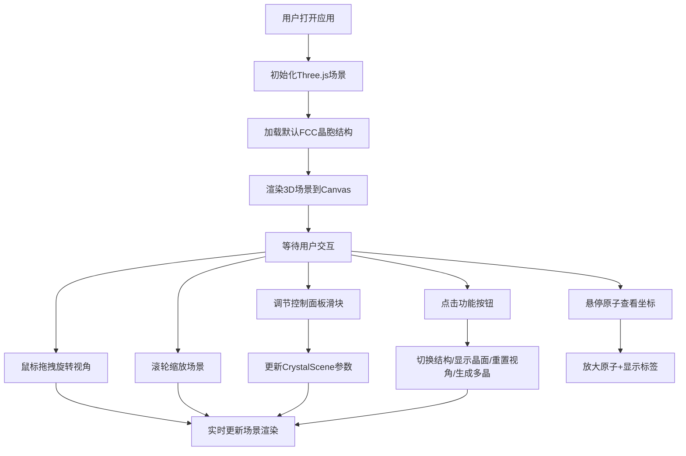

## 1. 产品概述

3D晶体结构可视化应用，面向化学/材料科学爱好者和学生，帮助用户直观理解复杂晶胞内的原子排列、晶面切割与对称性。通过交互式3D渲染，让抽象的晶体结构概念变得可感知、可操作。

- 核心价值：将传统教科书上的静态2D晶体图示转化为可旋转、可缩放、可交互的3D可视化体验
- 目标用户：化学、材料科学、物理学领域的学生、教师和爱好者

## 2. 核心功能

### 2.1 功能模块

1. **3D晶胞渲染模块**：面心立方(FCC)和体心立方(BCC)晶胞的实时3D渲染
2. **视角交互模块**：鼠标拖拽旋转、滚轮缩放、视角重置
3. **控制面板模块**：原子半径缩放、晶格透明度、旋转速度调节
4. **晶面切割模块**：(1,1,1)法向量晶面的显示/隐藏切换
5. **多晶生成模块**：3×3×3网格内随机多晶结构生成
6. **状态显示模块**：FPS计数、原子总数实时显示
7. **原子交互模块**：鼠标悬停放大并显示坐标标签

### 2.2 页面详情

| 页面名称 | 模块名称 | 功能描述 |
|---------|---------|---------|
| 主页面 | 3D场景区域 | 全屏Canvas渲染，深空蓝渐变背景，晶胞居中显示 |
| 主页面 | 控制面板 | 右上角浮动毛玻璃面板，含3个滑块和3个主按钮+多晶生成按钮 |
| 主页面 | 状态信息栏 | 底部10%区域显示FPS和原子总数 |
| 主页面 | 原子交互层 | 鼠标悬停时原子放大1.2倍并显示坐标标签 |

## 3. 核心流程

## 4. 用户界面设计

### 4.1 设计风格
- **主色调**：深空蓝渐变背景（#0A0E27 → #1A1F3A），青蓝色渐变强调色（#00D2FF → #3A7BD5）
- **原子配色**：角原子红色#E74C3C，面心原子蓝色#3498DB，多晶原子从12种高对比度色板随机选取
- **按钮风格**：半透明深灰背景（rgba(40,40,60,0.7)），悬停上移2px，点击缩放0.95
- **字体**：白色为主，12-14px，带黑色描边增强可读性
- **布局**：桌面端控制面板固定右上角（220px宽，距边缘20px），移动端堆叠底部可拖动折叠栏

### 4.2 视觉细节
- **控制面板**：backdrop-filter: blur(12px) 毛玻璃效果，圆角12px，边框白色半透明0.3
- **滑块**：轨道灰色#555，手柄青蓝色渐变，悬停放大1.1倍
- **晶胞框架**：半透明银灰色线条，线宽1px，抗锯齿渲染
- **原子材质**：roughness=0.3，metalness=0.1，带微弱glossiness效果
- **晶面平面**：半透明淡紫色，法向量(1,1,1)
- **过渡动画**：所有UI状态变化使用0.2-0.3s ease-out过渡

### 4.3 页面设计概述

| 页面名称 | 模块名称 | UI元素 |
|---------|---------|---------|
| 主页面 | 3D场景 | 全屏Canvas，深空蓝渐变背景，抗锯齿渲染，居中晶胞 |
| 主页面 | 控制面板 | 毛玻璃面板，圆角12px，3个滑块+4个按钮，标签+数值显示 |
| 主页面 | 状态栏 | 底部10%区域，FPS计数，原子总数，白色14px字体 |
| 主页面 | 原子标签 | 悬停时显示，白色12px字体，0.5px黑色描边 |

### 4.4 响应式设计
- **桌面端**（≥768px）：控制面板固定于右上角，宽度220px，距边缘20px
- **移动端**（<768px）：控制面板堆叠在底部，形成可拖动的折叠式控制栏，触摸优化交互

### 4.5 3D场景指导
- **环境**：深空蓝渐变背景，营造科技感和沉浸感
- **光照**：环境光+方向光组合，确保原子表面有足够的光泽和立体感
- **相机**：PerspectiveCamera，初始视角能完整观察晶胞，支持OrbitControls自由旋转
- **交互**：OrbitControls实现拖拽旋转、滚轮缩放（0.5x-3x范围）
- **渲染优化**：启用抗锯齿，使用InstancedMesh优化大量原子渲染，保证50+ FPS
- **性能目标**：500原子≥50FPS，1000原子≥30FPS，内存≤300MB，交互延迟<50ms
