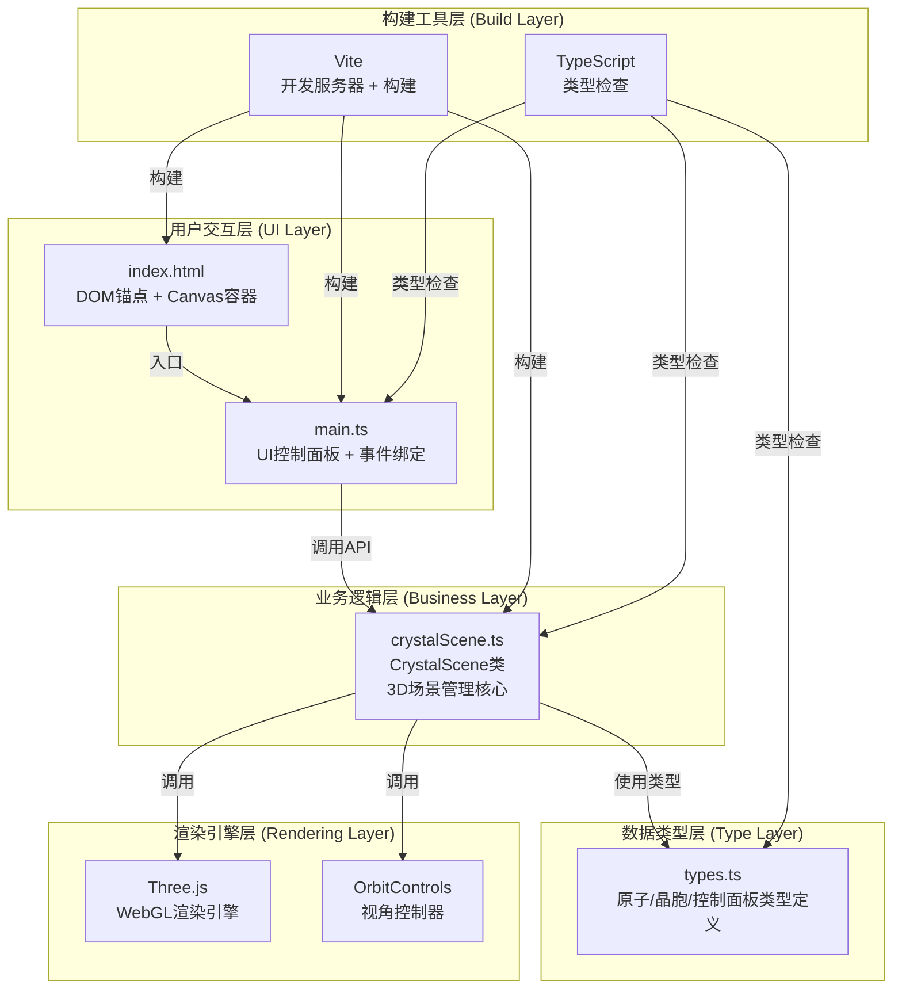

## 1. 架构设计



## 2. 技术选型

| 技术 | 版本/说明 | 用途 |
|-----|----------|------|
| TypeScript | ESNext模块，严格模式 | 类型安全的应用开发 |
| Three.js | ^0.160.0 | WebGL 3D渲染引擎 |
| @types/three | ^0.160.0 | Three.js TypeScript类型定义 |
| Vite | ^5.0.0 | 开发服务器与构建工具，端口8080 |

## 3. 文件结构

```
auto203/
├── .trae/documents/
│   ├── PRD.md                    # 产品需求文档
│   └── TECHNICAL_ARCHITECTURE.md # 技术架构文档
├── src/
│   ├── main.ts                   # 应用入口，UI初始化与事件绑定
│   ├── crystalScene.ts           # 核心3D场景管理类
│   └── types.ts                  # 类型定义
├── index.html                    # 入口页面
├── package.json                  # 项目依赖与脚本
├── vite.config.js                # Vite构建配置
└── tsconfig.json                 # TypeScript配置
```

## 4. 核心模块设计

### 4.1 类型定义 (types.ts)

```typescript
// 原子数据结构
interface Atom {
  position: { x: number; y: number; z: number };
  radius: number;
  color: string;
  type: 'corner' | 'face' | 'body' | 'random';
}

// 晶胞参数
interface LatticeParams {
  size: number;
  opacity: number;
  lineWidth: number;
  color: string;
}

// 晶体结构类型
type StructureType = 'FCC' | 'BCC' | 'POLY';

// 控制面板状态
interface ControlPanelState {
  atomRadiusScale: number;   // 0.5 - 1.5
  latticeOpacity: number;    // 0.1 - 1.0
  rotationSpeed: number;     // 0 - 5 度/秒
  showCrystalPlane: boolean;
  currentStructure: StructureType;
}

// 多晶配置
interface PolyCrystalConfig {
  gridSize: number;    // 3x3x3
  minAtomsPerGrain: number;
  maxAtomsPerGrain: number;
}
```

### 4.2 CrystalScene 类 (crystalScene.ts)

公共方法：
| 方法 | 参数 | 说明 |
|-----|------|------|
| `constructor(container: HTMLElement)` | DOM容器元素 | 初始化场景、相机、渲染器、控制器 |
| `setAtomRadiusScale(scale: number)` | 缩放系数 0.5-1.5 | 实时更新所有原子半径 |
| `setLatticeOpacity(opacity: number)` | 透明度 0.1-1.0 | 实时更新晶胞框架透明度 |
| `setRotationSpeed(speed: number)` | 速度 度/秒 | 设置自动旋转速度 |
| `toggleStructure()` | 无 | 在FCC和BCC之间切换 |
| `toggleCrystalPlane()` | 无 | 显示/隐藏(1,1,1)晶面 |
| `resetCamera()` | 无 | 重置视角到初始位置 |
| `generatePolyCrystal()` | 无 | 生成3x3x3随机多晶结构 |
| `getAtomCount()` | 无 | 返回当前原子总数 |
| `render()` | 无 | 主动触发一次渲染 |
| `dispose()` | 无 | 清理资源 |

内部实现要点：
- 使用 `InstancedMesh` 批量渲染同色原子以优化性能
- `Raycaster` 实现原子悬停检测与坐标标签显示
- 帧循环中集成 FPS 计数器
- 原子材质使用 `MeshStandardMaterial` (roughness=0.3, metalness=0.1)

### 4.3 应用入口 (main.ts)

职责：
1. 创建控制面板DOM元素与样式
2. 绑定滑块、按钮事件
3. 实例化 CrystalScene
4. 数据流向：用户操作 → 更新状态 → 调用 CrystalScene API → 场景更新
5. 响应式布局：检测窗口宽度 < 768px 时切换为移动端布局

### 4.4 入口页面 (index.html)

包含：
- 全屏 Canvas 容器 (`#scene-container`)
- 控制面板 DOM 锚点 (`#control-panel`)
- 状态栏 DOM 锚点 (`#status-bar`)
- 原子标签 DOM 锚点 (`#atom-label`)

## 5. 性能优化策略

| 优化点 | 实现方式 | 预期效果 |
|-------|---------|---------|
| 原子批量渲染 | 使用 `THREE.InstancedMesh` 合并同色原子的绘制调用 | 500+原子仍保持高帧率 |
| 几何复用 | 原子球体使用单一 `SphereGeometry` 实例共享 | 减少内存占用 |
| 材质复用 | 相同颜色原子共享 `MeshStandardMaterial` 实例 | 降低GPU状态切换开销 |
| 抗锯齿 | WebGLRenderer `antialias: true` + `pixelRatio` 适配 | 线条清晰无锯齿 |
| 帧率控制 | `requestAnimationFrame` 自动适配显示器刷新率 | 稳定55+ FPS |
| 射线检测优化 | 仅在鼠标移动时进行 `Raycaster` 检测 | 降低CPU占用 |

## 6. UI交互规范

| 交互元素 | 状态 | 样式 |
|---------|------|------|
| 滑块手柄 | 默认 | 青蓝色渐变 (#00D2FF → #3A7BD5) |
| 滑块手柄 | 悬停 | 放大1.1倍 |
| 按钮 | 默认 | rgba(40,40,60,0.7), transition 0.2s ease-out |
| 按钮 | 悬停 | rgba(60,60,90,0.9), translateY(-2px) |
| 按钮 | 点击 | transform: scale(0.95) |
| 晶面切换 | 状态变化 | 0.3s淡入淡出 |
| 原子 | 悬停 | 放大至1.2倍 + 显示坐标标签 |

## 7. 色彩规范

| 用途 | 颜色值 |
|-----|-------|
| 背景渐变起始 | #0A0E27 |
| 背景渐变结束 | #1A1F3A |
| 角原子 (FCC) | #E74C3C |
| 面心原子 (FCC) | #3498DB |
| 体心原子 (BCC) | #2ECC71 |
| 晶胞框架 | rgba(192, 192, 192, opacity) |
| 晶面平面 | rgba(180, 150, 255, 0.3) 淡紫色 |
| 滑块轨道 | #555 |
| 滑块手柄渐变 | #00D2FF → #3A7BD5 |
| 文字主色 | #FFFFFF |
| 文字次色 | #AAAAAA |

### 多晶12色调色板
```typescript
const POLY_PALETTE = [
  '#E74C3C', '#3498DB', '#2ECC71', '#F39C12',
  '#9B59B6', '#1ABC9C', '#E67E22', '#34495E',
  '#FF6B9D', '#00D2FF', '#FFD93D', '#6BCB77'
];
```

## 8. 构建与开发

| 命令 | 说明 |
|-----|------|
| `npm install` | 安装所有依赖 |
| `npm run dev` | 启动Vite开发服务器 (端口8080) |
