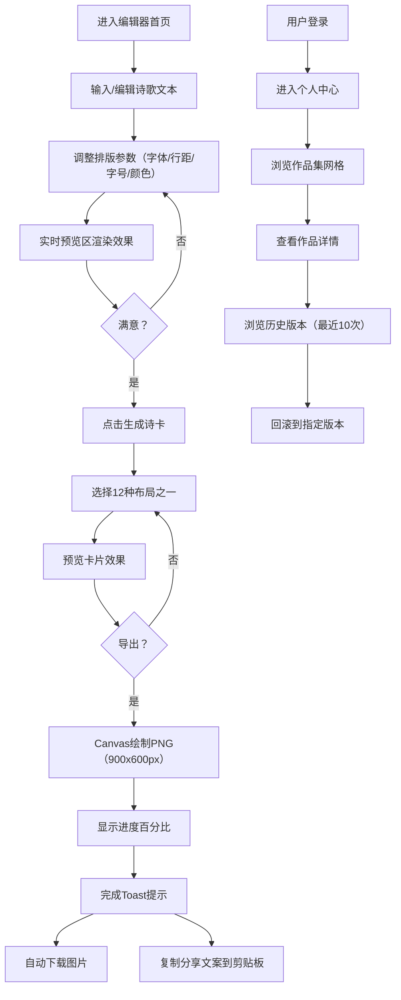

## 1. 产品概述

诗韵工坊是一款为小型独立出版社设计的在线诗歌创作与排版全栈Web应用，为诗人与编辑提供协作编辑、古典风格排版、精美诗卡导出与作品集管理的一体化解决方案。

- 核心价值：让诗歌创作与排版变得简单优雅，一键生成专业级诗歌分享卡片
- 目标用户：独立诗人、文学编辑、小型独立出版社

## 2. 核心功能

### 2.1 用户角色

| 角色 | 注册方式 | 核心权限 |
|------|----------|----------|
| 普通用户 | 邮箱注册 | 创作诗歌、排版编辑、导出诗卡、管理作品集 |
| 游客 | 无需注册 | 使用编辑器基础功能、预览排版（作品不保存） |

### 2.2 功能模块

1. **诗歌编辑器首页**：左侧排版工具栏、右侧实时预览区、羊皮纸纹理背景、行号显示
2. **诗卡生成模态框**：12种预制布局、自动适配文字、毛玻璃效果
3. **导出分享模块**：Canvas分层绘制PNG、进度状态栏、Toast提示、一键复制分享文案
4. **个人中心**：作品集网格展示、作品详情、历史版本记录与回滚
5. **模板市场**：预设排版模板浏览与应用
6. **顶栏导航系统**：滚动自适应、半透明渐变、用户状态指示

### 2.3 页面详情

| 页面名称 | 模块名称 | 功能描述 |
|----------|----------|----------|
| 编辑器首页 | 左侧工具栏 | 字体选择（衬线/无衬线/手写体）、行距滑块（1.2-2.0）、字号滑块（12-36px）、6种主题色、保存模板按钮 |
| 编辑器首页 | 右侧预览区 | 自适应宽度（400-800px）、羊皮纸纹理背景、逐行行号、500ms内实时更新、0.3s平滑过渡 |
| 诗卡模态框 | 布局选择器 | 12种布局（竖排书法/横排极简/复古蜡封/水彩花卉等）、渐变色背景、装饰元素、自动适配文字字号 |
| 导出模块 | 图片生成 | 900x600px PNG、Canvas分层绘制（纹理→装饰→文字→水印）、进度百分比显示 |
| 导出模块 | 分享反馈 | 底部状态栏进度、完成Toast（绿色#A6E3A1，2s）、自动下载、复制分享文案到剪贴板 |
| 个人中心 | 作品集网格 | 220x320px卡片、悬停上浮5px、投影增强、移除延迟100ms |
| 个人中心 | 版本历史 | 最近10次修改、时间戳、差异摘要、一键回滚 |
| 顶栏导航 | 导航栏 | Logo、导航链接（编辑器/个人中心/模板市场）、用户头像（在线绿点#00FF88）、滚动自适应（60px→40px，透明度90%→70%） |

## 3. 核心流程

用户打开首页进入诗歌编辑器，在左侧工具栏调整排版参数，右侧实时预览诗歌效果。调整满意后，点击"生成诗卡"按钮打开模态框，选择12种布局之一预览卡片效果。确认后点击"导出分享"，系统通过Canvas绘制PNG图片，显示进度条，完成后自动下载图片并复制分享文案。已登录用户可在个人中心查看作品集，浏览作品历史版本并回滚到任意版本。

## 4. 用户界面设计

### 4.1 设计风格

- **主色调**：深色背景 #1E1E2E，主文字 #CDD6F4
- **强调色系**：浅金 #F5E6CA、玫瑰红 #E8A2B0、墨绿 #4A7C59、藏蓝 #2B3A67、赭石 #8B5E3C、石墨灰 #5A5A6E
- **按钮样式**：圆角矩形、悬停微放大、点击反馈、0.3s过渡动画
- **字体方案**：衬线体（宋体/Noto Serif SC）、无衬线体（思源黑体）、手写体（Ma Shan Zheng/书法字体）
- **布局风格**：左右分栏编辑器、卡片式作品集、固定顶栏导航
- **装饰元素**：羊皮纸纹理（CSS伪元素）、毛玻璃效果（backdrop-filter: blur 12px）、平滑过渡动画

### 4.2 页面设计概述

| 页面名称 | 模块名称 | UI元素 |
|----------|----------|--------|
| 编辑器首页 | 整体布局 | 深色背景#1E1E2E、左右两栏、间距24px |
| 编辑器首页 | 左侧工具栏 | 垂直排列控件组、滑块样式统一、颜色预设色块、分组标题#A6ADC8 |
| 编辑器首页 | 右侧预览区 | 羊皮纸纹理、自适应宽度、行号左侧显示（小字#888）、阴影柔和 |
| 诗卡模态框 | 背景蒙层 | 半透明黑色#00000080、毛玻璃blur(12px) |
| 诗卡模态框 | 布局选择 | 12个缩略图网格、选中态金色边框#F5E6CA、悬停放大1.05倍 |
| 导出模块 | 状态栏 | 底部固定、进度条动画、百分比文字 |
| 导出模块 | Toast提示 | 从顶部下滑、背景#A6E3A1、文字#1E1E2E、2s后淡出 |
| 个人中心 | 作品集网格 | CSS Grid布局、gap 24px、卡片圆角8px |
| 顶栏导航 | 导航栏 | 固定定位top:0、z-index:100、渐变透明度背景 |

### 4.3 响应式设计

- **桌面端（1200px以上）**：左右分栏布局，预览区居中自适应
- **平板端（768-1200px）**：工具栏宽度压缩，预览区自适应
- **移动端（768px以下）**：工具栏变为底部浮动栏（高度60px，横向滚动），预览区全屏显示，文字自动缩放适配

### 4.4 性能要求

- 顶栏滚动渲染帧率 ≥ 50fps
- 平均200字诗歌导出PNG耗时 ≤ 2秒
- 编辑器预览更新延迟 ≤ 500ms
- 所有过渡动画使用CSS transition（all 0.3s ease）确保流畅
