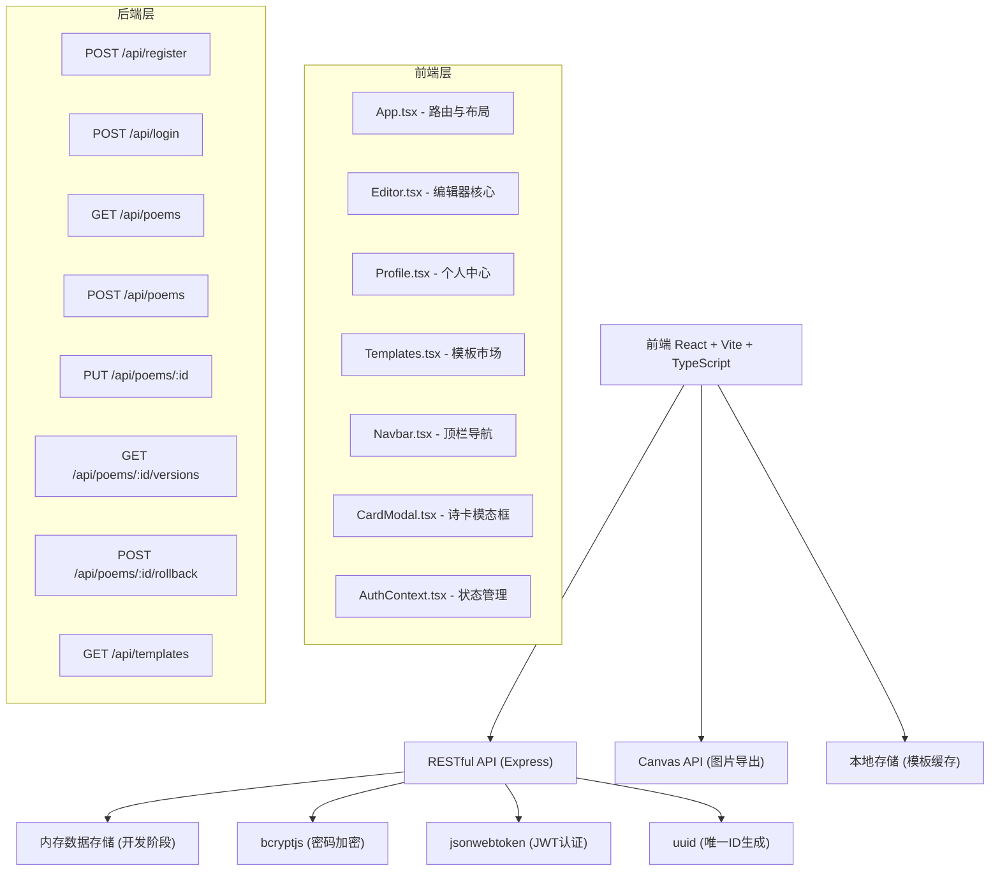
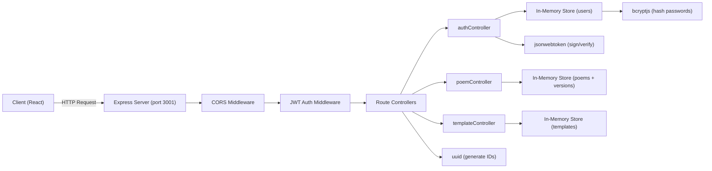
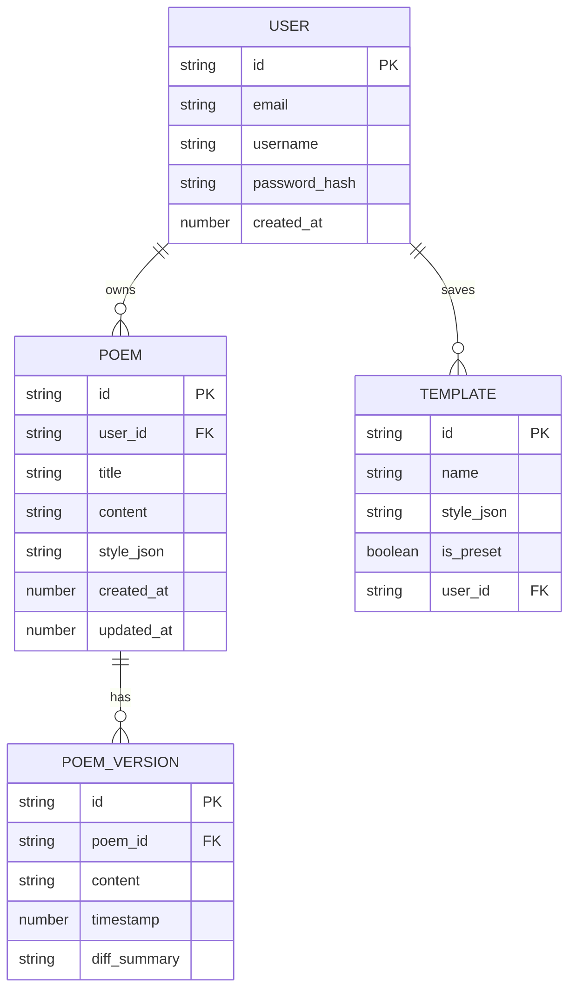

## 1. 架构设计



## 2. 技术说明

- **前端**：React@18 + TypeScript + Vite@5
- **后端**：Express@4 + Node.js
- **样式**：原生CSS（CSS变量 + 响应式媒体查询）
- **认证**：JWT (jsonwebtoken) + bcryptjs 密码加密
- **图片处理**：Canvas API（前端渲染900x600px PNG）
- **ID生成**：uuid
- **数据存储**：开发阶段使用内存存储（后续可替换为数据库）
- **构建工具**：Vite（开发端口3000，代理/api到后端3001）

## 3. 路由定义

| 路由 | 用途 | 组件 |
|------|------|------|
| / | 诗歌编辑器首页 | Editor.tsx |
| /profile | 个人中心（作品集管理） | Profile.tsx |
| /templates | 模板市场 | Templates.tsx |
| /login | 用户登录 | Login.tsx |
| /register | 用户注册 | Register.tsx |

## 4. API 定义

### 4.1 类型定义

```typescript
interface User {
  id: string;
  email: string;
  username: string;
  password: string;
  createdAt: number;
}

interface Poem {
  id: string;
  userId: string;
  title: string;
  content: string;
  style: {
    fontFamily: string;
    fontSize: number;
    lineHeight: number;
    color: string;
  };
  versions: PoemVersion[];
  createdAt: number;
  updatedAt: number;
}

interface PoemVersion {
  id: string;
  content: string;
  timestamp: number;
  diffSummary: string;
}

interface Template {
  id: string;
  name: string;
  style: {
    fontFamily: string;
    fontSize: number;
    lineHeight: number;
    color: string;
  };
  isPreset: boolean;
  userId?: string;
}

interface CardLayout {
  id: string;
  name: string;
  background: {
    type: 'gradient' | 'solid' | 'texture';
    colors: string[];
  };
  orientation: 'vertical' | 'horizontal';
  decoration: string;
  padding: number;
}
```

### 4.2 请求/响应模式

**POST /api/register**
```json
Request: { "email": "string", "username": "string", "password": "string" }
Response: { "token": "jwt_string", "user": { "id": "", "email": "", "username": "" } }
```

**POST /api/login**
```json
Request: { "email": "string", "password": "string" }
Response: { "token": "jwt_string", "user": { "id": "", "email": "", "username": "" } }
```

**GET /api/poems** (需JWT)
```json
Response: [{ "id": "", "title": "", "content": "", "style": {}, "updatedAt": 0 }]
```

**POST /api/poems** (需JWT)
```json
Request: { "title": "", "content": "", "style": {} }
Response: { "id": "", "title": "", "content": "", "style": {}, "versions": [] }
```

**PUT /api/poems/:id** (需JWT)
```json
Request: { "title": "", "content": "", "style": {} }
Response: { "id": "", "title": "", "content": "", "style": {}, "versions": [] }
```

**GET /api/poems/:id/versions** (需JWT)
```json
Response: [{ "id": "", "timestamp": 0, "diffSummary": "" }]
```

**POST /api/poems/:id/rollback** (需JWT)
```json
Request: { "versionId": "" }
Response: { "id": "", "content": "", "style": {} }
```

**GET /api/templates**
```json
Response: [{ "id": "", "name": "", "style": {}, "isPreset": true }]
```

## 5. 服务器架构图



## 6. 数据模型

### 6.1 实体关系图



### 6.2 初始化数据

```javascript
// 预设模板
const presetTemplates = [
  {
    id: 'tpl-1',
    name: '经典宋体',
    style: { fontFamily: 'serif', fontSize: 18, lineHeight: 1.8, color: '#1E1E2E' },
    isPreset: true
  },
  {
    id: 'tpl-2',
    name: '现代黑体',
    style: { fontFamily: 'sans-serif', fontSize: 16, lineHeight: 1.6, color: '#2B3A67' },
    isPreset: true
  },
  {
    id: 'tpl-3',
    name: '优雅手写',
    style: { fontFamily: 'cursive', fontSize: 20, lineHeight: 2.0, color: '#8B5E3C' },
    isPreset: true
  }
];

// 12种诗卡布局
const cardLayouts = [
  { id: 'layout-1', name: '竖排书法', background: { type: 'gradient', colors: ['#2D1B4E', '#1A3A3A'] }, orientation: 'vertical', decoration: 'brush', padding: 60 },
  { id: 'layout-2', name: '横排极简', background: { type: 'gradient', colors: ['#FFF5E6', '#FDEBD0'] }, orientation: 'horizontal', decoration: 'none', padding: 80 },
  { id: 'layout-3', name: '复古蜡封', background: { type: 'gradient', colors: ['#8B4513', '#654321'] }, orientation: 'horizontal', decoration: 'wax-seal', padding: 50 },
  { id: 'layout-4', name: '水彩花卉', background: { type: 'gradient', colors: ['#FFE4E1', '#FFB6C1'] }, orientation: 'vertical', decoration: 'flowers', padding: 55 },
  { id: 'layout-5', name: '深夜墨蓝', background: { type: 'gradient', colors: ['#0F0C29', '#302B63'] }, orientation: 'horizontal', decoration: 'stars', padding: 70 },
  { id: 'layout-6', name: '暖茶羊皮', background: { type: 'gradient', colors: ['#F5E6CA', '#E8D4A8'] }, orientation: 'horizontal', decoration: 'parchment', padding: 65 },
  { id: 'layout-7', name: '翡翠绿意', background: { type: 'gradient', colors: ['#134E5E', '#71B280'] }, orientation: 'vertical', decoration: 'leaves', padding: 60 },
  { id: 'layout-8', name: '玫瑰金粉', background: { type: 'gradient', colors: ['#E8A2B0', '#F5E6CA'] }, orientation: 'vertical', decoration: 'rose', padding: 55 },
  { id: 'layout-9', name: '几何线条', background: { type: 'gradient', colors: ['#2C3E50', '#4CA1AF'] }, orientation: 'horizontal', decoration: 'geometric', padding: 75 },
  { id: 'layout-10', name: '赭石古韵', background: { type: 'gradient', colors: ['#8B5E3C', '#D4A574'] }, orientation: 'vertical', decoration: 'ancient', padding: 50 },
  { id: 'layout-11', name: '石墨灰白', background: { type: 'gradient', colors: ['#232526', '#414345'] }, orientation: 'horizontal', decoration: 'minimal', padding: 80 },
  { id: 'layout-12', name: '藏蓝经典', background: { type: 'gradient', colors: ['#141E30', '#243B55'] }, orientation: 'vertical', decoration: 'classic', padding: 65 }
];
```
