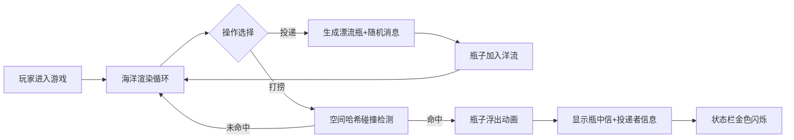

## 1. 产品概述

像素风漂流瓶通信模拟器——基于浏览器的Canvas游戏，玩家在动态生成的海洋地图上投递和打捞漂流瓶，瓶中信由本地词库随机组合生成诗歌风格信息，形成异步社交体验。

- 目标用户：独立游戏爱好者、喜欢休闲社交体验的玩家
- 产品价值：通过像素艺术风格和随机生成机制，创造治愈系的数字漂流瓶体验

## 2. 核心功能

### 2.1 功能模块

1. **海洋渲染系统**：动态波浪生成、泡沫粒子、洋流方向与强度
2. **漂流瓶系统**：像素风格瓶子渲染、浮力动画、投递与打捞交互
3. **消息生成系统**：词库随机组合生成诗歌风格内容、投递者昵称生成
4. **状态UI系统**：底部状态栏、洋流强度显示、打捞成功反馈动画

### 2.2 功能详情

| 模块名称 | 子功能 | 功能描述 |
|---------|--------|---------|
| 海洋渲染 | 动态波浪 | 正弦波叠加生成800x600px动态海面，颜色浅蓝#87CEEB到深蓝#1E90FF渐变 |
| 海洋渲染 | 泡沫粒子 | 随机分布白色泡沫，半径2-5px，透明度0.3-0.7 |
| 海洋渲染 | 洋流系统 | 每帧更新洋流方向和强度（1-10级），驱动漂流瓶移动 |
| 漂流瓶 | 投递 | 海岸线左侧点击投递，生成20x30px像素瓶（瓶身#DEB887，瓶塞#8B4513） |
| 漂流瓶 | 打捞 | 任意位置点击打捞，距离<40px时命中，瓶子旋转浮出水面动画 |
| 漂流瓶 | 浮力 | 瓶子随波浪起伏漂浮，随洋流漂动 |
| 消息系统 | 词库 | 内置100个常用词，随机组合3-5个词生成诗歌 |
| 消息系统 | 昵称 | 随机生成2-3汉字投递者昵称 |
| 消息系统 | 打捞计数 | 同一瓶子多次打捞显示"第X次被捞起" |
| UI系统 | 状态栏 | 底部50px高半透明白色栏，显示洋流强度、漂浮瓶数、打捞次数 |
| UI系统 | 反馈 | 打捞成功时状态栏闪烁金色边框#FFD700持续2秒 |

## 3. 核心流程

玩家进入游戏 → 观看动态海洋 → 点击"投递"按钮生成漂流瓶 → 瓶子随洋流漂浮 → 点击海洋任意位置尝试打捞 → 命中则显示瓶中信内容和投递者信息 → 状态栏更新计数

## 4. 用户界面设计

### 4.1 设计风格

- **像素艺术风格**：8位色盘，限12种颜色
- **主色调**：浅蓝#87CEEB、深蓝#1E90FF、沙黄#F4D03F、棕色#DEB887
- **字体**：系统monospace，字号14px
- **按钮**：透明背景，悬停半透明白#FFFFFF 0.6，点击平移1px下压动画
- **海岸线**：左侧50px宽渐变沙黄#F4D03F到#E59866

### 4.2 页面布局

| 区域 | 位置 | 元素 |
|-----|------|------|
| Canvas游戏区 | 顶部主体 | 800x600px像素海洋、漂流瓶、泡沫粒子 |
| 操作按钮区 | 海岸线上方 | "投递"按钮 |
| 底部状态栏 | Canvas下方50px | 洋流强度、漂浮瓶数、打捞成功次数 |

### 4.3 响应式设计

- 桌面端：Canvas 800x600px，状态栏水平排列
- 移动端（<600px）：Canvas等比缩放适配屏幕宽度（保持16:9），状态栏垂直堆叠

## 5. 性能要求

- 游戏循环稳定60FPS（requestAnimationFrame）
- 波浪更新每帧计算量≤2ms
- 空间哈希网格优化打捞检测
- 最多同时50个漂浮瓶子无卡顿
