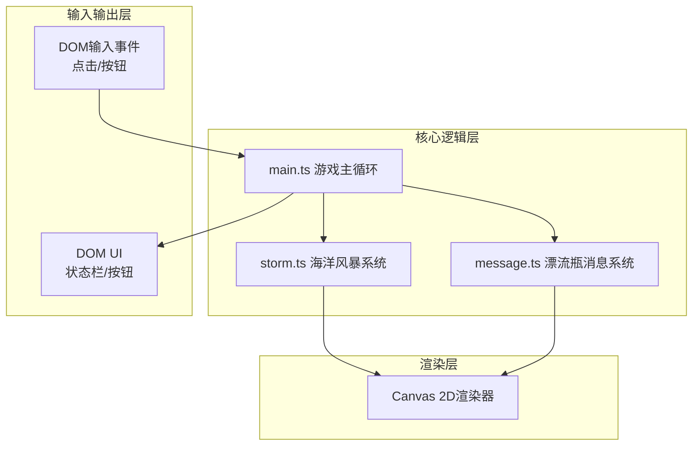

## 1. 架构设计



## 2. 技术选型

- **前端框架**：原生HTML/CSS + TypeScript（无框架）
- **构建工具**：Vite 5.x
- **渲染引擎**：Canvas 2D API
- **模块系统**：ES Modules

## 3. 文件结构与调用关系

```
├── package.json           # 依赖与脚本配置
├── vite.config.js         # Vite构建配置
├── tsconfig.json          # TypeScript严格模式配置
├── index.html             # 入口页面（Canvas容器+状态栏锚点）
└── src/
    ├── main.ts            # 游戏主入口 [调度中心]
    │   ├─ 导入 storm.ts   # → 获取波浪/泡沫/洋流数据
    │   ├─ 导入 message.ts # → 获取瓶子位置/内容
    │   └─ 输出到 Canvas渲染 + DOM UI更新
    ├── storm.ts           # 海洋风暴系统 [数据生产者]
    │   └─ 输出: WaveVertex[], FoamParticle[], OceanCurrent
    └── message.ts         # 漂流瓶消息系统 [状态管理者]
        ├─ 词库: string[]
        ├─ 瓶子池: Bottle[]
        └─ 空间哈希: SpatialHashGrid
```

### 数据流向说明

1. **输入流**：DOM事件 → main.ts → 分发给message.ts（投递/打捞）
2. **海洋数据流**：main.ts(时间增量) → storm.ts.update() → 输出波浪顶点+泡沫+洋流 → main.ts渲染
3. **瓶子数据流**：message.ts → 洋流数据驱动瓶子位置更新 → main.ts渲染瓶子
4. **UI数据流**：main.ts收集状态 → 更新DOM状态栏

## 4. 核心数据结构

```typescript
// storm.ts 输出类型
interface WaveVertex { x: number; y: number; }
interface FoamParticle { x: number; y: number; radius: number; alpha: number; }
interface OceanCurrent { dx: number; dy: number; strength: number; }

// message.ts 核心类型
interface Bottle {
  id: string;
  x: number;
  y: number;
  rotation: number;
  floatPhase: number;
  state: 'floating' | 'salvaged' | 'salvaging';
  content: string;
  senderName: string;
  sentTime: number;
  salvageCount: number;
  salvageAnimation?: { progress: number };
}
```

## 5. 性能优化方案

1. **波浪计算优化**：预计算正弦波参数，每帧仅更新相位偏移，顶点数限制为100个
2. **空间哈希网格**：将Canvas划分为40x40px网格，瓶子注册到对应网格单元，打捞时仅检测相邻9格
3. **对象池**：瓶子和泡沫粒子采用对象池复用，避免频繁GC
4. **渲染分层**：静态海岸线预渲染到离屏Canvas
