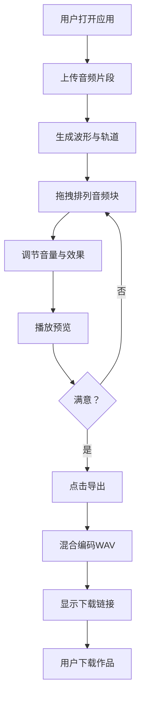

## 1. 产品概述

CyberMix Studio 是一款为独立音乐人设计的在线协作混音工作台Web应用，让音乐人可以在浏览器中完成多轨音频的录制、编辑、混音与导出工作，无需安装专业DAW软件即可创作完整音乐作品。

- 面向独立音乐人、制作人、播客创作者等非专业混音工程师群体
- 降低音乐制作门槛，提供简洁直观的赛博朋克风格操作界面
- 核心价值：随时随地、浏览器即用、零配置启动音乐创作

---

## 2. 核心功能

### 2.1 用户角色

| 角色 | 注册方式 | 核心权限 |
|------|----------|----------|
| 独立音乐人 | 无需注册，直接使用 | 上传音频、编辑轨道、混音、导出作品 |

### 2.2 功能模块

1. **混音工作台主页**：玻璃质感混音面板、工具栏、轨道列表、波形时间线、全局控制面板
2. **音频轨道管理**：轨道创建、颜色标记、音量调节、效果器、文字注释
3. **波形时间线编辑**：音频块拖拽、对齐网格、播放头定位、滚动缩放
4. **音频引擎**：音频播放、实时混音、效果处理、WAV编码导出
5. **文件管理**：音频上传、WAV作品导出下载

### 2.3 页面详情

| 页面名称 | 模块名称 | 功能描述 |
|----------|----------|----------|
| 混音工作台 | 顶部工具栏 | 上传音频按钮、播放/暂停控制、导出按钮 |
| 混音工作台 | 左侧轨道列表 | 轨道颜色指示器、音量推子、效果器按钮、注释编辑 |
| 混音工作台 | 右侧波形时间线 | Canvas波形渲染、音频块拖拽、1/4拍网格、播放头高亮、滚动缩放 |
| 混音工作台 | 底部全局控制面板 | 总时长显示、当前时间(mm:ss:ms)、轨道数、主音量旋钮(Canvas绘制) |
| 混音工作台 | 导出进度弹窗 | 渐变进度条、完成提示音、下载链接 |

---

## 3. 核心流程

用户打开应用 → 上传音频片段（支持多文件）→ 系统自动生成波形并创建轨道 → 用户拖拽音频块到时间线排列 → 调节各轨道音量与效果参数 → 添加轨道注释与颜色标记 → 点击播放预览混音效果 → 满意后点击导出 → 系统实时混合编码为WAV → 显示下载链接并播放完成提示音 → 用户下载作品

---

## 4. 用户界面设计

### 4.1 设计风格

- **主色调**：深灰蓝背景 `#1E1E2E`，轨道交替背景 `#2A2A3E` / `#252538`
- **霓虹点缀色**：电光蓝 `#00D4FF`、霓虹紫 `#B026FF`、草莓粉 `#FF6B9D` 等12种预设
- **玻璃质感面板**：`backdrop-filter: blur(10px)`，背景 `rgba(255,255,255,0.1)`
- **按钮风格**：圆角矩形，悬停时霓虹光晕 `box-shadow: 0 0 8px 当前元素颜色`
- **字体选择**：标题使用 Orbitron（赛博朋克风格），正文使用 JetBrains Mono（等宽数字显示）
- **布局方式**：固定三栏布局（左轨道+中时间线+底部控制），桌面端优先
- **交互动效**：旋钮旋转阻尼感、滑块数值提示气泡、播放头发光、波形渐变填充

### 4.2 页面设计概述

| 页面名称 | 模块名称 | UI元素 |
|----------|----------|--------|
| 混音工作台 | 玻璃面板 | 半透明白底+毛玻璃模糊、圆角16px、霓虹边框发光 |
| 混音工作台 | 轨道列表 | 颜色圆点指示器、交替行背景、水平音量滑块、效果器按钮组 |
| 混音工作台 | 波形时间线 | Canvas绘制振幅渐变波形、半透明灰色虚线网格、白色发光播放头 |
| 混音工作台 | 主音量旋钮 | Canvas绘制圆形旋钮、270°旋转范围、白色三角指针、整数刻度吸附 |
| 混音工作台 | 导出进度条 | 线性渐变 `#00D4FF → #B026FF`、百分比文字居中 |

### 4.3 响应式

- 桌面端优先设计（最小宽度1280px）
- 时间线区域可横向滚动，轨道区域固定宽度280px
- 触摸设备支持双指缩放时间线

### 4.4 性能指标

- 时间线滚动与波形渲染：稳定60fps
- 音频重采样与混合计算延迟：≤500ms
- 波形渲染使用离屏Canvas缓存优化
