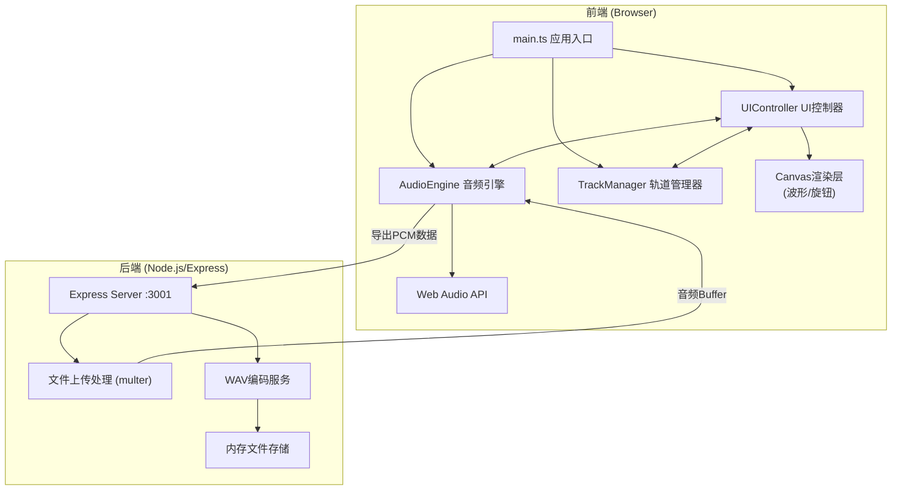
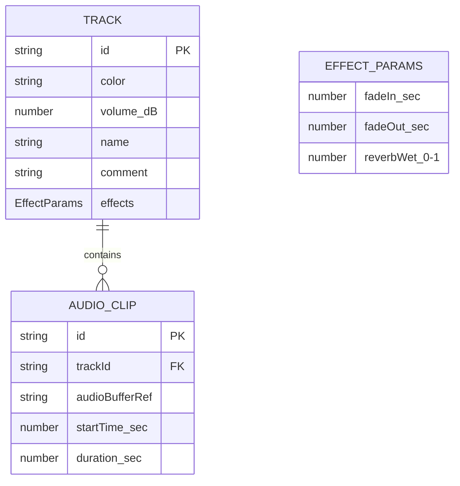

## 1. 架构设计



---

## 2. 技术描述

- **前端**：TypeScript + 原生HTML/CSS + Vite
- **构建工具**：Vite 5.x（入口 index.html，开发端口 8080，代理 /api → :3001）
- **后端**：Node.js + Express 4.x（端口 3001）
- **文件上传**：multer（内存存储 buffer）
- **跨域**：cors 中间件
- **ID生成**：uuid
- **音频处理**：Web Audio API（浏览器端实时混音）+ 后端PCM→WAV编码
- **图形渲染**：Canvas 2D API（波形、旋钮）

---

## 3. 项目文件结构

```
auto207/
├── package.json
├── index.html
├── vite.config.js
├── tsconfig.json
├── src/
│   ├── main.ts              # 应用入口，初始化各模块
│   ├── audioEngine.ts       # 音频上下文、混音、WAV编码
│   ├── uiController.ts      # DOM事件、Canvas渲染、滚动缩放
│   └── trackManager.ts      # 轨道数据结构管理
└── server/
    └── server.js            # Express服务：上传、WAV导出
```

---

## 4. 路由定义

| Route | Method | Purpose |
|-------|--------|---------|
| / | GET | Vite托管前端入口 |
| /api/upload | POST | 上传音频文件（multipart/form-data） |
| /api/export | POST | 接收PCM数据，编码为WAV并返回下载链接 |
| /api/download/:id | GET | 下载已生成的WAV文件 |

---

## 5. API 定义

### 5.1 上传音频

**Request** `POST /api/upload`
```typescript
// multipart/form-data
interface UploadRequest {
  file: File; // audio/*
}
```

**Response**
```typescript
interface UploadResponse {
  success: boolean;
  fileId: string;
  fileName: string;
  duration: number;
  sampleRate: number;
}
```

### 5.2 导出WAV

**Request** `POST /api/export`
```typescript
interface ExportRequest {
  pcmData: number[]; // Float32 单声道采样数据
  sampleRate: number; // 44100
  bitDepth: number; // 16
}
```

**Response**
```typescript
interface ExportResponse {
  success: boolean;
  downloadId: string;
  fileName: string;
  downloadUrl: string;
}
```

---

## 6. 数据模型

### 6.1 数据模型定义



### 6.2 TypeScript 类型定义

```typescript
// src/trackManager.ts
interface Track {
  id: string;
  name: string;
  color: string; // hex color
  volume: number; // dB, -30 to +6
  comment: string; // max 80 chars
  clips: AudioClip[];
  effects: EffectParams;
}

interface AudioClip {
  id: string;
  trackId: string;
  buffer: AudioBuffer | null;
  startTime: number; // seconds on timeline
  duration: number; // seconds
  offset: number; // offset within source audio
}

interface EffectParams {
  fadeIn: number; // 0-5 seconds
  fadeOut: number; // 0-5 seconds
  reverbWet: number; // 0 (dry) to 1 (wet)
}

interface TimelineState {
  zoom: number; // 1x to 4x
  scrollX: number; // pixels
  playhead: number; // seconds
  isPlaying: boolean;
  bpm: number; // default 120
}
```

---

## 7. 核心技术实现要点

### 7.1 音频引擎 (AudioEngine)
- 单例 `AudioContext`，采样率 44100Hz
- 每个轨道独立 `GainNode` 控制音量
- 使用 `ConvolverNode` 实现混响效果（内置脉冲响应）
- 淡入淡出使用 `GainNode.gain.linearRampToValueAtTime`
- 导出时离线渲染：`OfflineAudioContext` → PCM → 后端WAV编码

### 7.2 UI控制器 (UIController)
- Canvas 波形渲染：降采样振幅数据 + 线性渐变填充
- 时间线滚动：`requestAnimationFrame` + `translate` 优化
- 主音量旋钮：极坐标计算旋转角度，阻尼系数 0.3，吸附整数刻度
- 音频块拖拽：鼠标位置→时间换算，释放时对齐 1/4 拍网格

### 7.3 性能优化
- 波形数据预计算 + 离屏 Canvas 缓存
- 滚动时仅重绘可视区域
- 音频混合使用 Web Audio 原生节点（非JS逐采样计算）
