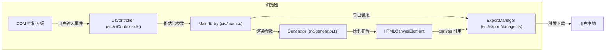

## 1. 架构设计



## 2. 技术描述

- **前端框架**：原生 TypeScript + HTML/CSS（无 UI 框架）
- **构建工具**：Vite 5.x
- **渲染技术**：HTML5 Canvas 2D Context + 矩阵旋转变换
- **动画驱动**：requestAnimationFrame
- **模块规范**：ES Module

## 3. 文件结构

```
auto208/
├── package.json              # 依赖与脚本
├── vite.config.js            # Vite 构建配置
├── tsconfig.json             # TypeScript 配置
├── index.html                # 入口 HTML
└── src/
    ├── main.ts               # 应用入口，数据流转中枢
    ├── generator.ts          # 核心万花筒图案生成
    ├── uiController.ts       # UI 参数控制
    └── exportManager.ts      # PNG 导出管理
```

### 3.1 模块职责与数据流向

| 文件 | 职责 | 输入 | 输出 |
|------|------|------|------|
| [main.ts](file:///e:/solo/VersionFast/tasks/auto208/src/main.ts) | 应用入口，Canvas 初始化，事件绑定，渲染循环驱动 | UIController 参数回调 | 调用 Generator 渲染，调用 ExportManager 导出 |
| [generator.ts](file:///e:/solo/VersionFast/tasks/auto208/src/generator.ts) | 万花筒图案核心渲染逻辑 | 对称轴数、颜色数组、旋转速度、形状类型 | 在 Canvas 上绘制帧 |
| [uiController.ts](file:///e:/solo/VersionFast/tasks/auto208/src/uiController.ts) | 控制面板事件监听与参数格式化 | DOM 事件 | 回调传递格式化参数对象 |
| [exportManager.ts](file:///e:/solo/VersionFast/tasks/auto208/src/exportManager.ts) | Canvas 内容 PNG 导出 | Canvas 元素 | 触发浏览器文件下载 |

## 4. 核心数据结构

```typescript
// 渲染参数
interface KaleidoscopeParams {
  symmetryAxes: number;      // 对称轴数 3-12
  rotationSpeed: number;     // 旋转速度 0-5 RPM
  colorStops: string[];      // 4 个颜色色标
  shapeType: ShapeType;      // 形状类型
}

type ShapeType = 'triangle' | 'circle' | 'star' | 'mixed';
```

## 5. 性能优化策略

1. **渲染优化**：使用 requestAnimationFrame 而非 setInterval，保证与浏览器刷新率同步
2. **参数插值**：形状切换时使用线性插值（lerp）实现 1 秒平滑过渡，避免跳变
3. **Canvas 状态缓存**：在循环外缓存变换矩阵和渐变对象，减少每帧 GC 压力
4. **离屏导出**：导出时创建临时 Canvas（2x 分辨率），单次渲染后导出，避免阻塞主线程
5. **事件节流**：高频 DOM 事件（滑块 input）无需节流，直接驱动参数更新（<16ms 延迟约束）
