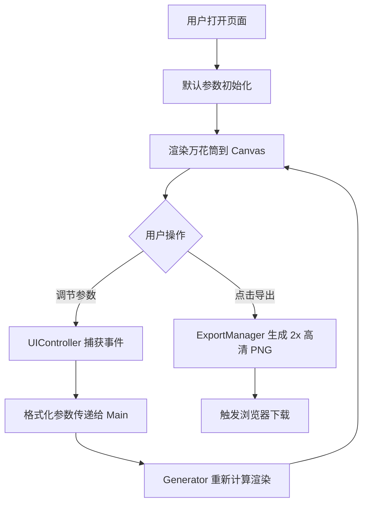

## 1. 产品概述

动态万花筒生成器是一款面向平面设计师和创意工作者的浏览器交互式可视化工具。用户通过调节对称轴数、颜色渐变、旋转速度等参数，实时生成变化万千的万花筒视觉效果，并支持一键导出为高清PNG壁纸。

## 2. 核心功能

### 2.1 功能模块

1. **主画布区**：800x800px Canvas 画布，深色背景，实时渲染万花筒图案
2. **参数控制面板**：右侧固定面板，提供对称轴数、旋转速度、颜色渐变、形状选择等参数调节
3. **导出模块**：一键导出当前画面为 1600x1600px 高清 PNG 壁纸
4. **状态显示**：FPS 计数器与版权声明

### 2.2 功能详情

| 模块名称 | 功能描述 |
|---------|---------|
| 万花筒渲染 | 基于对称轴数 N，通过矩阵旋转变换在每个对称扇区复制基本几何形状（三角形、圆形、星形），形成完整对称图案 |
| 参数实时调节 | 对称轴数 3-12，旋转速度 0-5 转/分钟，4 色标颜色渐变，形状类型选择（三角形/圆形/星形/混合随机） |
| 平滑过渡动画 | 参数变化时 1 秒内线性插值过渡，requestAnimationFrame 驱动 60fps 流畅渲染 |
| 高清导出 | 以 2 倍分辨率（1600x1600px）生成 PNG 并自动下载，文件名含时间戳 |
| 性能监控 | 右下角显示实时 FPS 计数器 |

## 3. 核心流程

用户进入页面 → 默认参数渲染万花筒 → 调节参数滑块/拾色器/形状选择 → 实时平滑更新画布 → 点击导出按钮 → 下载高清 PNG 壁纸

## 4. 用户界面设计

### 4.1 设计风格
- **主色调**：深色主题，主背景 #0D1117，画布背景 #1A1A2E，卡片背景 #161B22
- **强调色**：琥珀色导出按钮 #F4A460（悬停 #FFB347），滑块 #58A6FF
- **面板风格**：半透明磨砂玻璃（rgba(255,255,255,0.1) + backdrop-filter: blur(8px)，圆角 12px）
- **字体**：白色无衬线字体，版权声明 12px
- **微交互**：所有可交互元素悬停时 scale(1.05)，过渡 0.2s ease

### 4.2 页面布局
| 区域 | 位置 | 尺寸 | 内容 |
|------|------|------|------|
| 主画布 | 左侧居中 | 800x800px | Canvas 万花筒渲染 |
| 控制面板 | 右侧固定 | 宽 300px | 参数滑块、拾色器、形状选择、导出按钮 |
| 状态显示 | 画布右下角 | - | FPS 计数器 + 版权声明 |

### 4.3 UI 组件细节

| 组件 | 样式规范 |
|------|---------|
| 滑块 | 轨道色 #30363D，滑块圆形 #58A6FF，直径 16px |
| 颜色拾色器 | 正方形 48x48px，2px 白色描边 |
| 导出按钮 | 琥珀色 #F4A460，悬停 #FFB347，圆角 8px |
| FPS 显示 | 白色 12px 字体，背景 #00000044，内边距 4px，圆角 4px |

### 4.4 响应式
桌面端优先设计，控制面板固定右侧 300px，画布居中显示。

## 5. 性能约束

- 动画循环稳定 60fps
- 参数变化到画面更新延迟 < 16ms
- 导出高清 PNG 时页面卡顿 < 200ms
