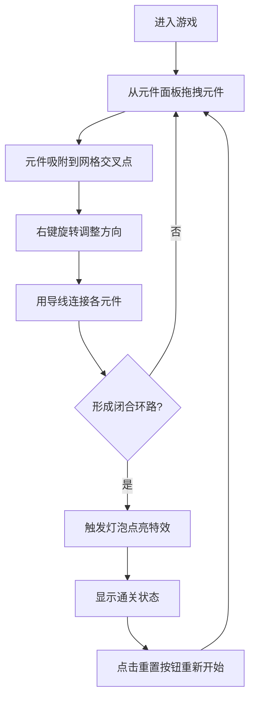

## 1. 产品概述

基于浏览器 Canvas 的交互式电路迷宫解谜工具，玩家通过拖拽和连接电子元件搭建闭合电路，点亮迷宫中央的灯泡以通关。目标是提供沉浸式的电子电路学习与解谜体验，适合对电路原理感兴趣的休闲玩家和学生群体。

## 2. 核心功能

### 2.1 用户角色

| 角色 | 注册方式 | 核心权限 |
|------|----------|----------|
| 普通玩家 | 无需注册，直接访问 | 进行游戏解谜、重置关卡 |

### 2.2 功能模块

1. **游戏主界面**：30x30 网格迷宫画布、中央灯泡节点、左上角电源节点
2. **元件面板**：电阻、电容、LED灯、开关、导线元件拖拽源
3. **状态面板**：已连接元件计数器、电流环路状态指示、重置按钮
4. **交互系统**：元件拖拽、网格吸附、右键旋转、悬停参数显示

### 2.3 页面详情

| 页面名称 | 模块名称 | 功能描述 |
|----------|----------|----------|
| 游戏主界面 | 迷宫画布 | 30x30 网格渲染、电源/灯泡节点固定放置、元件放置与连线可视化 |
| 游戏主界面 | 元件面板 | 右侧展示可拖拽元件库，响应式切换为底部横向滚动 |
| 游戏主界面 | 状态面板 | 左侧实时显示解谜进度、环路状态、提供重置操作 |
| 游戏主界面 | 通关特效 | 灯泡点亮动画、径向光晕、背景脉冲波 |

## 3. 核心流程

玩家从右侧元件面板拖拽元件至迷宫画布，元件自动吸附到最近网格交叉点。通过右键旋转调整方向，悬停查看元件参数。使用导线连接电源（+5V）→ 至少一个电阻 → 至少一个开关 → 中央灯泡，形成闭合回路。当检测到完整电流环路时，触发灯泡点亮动画和背景脉冲特效，显示通关状态。点击重置按钮可清空所有已放置元件重新开始。

## 4. 用户界面设计

### 4.1 设计风格

- **主色调**：深色科技感背景 #0D1117，径向渐变至 #1A1A2E
- **强调色**：亮黄 #FFD700（灯泡点亮）、青色 #00E5FF（高亮边框）、红色渐变 #E53E3E→#C53030（重置按钮）
- **网格线**：半透明 #1F2937 细线，间距 40px
- **按钮风格**：圆角 6px，3D 按下弹起效果，0.1s 过渡
- **字体**：系统默认无衬线字体，参数面板使用 12px 白色等宽字体
- **整体风格**：毛玻璃效果、背景轻微噪点纹理、0.2s hover/active 过渡动效

### 4.2 页面设计概览

| 页面名称 | 模块名称 | UI 元素 |
|----------|----------|---------|
| 游戏主界面 | 迷宫画布 | 深色径向渐变背景、30x30 半透明网格、电源图标（+5V）、灯泡图标（灰/亮黄切换）、元件渲染、导线连线、光晕动画、脉冲波特效 |
| 游戏主界面 | 元件面板 | 右侧垂直排列/底部横向排列，元件缩略图，拖拽手柄，悬停高亮 |
| 游戏主界面 | 状态面板 | 左侧毛玻璃面板，元件计数器（数字动画）、环路状态图标（绿✓/红✗，缩放弹跳动画 0.3s）、重置按钮（红色渐变，圆角 6px） |
| 游戏主界面 | 参数面板 | 深灰半透明 #1F2937 浮动框，圆角 8px，12px 白色等宽字体显示元件参数（R: 100Ω / C: 10μF） |

### 4.3 响应式设计

- **桌面优先**：浏览器宽度 ≥ 800px，元件面板在右侧垂直排列
- **移动适配**：浏览器宽度 < 800px，元件面板切换到底部横向滚动条布局，元件缩小为 80% 尺寸，间距保持不变

### 4.4 动效规范

| 动效名称 | 时长 | 缓动函数 | 描述 |
|----------|------|----------|------|
| 元件旋转 | 0.2s | ease-out | 右键点击时顺时针 90° 平滑过渡 |
| 悬停高亮 | 0.2s | ease | 鼠标悬停显示 #00E5FF 2px 边框 |
| 按钮按压 | 0.1s | ease | 重置按钮 3D 按下弹起效果 |
| 灯泡发光 | 1s | ease-in-out | 发光半径 0→60px→15px 循环 |
| 背景脉冲 | 0.5s | ease-out | #FFD700 透明度 0.3→0 淡出 |
| 计数器 | 0.3s | ease | 数字从 0 递增到目标值，每次 +1 |
| 状态图标 | 0.3s | ease | 绿✓/红✗ 缩放弹跳动画 |
