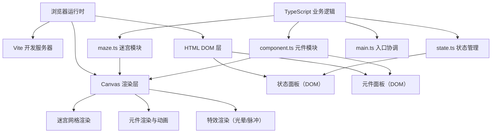

## 1. 架构设计



## 2. 技术描述

- **前端框架**：原生 TypeScript（无 UI 框架）+ HTML5 Canvas + 原生 CSS
- **构建工具**：Vite@5.x
- **开发语言**：TypeScript（严格模式，ESNext 模块）
- **后端**：无（纯前端应用）
- **数据库**：无（纯内存状态）

## 3. 项目结构

| 文件路径 | 用途 |
|----------|------|
| `/package.json` | 项目依赖与脚本配置（vite、typescript） |
| `/vite.config.js` | Vite 开发服务器配置（端口 8080，入口 index.html） |
| `/tsconfig.json` | TypeScript 编译配置（严格模式、ESNext、DOM 类型） |
| `/index.html` | 入口 HTML，包含全局样式、Canvas 容器、状态面板 DOM |
| `/src/main.ts` | 应用入口，初始化画布、加载元件库、绑定鼠标事件 |
| `/src/maze.ts` | 迷宫网格生成与渲染，30x30 网格逻辑、电源/灯泡节点 |
| `/src/component.ts` | 元件类定义（电阻、电容、LED、开关、导线），渲染、旋转、参数面板、网格吸附、连接检测 |
| `/src/state.ts` | 全局状态管理：连接元件列表、电流环路状态、计数器、重置功能 |

## 4. 核心数据结构

### 4.1 网格坐标系统

```typescript
interface GridPoint {
  col: number;    // 0-29，列索引
  row: number;    // 0-29，行索引
  x: number;      // 像素坐标 x = col * 40
  y: number;      // 像素坐标 y = row * 40
}
```

### 4.2 元件数据模型

```typescript
type ComponentType = 'resistor' | 'capacitor' | 'led' | 'switch' | 'wire';
type Rotation = 0 | 90 | 180 | 270;

interface CircuitComponent {
  id: string;
  type: ComponentType;
  gridPos: GridPoint;        // 网格吸附位置
  rotation: Rotation;        // 当前旋转角度
  targetRotation: Rotation;  // 目标旋转角度（用于动画）
  rotationProgress: number;  // 旋转动画进度 0-1
  params: Record<string, string>;  // 元件参数（如 R:100Ω, C:10μF）
  isHovered: boolean;
  connectionPoints: GridPoint[];   // 可连接点（相对网格位置）
}
```

### 4.3 全局状态

```typescript
interface GameState {
  placedComponents: CircuitComponent[];
  connectedCount: number;          // 已连接元件数量
  targetCount: number;             // 目标数量（至少2：1电阻+1开关）
  hasClosedLoop: boolean;          // 是否形成闭合环路
  isBulbLit: boolean;              // 灯泡是否点亮
  bulbGlowRadius: number;          // 灯泡光晕半径动画值
  pulseOpacity: number;            // 背景脉冲透明度
}
```

## 5. 核心算法

### 5.1 网格吸附算法

```
输入：鼠标像素坐标 (mouseX, mouseY)
输出：最近网格交叉点 GridPoint
  col = round((mouseX - offsetX) / 40)
  row = round((mouseY - offsetY) / 40)
  col = clamp(col, 0, 29)
  row = clamp(row, 0, 29)
  x = col * 40 + offsetX
  y = row * 40 + offsetY
```

### 5.2 闭合环路检测

使用 BFS/DFS 图遍历算法：
1. 将每个元件视为节点，连接点视为边
2. 从电源节点出发，沿导线和元件连接点遍历
3. 标记经过的元件和连接点
4. 检测是否能从电源到达灯泡，并且路径中至少包含 1 个电阻和 1 个开关
5. 若开关存在，需额外检测开关状态为闭合

### 5.3 渲染循环（requestAnimationFrame）

每帧执行顺序：
1. 更新动画状态（旋转进度、光晕半径、脉冲透明度）
2. 清空画布，绘制背景径向渐变 + 噪点纹理
3. 绘制 30x30 网格线（#1F2937）
4. 绘制电源节点和灯泡节点（含光晕动画）
5. 绘制背景脉冲波（通关时）
6. 遍历已放置元件，按旋转角度渲染
7. 绘制悬停高亮边框和参数面板
8. 绘制导线连线

## 6. 性能优化策略

- **Canvas 分层渲染**：静态背景（网格、渐变）预渲染到离屏 Canvas，每帧只重绘动态元素
- **脏矩形优化**：仅重绘元件位置变化的区域
- **requestAnimationFrame**：统一 60fps 渲染循环，避免重复重绘
- **事件防抖**：鼠标移动事件使用节流（throttle 16ms）
- **对象池**：元件对象复用，减少 GC 压力
- **CSS Transform**：DOM 层面板使用 GPU 加速的 transform 动画
