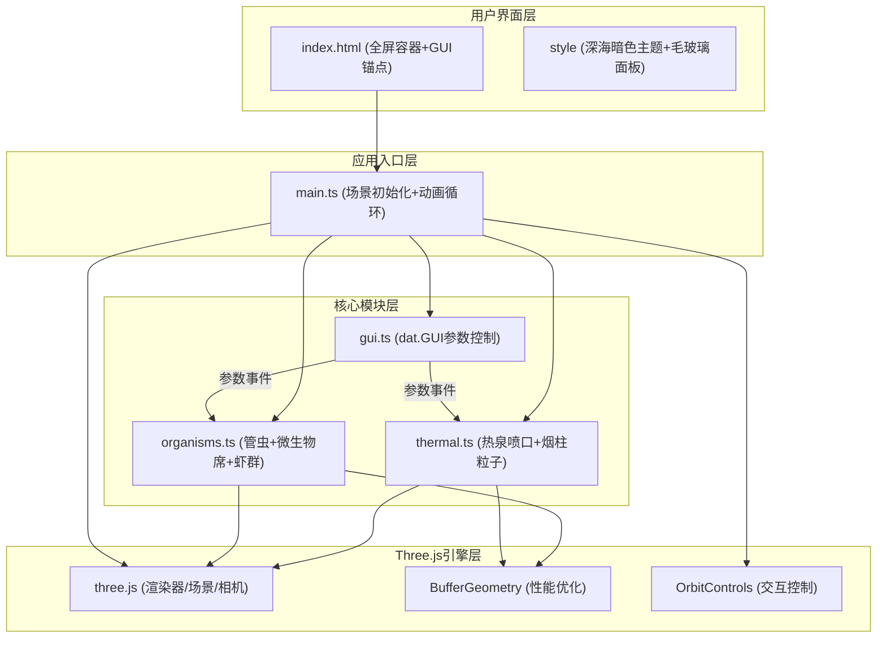
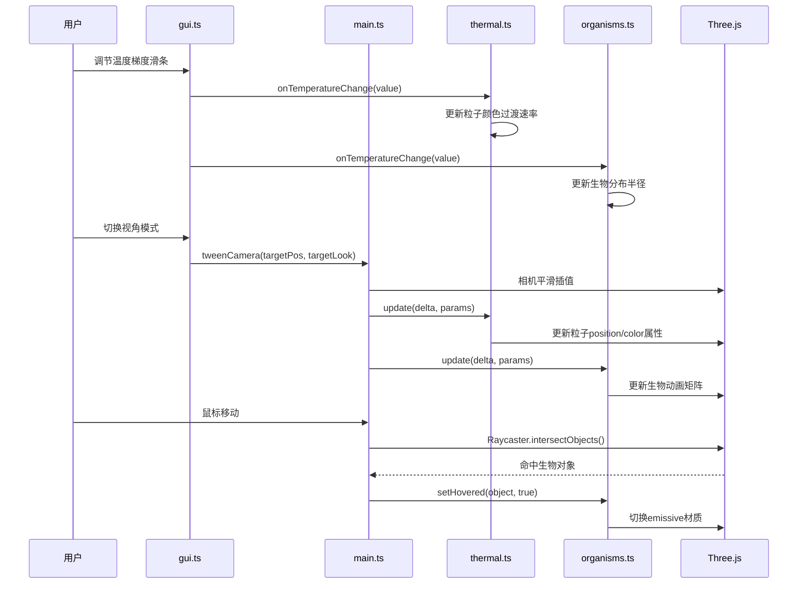

## 1. 架构设计

## 2. 技术描述
- 前端：TypeScript + Three.js + Vite
- 构建工具：Vite（端口8080）
- UI库：dat.GUI（参数控制面板）
- 状态管理：模块内部状态，通过GUI回调传递参数
- 无后端，纯前端3D可视化

## 3. 文件结构与调用关系

| 文件 | 职责 | 依赖/调用 |
|------|------|----------|
| package.json | 依赖配置与启动脚本 | three, @types/three, typescript, vite, dat.gui, @types/dat.gui |
| vite.config.js | Vite构建配置（端口8080） | - |
| tsconfig.json | TypeScript严格模式配置 | - |
| index.html | 入口页面（#app容器+#gui-container锚点） | 引入src/main.ts |
| src/main.ts | 场景初始化：WebGLRenderer/Scene/PerspectiveCamera/OrbitControls/动画循环；组装thermal、organisms、gui模块；处理鼠标悬停交互 | thermal.ts, organisms.ts, gui.ts |
| src/thermal.ts | 热泉喷口岩石几何体；Points粒子系统（BufferGeometry）；粒子生命周期（位置/颜色/透明度/大小更新）；导出createThermalVents()和updateThermal() | three (BufferGeometry/PointsMaterial) |
| src/organisms.ts | 管虫群（合并几何体+摆动动画）；微生物席（ShaderMaterial波动）；虾群（合并几何体+游动动画）；悬停发光材质切换；导出createOrganisms()和updateOrganisms() | three (BufferGeometryUtils.mergeGeometries) |
| src/gui.ts | dat.GUI实例创建；温度梯度/生物密度/视角模式控件；视角平滑过渡tween；导出createGUI() | dat.gui, three（相机tween） |

## 4. 数据流向

## 5. 性能优化策略
1. **粒子系统**：使用BufferGeometry，所有粒子共享PointsMaterial，单DrawCall
2. **生物合并**：同类生物使用BufferGeometryUtils.mergeGeometries合并为单个网格
3. **动画优化**：通过更新BufferGeometry的attribute而非逐个修改Object3D.matrix
4. **DrawCall控制**：粒子≤500，生物总数≤200，合并后DrawCall≤10
5. **材质复用**：同类生物共享材质实例，仅通过vertex color区分个体差异
