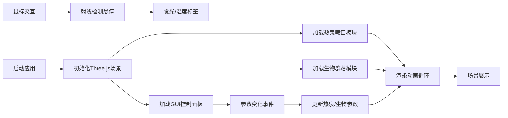

## 1. 产品概述
一个基于Three.js的交互式3D海底热泉生态系统可视化工具，展示深海热泉喷口周围不同温度梯度下微生物席、管虫和虾类的分布与能量流动。
- 目标用户：海洋生物学家、科研教育工作者
- 产品价值：直观呈现深海热泉生态系统的温度梯度分布与生物群落结构

## 2. 核心功能

### 2.1 功能模块
1. **3D主场景**：海底热泉喷口、烟柱粒子系统、深海环境
2. **生物群落模块**：管虫群（高温区）、微生物席（中温区）、虾群（低温区）
3. **参数控制面板**：温度梯度、生物密度、视角切换
4. **鼠标交互**：场景旋转缩放、悬停发光、温度标签显示

### 2.2 功能详情
| 模块名称 | 功能描述 |
|---------|---------|
| 热泉喷口 | 黑色岩石结构，高2单位，位于(0,-1,0)，喷出半透明烟柱粒子 |
| 烟柱粒子 | 初始亮橙色#FF6600，大小0.15，上升0-6单位渐变深蓝#003366，透明度0.6→0.1，50-500个动态可调 |
| 管虫群 | 半径0-2单位高温区，红色#FF4D4D→#CC0000，高度0.5-1.2，轻微摆动 |
| 微生物席 | 半径2-5单位中温区，绿色半透明#00FF66→#009933，厚度0.1，缓慢波动 |
| 虾群 | 半径5-10单位低温区，白色#F0F0F0→#D0D0D0，体长0.08，绕喷口游动 |
| 参数控制 | 温度梯度0-100，生物密度0-200%，视角：俯视/侧视/跟随烟柱（0.5秒平滑过渡） |
| 海底地面 | 半径15圆形平面，深褐色#2B1B0E，散布小岩石和沉积物 |
| 环境效果 | 深海雾#000033，密度0.003，背景纯黑#000 |
| 鼠标交互 | OrbitControls旋转缩放（3-30），悬停生物发光#FFFF00强度0.5，温度标签显示 |

## 3. 核心流程
用户打开页面 → 加载3D场景（热泉+生物+粒子） → 通过GUI调节参数 → 观察生物分布变化 → 鼠标交互探索细节

## 4. 用户界面设计

### 4.1 设计风格
- 主题：深海暗色主题，背景纯黑#000
- 主要颜色：浅蓝#88CCFF、深蓝#003366、亮蓝#00CCFF
- 控制面板：底部半透明毛玻璃（backdrop-filter: blur(8px)，背景rgba(0,20,40,0.7)）
- 滑条：轨道深蓝#003366，滑块亮蓝#00CCFF
- 字体颜色：浅蓝#88CCFF

### 4.2 3D场景指引
- **环境**：深海蓝色渐变雾效，营造深海压迫感
- **光照**：环境光（低强度深蓝色）+ 点光源（喷口位置，模拟热泉发光）
- **相机**：初始位置(10, 5, 10)，OrbitControls控制，LookAt(0,0,0)
- **焦点**：喷口为场景中心，烟柱向上延伸作为视觉引导
- **动画**：粒子上升、管虫摆动、微生物席波动、虾群游动
- **后处理**：雾化效果、边缘光（悬停时）
- **性能**：粒子≤500，生物≤200，使用BufferGeometry和合并几何体
