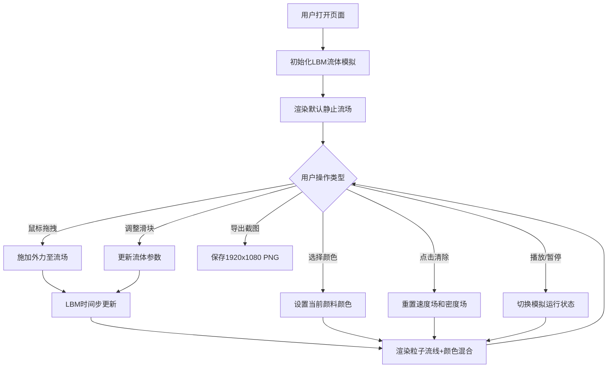

## 1. 产品概述

二维流体力学交互式画板应用，基于格子玻尔兹曼方法（LBM）在浏览器中实时模拟流体运动，解决用户无法直观观察和实验不同流体参数（黏度、密度、外力）对流体运动形态影响的问题。

- 目标用户：物理爱好者、教育工作者、学生、创意设计师
- 核心价值：通过直观的视觉交互，让抽象的流体力学原理变得可感知、可实验

## 2. 核心功能

### 2.1 用户角色

| 角色 | 注册方式 | 核心权限 |
|------|----------|----------|
| 普通用户 | 无需注册 | 使用全部模拟功能、调整参数、导出截图 |

### 2.2 功能模块

1. **主画布区域**：LBM流体实时模拟、鼠标拖拽交互、粒子流线轨迹渲染、颜色流体混合
2. **右侧控制面板**：黏度/密度/外力强度参数滑块、流体颜色选择器
3. **顶部工具栏**：清除/重置按钮、FPS与粒子计数显示、播放/暂停控制、导出截图按钮
4. **图例说明框**：流速区间颜色图例、可拖动交互

### 2.3 页面详情

| 页面名称 | 模块名称 | 功能描述 |
|----------|----------|----------|
| 主画板页面 | 画布区域 | 自适应窗口尺寸（最小800x600px），深灰背景#1E1E2E，支持鼠标拖拽施加外力，实时渲染白色半透明粒子流线和彩色流体粒子 |
| 主画板页面 | 控制面板 | 固定宽度220px，半透明深灰背景#2A2A3C+毛玻璃效果，三个参数滑块带实时数值显示，6种流体颜色圆形选择器 |
| 主画板页面 | 工具栏 | 全宽50px高，背景#1A1A2E，左侧清除按钮、中间FPS/粒子计数、右侧播放暂停、导出按钮 |
| 主画板页面 | 图例框 | 右下角200x120px，半透明深灰背景+毛玻璃，三种流速颜色区间，可通过顶部手柄拖动 |

## 3. 核心流程

## 4. 用户界面设计

### 4.1 设计风格

- **主题色调**：暗色科技感，主背景#121220，文字#E0E0E0
- **主色板**：
  - 画布背景：#1E1E2E
  - 面板背景：#2A2A3C（半透明+毛玻璃backdrop-filter: blur(8px)）
  - 工具栏背景：#1A1A2E
  - 边框色：#3A3A5C
  - 滑块色：轨道#3A3A5C，滑块#7C4DFF
  - 警示色（清除按钮）：#E53935
  - 成功色（FPS显示、播放图标）：#4CAF50
  - 警告色（暂停图标）：#FFC107
  - 导出按钮：#7E57C2
- **流体颜色**：青绿#00E5FF、紫罗兰#B388FF、橙红#FF6B6B、柠檬黄#FFE082、翠绿#69F0AE、洋红#FF4081
- **按钮样式**：圆角8px，1px细边框，hover平滑过渡0.2s ease-in-out
- **字体**：等宽字体（monospace），参数数值14px，FPS显示16px
- **布局风格**：左侧画布+右侧控制面板（桌面端），上下布局（移动端）

### 4.2 页面设计概览

| 页面名称 | 模块名称 | UI元素 |
|----------|----------|--------|
| 主画板 | 画布区域 | 深灰背景、自适应尺寸、粒子轨迹、颜色流体渐变混合 |
| 主画板 | 控制面板 | 半透明毛玻璃面板、参数滑块（轨道4px高、滑块16px圆形）、数值显示、圆形颜色选择器 |
| 主画板 | 工具栏 | 全宽条栏、清除按钮（红边框白字、hover半透明红）、绿色等宽FPS文字、播放/暂停切换图标、紫色导出按钮 |
| 主画板 | 图例框 | 半透明毛玻璃小面板、顶部深色手柄、三行颜色+流速区间标签 |

### 4.3 响应式设计

- **桌面端（≥768px）**：左侧主画布 + 右侧220px固定控制面板
- **移动端（<768px）**：控制面板移至底部全宽，画布高度缩减至窗口高度60%，所有文字缩小2px，控制面板支持折叠/展开

### 4.4 性能指标

- 60x60网格密度时FPS≥45
- 流体粒子总数≤2000
- FPS<30时自动降级渲染质量（粒子直径减半、透明度降至0.3）
