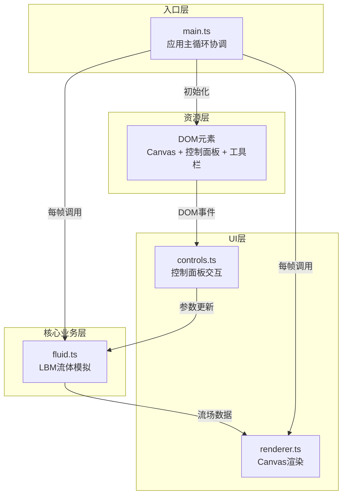

## 1. 架构设计



## 2. 技术描述

- **前端框架**：原生 TypeScript + HTML5 Canvas（不使用React/Vue框架，用户明确要求）
- **构建工具**：Vite 5.x
- **编程语言**：TypeScript（严格模式，target ESNext）
- **样式方案**：原生 CSS（无CSS框架，自定义暗色科技感主题）
- **物理算法**：格子玻尔兹曼方法（LBM）D2Q9模型
- **项目初始化**：使用 `vite-init` vanilla-ts 模板创建基础结构

## 3. 文件结构

```
项目根目录/
├── package.json              # 依赖配置：vite、typescript
├── index.html                # 入口HTML：画布容器、控制面板、工具栏DOM
├── vite.config.js            # Vite构建配置：端口8080、跨域
├── tsconfig.json             # TS配置：严格模式、ESNext、bundler模式
└── src/
    ├── main.ts               # 应用入口：初始化、主循环、模块协调
    ├── fluid.ts              # LBM核心：格子初始化、时间步更新、外力施加
    ├── renderer.ts           # 渲染模块：粒子流线、颜色混合、FPS显示、导出
    └── controls.ts           # 交互模块：滑块、颜色选择、按钮、性能监听
```

## 4. 核心模块接口定义

### 4.1 fluid.ts - LBM流体模拟

```typescript
export interface FluidParams {
  viscosity: number;      // 黏度 0.01-0.5
  density: number;        // 密度 0.5-2.0
  forceStrength: number;  // 外力强度 0-10
}

export class FluidSimulation {
  constructor(gridSizeX: number, gridSizeY: number);
  setParams(params: Partial<FluidParams>): void;
  resize(gridX: number, gridY: number): void;        // 调整网格不重置流场
  applyForce(x: number, y: number, fx: number, fy: number, radius?: number): void;
  addColor(x: number, y: number, color: RGB, radius?: number): void;
  step(): void;                                       // 单步LBM更新
  getVelocityField(): Float32Array[];                 // [ux, uy]
  getDensityField(): Float32Array;
  getColorField(): Float32Array[];                    // [r, g, b]
  reset(): void;                                      // 清零速度和密度场
}

export type RGB = [number, number, number];
```

### 4.2 renderer.ts - 渲染模块

```typescript
export interface RendererConfig {
  particleMax: number;        // 最大粒子数 2000
  particleTrailLength: number; // 轨迹长度约50px
}

export class FluidRenderer {
  constructor(canvas: HTMLCanvasElement, fluid: FluidSimulation);
  setColor(color: string): void;   // 设置当前颜料色
  setPaused(paused: boolean): void;
  render(isDragging: boolean, dragPos?: {x:number;y:number}): void;
  updateLegendPosition(x: number, y: number): void;
  exportScreenshot(): Promise<void>;  // 导出1920x1080 PNG
  updatePerformanceQuality(fps: number): void;  // FPS降级处理
}
```

### 4.3 controls.ts - 交互控制模块

```typescript
export interface ControlState {
  viscosity: number;
  density: number;
  forceStrength: number;
  selectedColor: string;
  gridSize: number;
  paused: boolean;
}

export class ControlPanel {
  constructor(
    fluid: FluidSimulation,
    renderer: FluidRenderer,
    onStateChange: (state: ControlState) => void
  );
  getState(): ControlState;
  getFPS(): number;
}
```

### 4.4 main.ts - 主入口协调

```typescript
// 数据流向：
// controls.ts --参数变更--> fluid.ts --流场数据--> renderer.ts --绘制--> Canvas
// main.ts 驱动 requestAnimationFrame 主循环，每帧调用 fluid.step() + renderer.render()
```

## 5. LBM算法实现要点

- **格子模型**：D2Q9（二维9速度模型）
- **平衡分布函数**：单松弛时间BGK算子
- **边界条件**：周期性边界或无滑移反弹边界
- **外力施加**：在拖拽位置的邻域格子上施加速度扰动，限制最大流速5格子/帧
- **颜色平流**：将RGB作为被动标量跟随流场平流，混合时插值渐变（过渡宽度约10px）

## 6. 性能优化策略

1. **TypedArray**：使用 Float32Array 存储分布函数和场数据
2. **粒子池化**：维护固定最大数量（2000）的粒子对象池，避免频繁GC
3. **自适应降级**：FPS<30时粒子直径减半、透明度降至0.3
4. **离屏渲染**：导出截图使用独立离屏Canvas，不影响主循环帧率
5. **requestAnimationFrame**：与浏览器刷新同步，避免无效渲染
