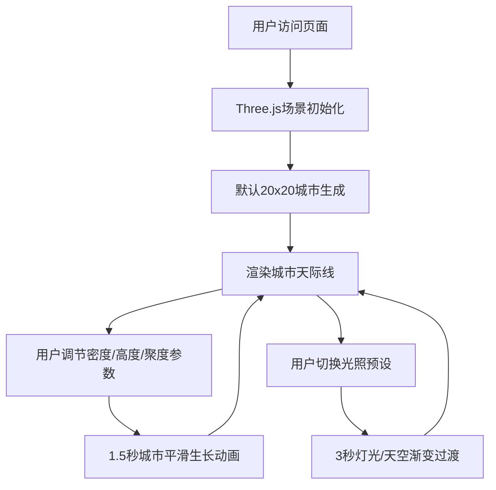

## 1. 产品概述

本产品是一个基于Three.js的交互式3D城市天际线生成器，面向建筑可视化设计师与创意工作者。用户通过调节参数实时塑造摩天大楼的密度、高度和灯光分布，并模拟不同时间段的光照氛围，创造独特的城市视觉效果。

- 目标用户：建筑可视化设计师、数字艺术家、创意工作者
- 市场价值：提供快速、直观的城市天际线可视化工具，辅助建筑方案展示与城市规划可视化

## 2. 核心功能

### 2.1 用户角色

| 角色 | 注册方式 | 核心权限 |
|------|---------|----------|
| 设计师用户 | 无需注册 | 浏览和使用全部参数调节与光照预设功能 |

### 2.2 功能模块

1. **主场景页面**：3D城市渲染区、顶部工具栏、参数控制面板、光照预设切换

### 2.3 页面详情

| 页面名称 | 模块名称 | 功能描述 |
|---------|---------|----------|
| 主场景页面 | 3D渲染区 | 全屏Three.js画布，实时渲染3D城市天际线，支持鼠标交互视角控制 |
| 主场景页面 | 顶部工具栏 | 显示当前光照预设名称、参数状态信息 |
| 主场景页面 | 参数控制面板 | 密度滑块、最大高度滑块、建筑群聚程度滑块 |
| 主场景页面 | 光照预设切换 | 清晨、正午、黄昏、夜晚四种预设按钮，点击触发平滑过渡动画 |

## 3. 核心流程

用户打开页面 → 默认加载3D城市自动生成 → 用户调节参数滑块 → 城市平滑重绘（生长动画）→ 用户切换光照预设 → 灯光与天空渐变过渡 → 继续探索不同时段城市景观

## 4. 用户界面设计

### 4.1 设计风格

- 主色调：深灰蓝基调 #1A1A2E，辅以现代都市建筑色板（玻璃蓝 #4A90D9、暖灰 #A0A0A0、深蓝灰 #2C3E50、铜色 #CD7F32）
- 按钮/控件风格：半透明玻璃质感（backdrop-filter: blur(8px)），圆角设计，悬停时轻微发光边框
- 字体：简洁无衬线字体，信息展示12px，移动端10px
- 布局风格：全屏3D画布铺满全屏，顶部悬浮工具栏，右下角固定参数面板
- 交互反馈：所有交互元素悬停发光边框动画（box-shadow 0 0 8px rgba(100,100,200,0.4)）

### 4.2 页面设计概览

| 页面名称 | 模块名称 | UI元素 |
|---------|---------|--------|
| 主场景页面 | 3D渲染区 | 全屏画布、鼠标拖动旋转视角、滚轮缩放、平移 |
| 主场景页面 | 顶部工具栏 | 半透明玻璃面板、预设名称显示、参数状态、12px白色文字带2px阴影 |
| 主场景页面 | 参数控制面板 | 紧凑型dat.GUI面板（260px宽）、自定义滑块轨道#2E2E4E、滑块手柄#7C7CBA |
| 主场景页面 | 光照预设按钮 | 四个预设按钮组、点击触发3秒渐变过渡、生长动画 |

### 4.3 响应式

- 桌面端：全屏画布+右下角固定面板（260px）+顶部工具栏
- 移动端（<768px）：dat.GUI变为底部可折叠抽屉（150px高），工具栏字体缩小至10px，城市网格自动减为15x15

### 4.4 3D场景指引

- 环境/氛围：现代都市夜景与日景交替，四种时段氛围
- 光照设置：环境光+方向光+建筑顶部点光源，支持阴影
- 相机设置：透视相机，初始视角俯视45度，支持OrbitControls鼠标控制
- 构图与焦点元素：城市天际线全景，建筑顶部发光点光源点缀
- 交互与动画：建筑生长上升动画+轻微回弹、光照平滑过渡
- 后处理效果：建筑半透明发光材质
- 性能预算：标准参数下稳定55FPS以上，单次重建耗时<1.8秒
