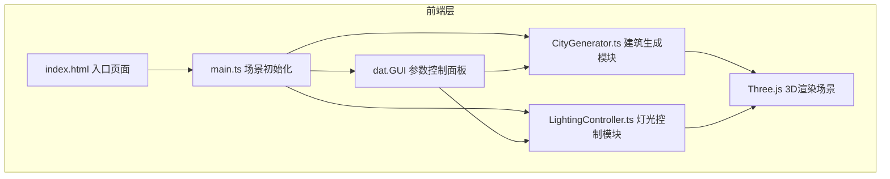

## 1. 架构设计



## 2. 技术说明

- 前端：TypeScript + Vite + Three.js + dat.GUI
- 初始化工具：Vite脚手架（vanilla-ts模板）
- 后端：无（纯前端3D可视化应用）
- 数据库：无

## 3. 文件结构

```
项目根目录
├── index.html                 # 入口页面，全屏渲染容器+UI层
├── package.json               # 项目依赖（three、@types/three、typescript、vite、dat.gui、@types/dat.gui）
├── vite.config.js             # Vite构建配置，端口8080，开启HMR
├── tsconfig.json              # TypeScript配置，严格模式
└── src/
    ├── main.ts                # 主入口：场景、相机、渲染器、动画循环
    ├── CityGenerator.ts       # 核心建筑生成模块
    └── LightingController.ts  # 灯光与天空盒控制模块
```

## 4. 数据流向

### 4.1 参数调整数据流
```
dat.GUI参数变化 → main.ts接收事件 → CityGenerator.update(params) → 批量几何体更新 → 建筑生长动画 → 场景重绘
```

### 4.2 光照预设数据流
```
用户点击预设按钮 → LightingController.setPreset(name) → 颜色/强度插值计算 → 3秒平滑过渡 → 环境光/方向光/天空盒同步更新
```

### 4.3 类型定义

```typescript
// CityGenerator 参数
interface CityParams {
  density: number;        // 0-100% (30-100)
  maxHeight: number;      // 5-30 单位
  clustering: number;     // 0-1，建筑群聚程度
  gridSize: number;       // 网格大小（桌面20，移动15）
  gridSpacing: number;    // 网格间距6单位
}

// 建筑配置
interface BuildingConfig {
  position: { x: number; z: number };
  width: number;          // 1.5-3
  depth: number;          // 2-4
  height: number;         // 3-maxHeight
  facadeColor: string;    // #4A90D9/#A0A0A0/#2C3E50/#CD7F32
  lightIntensity: number; // 0.5-1.0
}

// 光照预设
interface LightingPreset {
  ambientColor: string;
  directionalColor: string;
  skyTopColor: string;
  skyBottomColor?: string;
  hasStars?: boolean;
}
```

## 5. 核心算法说明

### 5.1 建筑群聚算法
根据clustering参数，使用径向衰减概率函数计算每个网格点的生成概率：
```
distance = sqrt((x-centerX)^2 + (z-centerZ)^2)
baseProbability = density * (1 - clustering * (distance / maxDistance))
```

### 5.2 平滑过渡动画
采用线性插值（lerp）实现颜色和数值的3秒渐变：
```typescript
currentValue = startValue + (targetValue - startValue) * (elapsedTime / duration)
```

### 5.3 建筑生长动画
使用缓动函数实现上升+轻微回弹效果：
```typescript
// 上升阶段（0-1.2秒）：easeOutCubic
// 回弹阶段（1.2-1.5秒）：过冲后回落
```

### 5.4 性能优化策略
- 批量几何体复用：每次重建优先更新变换矩阵而非销毁重建
- 材质复用：同类建筑共享材质实例
- 视锥剔除：Three.js内置Frustum Culling
- 响应式降级：移动端自动减小网格密度
