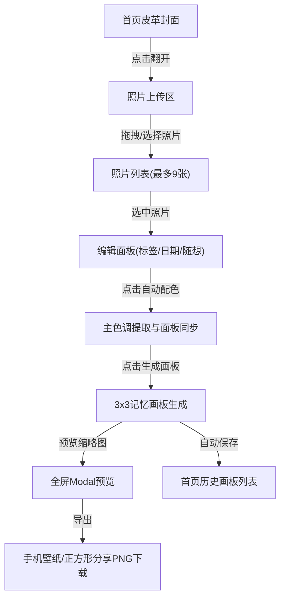

## 1. 产品概述

Travelogue是一款为旅行爱好者设计的在线手绘风格旅行记忆拼图应用。用户可以将旅行照片整理成精美的复古风格记忆画板，并导出为壁纸或社交分享图。

- 核心价值：让旅行记忆以艺术化、个性化的方式被保存和分享
- 目标用户：热爱旅行、喜欢记录生活、追求美学体验的年轻用户群体

## 2. 核心功能

### 2.1 用户角色
| 角色 | 注册方式 | 核心权限 |
|------|----------|----------|
| 普通用户 | 无需注册，本地存储 | 上传照片、编辑、生成画板、导出图片、保存记录 |

### 2.2 功能模块
1. **首页**：皮革封面笔记本入口、历史画板列表
2. **编辑页**：照片上传区、编辑面板、自动配色、画板生成与预览、导出功能

### 2.3 页面详情
| 页面名称 | 模块名称 | 功能描述 |
|----------|----------|----------|
| 首页 | 皮革封面 | 仿皮革质感背景、烫金"Travelogue"标题、悬停凹凸动画、点击翻页进入内页 |
| 首页 | 历史画板 | 水平滚动展示已保存画板卡片、点击重新加载、支持JSON导出全部数据 |
| 编辑页 | 照片上传区 | 白色方格纸底纹、拖拽/点击上传、最多9张、4:3裁剪、手绘虚线边框、删除按钮 |
| 编辑页 | 编辑面板 | 文字标签(20字)、日期、旅行随想(200字)、自动配色提取照片主色调 |
| 编辑页 | 画板生成 | 3x3网格布局、印章装饰、日期统计、颜色统一风格 |
| 编辑页 | 预览与导出 | 缩略图预览、全屏modal查看、手机壁纸(1080x1920)、正方形分享(1080x1080)导出 |

## 3. 核心流程

用户从首页皮革封面点击进入 → 上传最多9张旅行照片 → 选中照片编辑标签/日期/随想 → 自动配色提取主色调 → 点击生成画板 → 预览画板效果 → 导出为壁纸或分享图 → 画板自动保存到首页历史记录

## 4. 用户界面设计

### 4.1 设计风格
- **主色调**：大地色系 - 封面#2C1810、内页#FFF8E7、装饰线#D4A574、烫金#D4A574
- **辅助色**：删除#E74C3C、印章#CC3333、文字深色#2C1810、文字浅色#666、按钮#8B5E3C
- **按钮风格**：圆角矩形、渐变填充、hover缩放1.05、点击涟漪扩散效果(0.4s)
- **字体**：标题"Crimson Text"衬线字体，正文系统字体
- **布局风格**：左右分栏桌面布局，移动端上下折叠
- **装饰元素**：手绘虚线边框、皮革纹理、方格纸底纹、复古印章

### 4.2 页面设计概述
| 页面名称 | 模块名称 | UI元素 |
|----------|----------|--------|
| 首页 | 皮革封面 | 深棕#2C1810背景、皮革纹理、烫金字体#D4A574、hover凹凸效果、翻页动画 |
| 首页 | 历史画板列表 | 水平滚动、卡片宽200px、圆角8px、阴影2px rgba(#666, 0.2) |
| 编辑页 | 照片上传区 | #FFF8E7背景、10px方格线#E0D5C1、4:3照片、虚线边框#8B7355、删除圆叉 |
| 编辑页 | 编辑面板 | 白色背景、Crimson Text标签字体、日期选择、文本域、配色按钮#8B5E3C |
| 编辑页 | 画板预览 | 3x3网格、2px分隔线#D4A574、40px印章、底部统计、16:9缩略图 |
| 编辑页 | 导出Modal | 半透明#000(70%)背景、右上角关闭、全宽导出按钮 |

### 4.3 响应式设计
- **桌面端**：左上传区(60%)、右编辑面板(40%)并排布局
- **平板端**：上传区与编辑面板上下排列
- **手机端**：上传区占满宽度，编辑面板折叠在底部可上滑展开，导出按钮全宽

### 4.4 动画与交互
- 所有按钮：hover transform: scale(1.05)，transition 0.2s ease
- 按钮点击：涟漪扩散效果（伪元素径向渐变圆形，0.4s）
- 封面hover：皮革纹理轻微凹凸变化
- 删除按钮：hover放大至1.1倍
- 生成按钮点击：transform: scale(0.98)按下效果
- 所有交互响应时间 < 100ms
