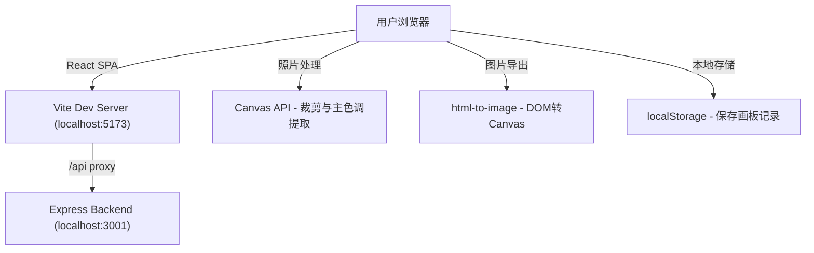

## 1. 架构设计



## 2. 技术选型说明
- **前端框架**：React 18 + TypeScript
- **构建工具**：Vite 5 + @vitejs/plugin-react
- **后端服务**：Express 4（可选，用于API扩展）
- **跨域处理**：cors 中间件
- **照片上传**：react-dropzone
- **图片导出**：html-to-image
- **状态管理**：React useState/useReducer（轻量级场景）
- **存储方案**：localStorage（前端本地持久化）

## 3. 项目文件结构
```
e:\solo\VersionFast\tasks\auto220/
├── package.json
├── index.html
├── vite.config.ts
├── tsconfig.json
├── server/
│   └── index.ts              # Express后端（可选）
└── src/
    ├── App.tsx               # 主组件，路由与全局状态
    ├── main.tsx              # 入口文件
    ├── index.css             # 全局样式与CSS变量
    ├── components/
    │   ├── PhotoUploader.tsx # 照片上传区组件
    │   ├── EditPanel.tsx     # 编辑面板组件
    │   ├── MemoryBoard.tsx   # 记忆画板组件
    │   ├── PreviewModal.tsx  # 全屏预览Modal
    │   ├── LeatherCover.tsx  # 皮革封面组件
    │   └── HistoryList.tsx   # 历史画板列表
    └── utils/
        ├── colorExtractor.ts # 主色调提取工具
        └── canvasExporter.ts # Canvas导出工具
```

## 4. 路由定义
| 路由 | 用途 |
|------|------|
| / | 首页（皮革封面 + 历史画板列表） |
| /edit | 编辑页（照片上传、编辑、画板生成、导出） |

## 5. API定义（后端可选）
```typescript
// 画板数据类型
interface TravelPhoto {
  id: string;
  src: string;              // base64图片数据
  label: string;            // 文字标签 (≤20字)
  date: string;             // YYYY-MM-DD
  thought: string;          // 旅行随想 (≤200字)
  dominantColor: string;    // 主色调 HEX
}

interface MemoryBoard {
  id: string;
  createdAt: string;
  photos: TravelPhoto[];
  titleColor: string;       // 整体配色
  dateRange: string;        // 日期范围
}

// GET /api/boards - 获取所有画板
// Response: MemoryBoard[]

// POST /api/boards - 保存画板
// Request: Omit<MemoryBoard, 'id' | 'createdAt'>
// Response: MemoryBoard

// DELETE /api/boards/:id - 删除画板
```

## 6. 核心数据模型
```typescript
// 全局状态
interface AppState {
  currentView: 'home' | 'edit';
  photos: TravelPhoto[];
  selectedPhotoId: string | null;
  generatedBoard: MemoryBoard | null;
  savedBoards: MemoryBoard[];
  panelTheme: {
    bg: string;
    text: string;
    accent: string;
  };
}
```

## 7. 关键工具函数
### colorExtractor.ts
- `extractDominantColor(imageSrc: string): Promise<string>` - 遍历Canvas像素，计算RGB平均值，返回HEX颜色值
- 性能要求：单张照片处理 < 500ms

### canvasExporter.ts
- `exportAsWallpaper(element: HTMLElement): Promise<void>` - 导出1080x1920手机壁纸PNG
- `exportAsSquare(element: HTMLElement): Promise<void>` - 导出1080x1080正方形分享图PNG
- 使用html-to-image库实现DOM到Canvas的高清转换
