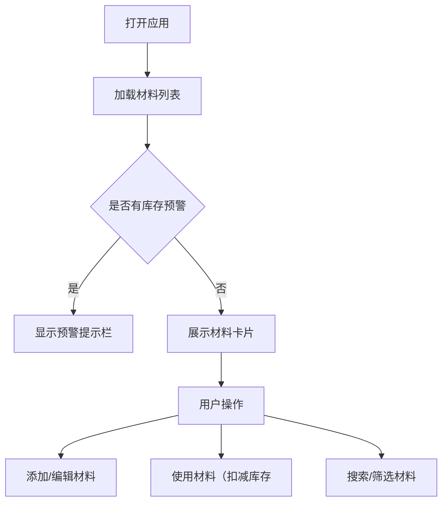

## 1. 产品概述

"匠心材料簿"是一款专为手工艺人设计的材料库存管理Web应用，帮助用户记录和管理个人创作中使用的各类材料（木材、布料、颜料等）的库存信息、采购记录和使用搭配。

- **目标用户**：手工艺爱好者、独立设计师、手工创作者
- **核心价值**：简化材料管理流程，实时掌握库存状态，避免材料短缺或浪费

## 2. 核心功能

### 2.1 用户角色
| 角色 | 注册方式 | 核心权限 |
|------|-----------|----------|
| 普通用户 | 无需注册，本地存储 | 浏览、添加、编辑、删除材料记录，记录使用日志 |

### 2.2 功能模块
1. **材料列表页（主页）**：材料卡片展示、搜索筛选、库存预警提示、搜索框、分类筛选器
2. **材料编辑模态框**：新增/编辑材料信息表单
3. **材料使用对话框**：记录材料消耗、库存扣减

### 2.3 页面详情
| 页面名称 | 模块名称 | 功能描述 |
|---------|---------|---------|
| 主页 | 顶部导航栏 | 应用标题、搜索框（300ms防抖）、类型筛选下拉菜单 |
| 主页 | 材料卡片列表 | 三列网格布局、按最后更新时间降序排列、空状态插画提示 |
| 主页 | 材料卡片 | Emoji图标、材料名称、类型、库存数量、最后采购日期、编辑按钮、使用按钮、库存预警指示灯 |
| 主页 | 库存预警提示栏 | 底部自动淡出提示，列出库存不足材料及缺口数量 |
| 材料表单模态框 | 表单区域 | 材料名称（必填）、类型下拉、库存数量、最低预警库存、采购单价、供应商、备注（支持Markdown） |
| 使用对话框 | 输入区域 | 消耗数量输入框、确认按钮 |

## 3. 核心流程

用户打开应用后即可看到所有材料卡片列表。用户可以：
- 点击"添加材料"按钮打开表单模态框，填写信息后提交
- 点击卡片编辑按钮修改材料信息
- 点击卡片使用按钮记录消耗数量扣减库存
- 通过搜索框和筛选器快速定位材料
- 库存不足时自动收到视觉预警

## 4. 用户界面设计

### 4.1 设计风格
- **主色调**：
  - 背景色：#F5EFE6（米白）
  - 导航栏渐变：#8B7E6B → #6B5F50（灰褐色系）
  - 卡片背景：#FFFFFF
  - 卡片边框：#D6CCC2
  - 卡片阴影：0 2px 8px rgba(0,0,0,0.06)
  - 标题文字：#4A3F35
  - 详情文字：#7A6F5E
  - 预警红色：#FF4444
  - Emoji背景：#E8DDD0
- **按钮样式**：12px圆角，hover时亮度增加10% + scale(1.02)，点击ripple水波纹
- **字体**：采用自然优雅的无衬线字体，标题18px粗体，详情14px
- **布局**：卡片式布局，顶部导航栏
- **图标**：Emoji图标（每材料自选Emoji作为视觉标识

### 4.2 页面设计概览
| 页面名称 | 模块名称 | UI元素 |
|---------|---------|--------|
| 主页 | 顶部导航栏 | 渐变背景、白色文字、搜索框、筛选下拉 |
| 主页 | 材料卡片 | 圆角12px、Emoji圆形图标、预警闪烁指示灯、编辑/使用按钮 |
| 主页 | 预警提示栏 | 底部淡入淡出、5秒自动消失 |
| 表单模态框 | 毛玻璃效果、半透明遮罩、表单控件 |
| 使用对话框 | 简洁输入框、确认按钮 |

### 4.3 响应式设计
- **桌面端（≥768px）：三列卡片网格布局
- **移动端（<768px）：单列全宽卡片，搜索框与筛选器上下堆叠

### 4.4 动画效果
- 库存预警指示灯：#FF4444 8px直径，缓慢闪烁动画（≥30fps）
- 预警提示栏：fade-in/out 5秒后自动消失
- 使用材料："-N"数字动画飞出淡出（0.8秒）
- 按钮hover：亮度+10% + scale(1.02)
- 按钮点击：ripple水波纹效果
