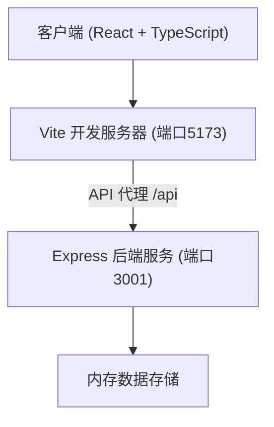
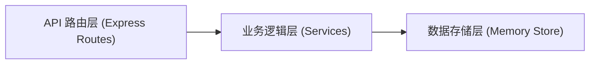
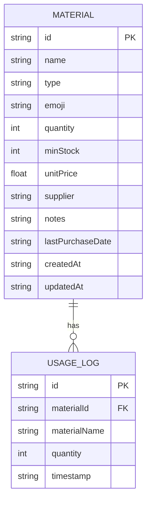

## 1. 架构设计



## 2. 技术说明

- **前端**: React@18 + ReactDOM + TypeScript + Vite
- **构建工具**: Vite@5 + @vitejs/plugin-react
- **后端**: Express@4 + TypeScript + cors
- **数据存储**: 内存存储（开发阶段），数据保存在Express服务内存中
- **启动脚本**: `npm run dev`（同时启动前端Vite和后端Express，使用concurrently）

## 3. 路由定义

| 路由 | 用途 |
|------|------|
| / | 主页（材料列表） |

## 4. API 定义

### 4.1 类型定义
```typescript
type MaterialType = '木材' | '布料' | '颜料' | '其他';

interface Material {
  id: string;
  name: string;
  type: MaterialType;
  emoji: string;
  quantity: number;
  minStock: number;
  unitPrice?: number;
  supplier?: string;
  notes?: string;
  lastPurchaseDate?: string;
  createdAt: string;
  updatedAt: string;
}

interface UsageLog {
  id: string;
  materialId: string;
  materialName: string;
  quantity: number;
  timestamp: string;
}
```

### 4.2 API 端点

| 方法 | 路径 | 描述 | 请求体 | 响应 |
|------|------|------|--------|------|
| GET | /api/materials | 获取所有材料列表 | - | Material[] |
| POST | /api/materials | 创建新材料 | Partial<Material> | Material |
| PUT | /api/materials/:id | 更新材料信息 | Partial<Material> | Material |
| DELETE | /api/materials/:id | 删除材料 | - | { success: boolean } |
| POST | /api/materials/:id/use | 记录材料消耗 | { quantity: number } | Material |
| GET | /api/materials/:id/logs | 获取材料使用日志 | - | UsageLog[] |
| GET | /api/logs | 获取所有使用日志 | - | UsageLog[] |

## 5. 服务端架构图



## 6. 数据模型

### 6.1 数据模型定义



### 6.2 初始化数据
- 服务启动时预置10条示例材料数据，覆盖木材、布料、颜料、其他四种类型
- 预置数据包含各种库存状态（正常、预警、充足）以便展示所有功能

## 7. 前端文件结构

```
src/
├── server/
│   └── index.ts              # Express后端服务，REST API
├── client/
│   ├── App.tsx               # React主组件，状态管理
│   ├── components/
│   │   ├── MaterialCard.tsx  # 材料卡片组件
│   │   └── MaterialForm.tsx  # 材料编辑表单组件
│   ├── types/
│   │   └── index.ts          # TypeScript类型定义
│   └── styles/
│       └── index.css         # 全局样式
├── index.html                # Vite入口HTML
├── vite.config.ts            # Vite配置
├── tsconfig.json             # TypeScript配置
└── package.json              # 项目依赖和脚本
```

## 8. 性能优化策略

- **搜索防抖**: 使用useDebounce hook，300ms延迟过滤
- **虚拟滚动**: 针对1000条数据列表进行优化（可选）
- **CSS动画**: 所有动画使用transform和opacity属性，确保GPU加速，帧率≥30fps
- **数据缓存**: 前端状态管理中缓存材料数据，减少不必要的API请求
