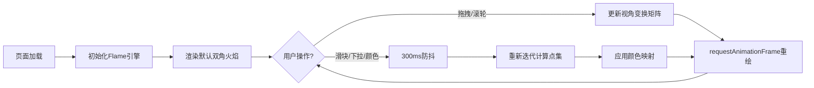

## 1. 产品概述
分形火焰交互式画板是一款面向创意设计师、数学艺术爱好者和计算机图形学学习者的浏览器端工具，通过实时参数调节让用户直观探索分形火焰算法的视觉表现力。
- 核心价值：将复杂的分形数学可视化，提供零门槛的交互式创作体验
- 目标用户：数字艺术创作者、理工科学生、分形几何爱好者

## 2. 核心功能

### 2.1 功能模块
1. **主画布区**：自适应Canvas渲染引擎、分形火焰实时绘制、视角变换（平移/缩放/旋转）
2. **左侧控制面板**：点数量滑块、4个仿射变换函数下拉选择器、颜色选择器组
3. **右侧控制面板**：旋转速度滑块、面板收起/展开控制

### 2.3 页面详情
| 页面名称 | 模块名称 | 功能描述 |
|-----------|-------------|---------------------|
| 主画布 | Canvas渲染层 | 16:9自适应画布、#0D0D0D背景、分形点集渲染、动画循环 |
| 主画布 | 交互层 | 鼠标左键拖拽平移、滚轮以指针为中心缩放、自动旋转动画 |
| 左侧面板 | 参数控制 | 点数滑块(20000-200000)、4个变换函数选择器(线性/正弦/球形/螺旋/心形/碟形) |
| 左侧面板 | 颜色控制 | 起始色/结束色选择器、128级渐变插值、随机鲜艳色按钮 |
| 右侧面板 | 动画控制 | 旋转速度滑块(0-5度/秒,步长0.1)、实时数值显示 |
| 通用 | 面板动画 | 边缘按钮触发挥出/收起、300ms缓动过渡 |
| 页脚 | 操作提示 | "使用鼠标拖拽平移、滚轮缩放" 居中提示文字 |

## 3. 核心流程
用户打开页面 → 系统初始化分形火焰（默认50000点、4个双角形态变换、橙红到金黄渐变、1度/秒旋转）→ 用户拖拽/缩放查看火焰 → 用户调整任一参数（点数/变换/颜色/转速）→ 系统300ms防抖后重新计算并渲染 → 用户持续探索或使用随机颜色按钮获得惊喜效果。

## 4. 用户界面设计
### 4.1 设计风格
- **主色系**：深紫黑背景#1A1A2E，画布纯黑#0D0D0D，控件文字#E0E0E0
- **强调色**：滑块轨道渐变#6C63FF→#FF6584，圆钮白色带投影
- **玻璃拟态**：控制面板采用rgba(255,255,255,0.05)背景+12px高斯模糊+1px半透明白边
- **字体**：系统无衬线字体（system-ui, sans-serif），正文16px，页脚12px
- **动效**：面板滑动使用cubic-bezier(0.4, 0, 0.2, 1) 300ms缓动

### 4.2 页面设计概览
| 页面名称 | 模块名称 | UI元素 |
|-----------|-------------|-------------|
| 主画布 | 画布容器 | 全屏、16:9比例约束、居中、#0D0D0D背景 |
| 左侧面板 | 参数面板 | 固定左对齐、宽度280px、高度100vh、毛玻璃效果、内部12px间距 |
| 右侧面板 | 动画面板 | 固定右对齐、宽度220px、高度100vh、毛玻璃效果、内部12px间距 |
| 控件组 | 滑块组件 | 4px高圆角轨道、渐变填充、16px白色圆钮带box-shadow |
| 控件组 | 下拉/颜色选择器 | 深色背景、与面板风格统一、#E0E0E0文字 |

### 4.3 响应式
采用桌面优先设计，控制面板固定定位，主画布自动填充剩余空间；窗口resize时Canvas重排且保持火焰视口居中。
