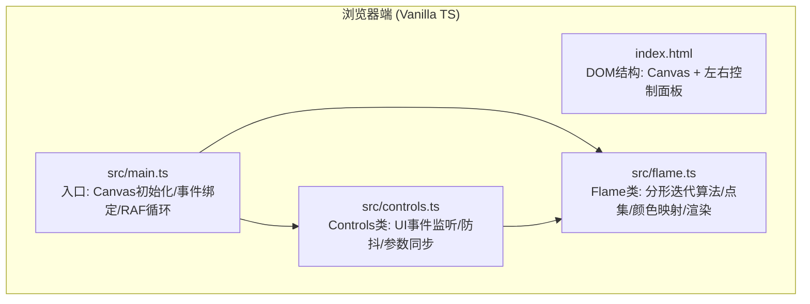

## 1. 架构设计



## 2. 技术描述
- **前端**：TypeScript 5.x + 原生HTML/CSS + Vite 5.x（无React/Vue框架，用户要求原生实现）
- **构建工具**：Vite，开发端口8080
- **渲染**：HTML5 Canvas 2D API，离屏缓冲 + 半透明叠加模拟辉光
- **无后端/无数据库**：纯前端静态应用

## 3. 模块定义

### 3.1 Flame 类 (src/flame.ts)
| 方法/属性 | 签名 | 职责 |
|-----------|------|------|
| `constructor(points, functions, colors)` | `(number, string[], [string, string]) => void` | 初始化参数、预分配点集数组 |
| `setPoints(n)` | `(number) => void` | 更新点数量、重置迭代、保留配色 |
| `setFunctions(fns)` | `(string[]) => void` | 更新4个仿射变换函数类型 |
| `setColors(start, end)` | `(string, string) => void` | 更新渐变两端、重新生成128级色阶 |
| `setRotationSpeed(speed)` | `(number) => void` | 设置每秒旋转角度 |
| `iterate()` | `() => void` | 执行迭代计算（混沌吸引子），生成点集坐标+颜色索引 |
| `render(canvas, ctx, view)` | `(HTMLCanvasElement, CanvasRenderingContext2D, ViewTransform) => void` | 将点集应用视角变换后绘制到Canvas |

### 3.2 Controls 类 (src/controls.ts)
| 方法/属性 | 签名 | 职责 |
|-----------|------|------|
| `constructor(flame, root)` | `(Flame, HTMLElement) => void` | 绑定DOM引用、注册所有事件 |
| `debounceRender()` | `() => void` | 300ms防抖触发重计算+重渲染 |

### 3.3 视角变换 (ViewTransform 接口)
```typescript
interface ViewTransform {
  offsetX: number;    // 水平平移像素
  offsetY: number;    // 垂直平移像素
  scale: number;      // 缩放系数 (0.1 ~ 5)
  rotation: number;   // 当前累计旋转弧度
}
```

## 4. 项目文件结构
```
auto224/
├── .trae/documents/
│   ├── PRD-分形火焰画板.md
│   └── TECH-分形火焰画板.md
├── index.html              # 入口HTML，包含Canvas和左右面板DOM
├── package.json            # vite + typescript 依赖
├── vite.config.js          # Vite 配置 (port 8080)
├── tsconfig.json           # TS 严格模式配置
└── src/
    ├── main.ts             # 应用入口、事件循环
    ├── flame.ts            # 分形火焰核心算法
    └── controls.ts         # 控制面板交互逻辑
```

## 5. 分形火焰算法实现要点
1. **仿射变换预变换**：每个函数先执行基础仿射变换 `[a b; c d][x; y] + [e; f]`，参数随机但固定
2. **非线性变换**：在6种变体（Linear/Sinusoidal/Spherical/Helicoidal/Heart-shaped/Disc-shaped）间按公式映射
3. **混沌迭代**：从原点出发，每步随机挑一个变换函数，迭代100000次热身，记录后续50000个点
4. **颜色映射**：每个点携带颜色索引（0-127），从渐变色阶中查表获得RGB，绘制时用globalAlpha累积密度
5. **性能优化**：Float32Array存储坐标、批量putImageData或单遍arc叠加

## 6. 性能指标验收
| 场景 | 指标 |
|------|------|
| 点数20000初始渲染 | ≤ 2秒 |
| 点数200000初始渲染 | ≤ 6秒 |
| 参数修改后重绘帧率 | ≥ 30fps |
| 拖拽/滚轮交互帧率 | ≥ 60fps（仅变换矩阵变化，无需重计算点集） |
