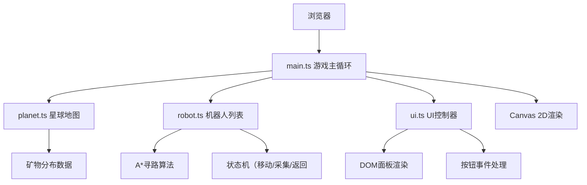

## 1. 架构设计



## 2. 技术选型

- 前端：TypeScript + 原生Canvas + HTML/CSS
- 构建工具：Vite
- 无后端、无数据库，纯前端游戏
- 数据存储：内存状态（游戏会话内）

## 3. 目录结构

```
.
├── package.json
├── index.html
├── vite.config.js
├── tsconfig.json
└── src/
    ├── main.ts      # 游戏主循环
    ├── planet.ts    # 星球地图与矿物
    ├── robot.ts     # 机器人与寻路
    └── ui.ts        # UI面板与交互
```

## 4. 数据模型

### 4.1 类型定义

```typescript
// 矿物类型
type MineralType = 'iron' | 'copper' | 'crystal' | 'darkMatter'

// 矿物配置
interface MineralConfig {
  type: MineralType
  color: string
  value: number  // 每单位积分价值
  rarity: number  // 生成概率权重
}

// 矿脉
interface MineralDeposit {
  x: number
  y: number
  type: MineralType
  amount: number
}

// 瓷砖类型
type TileType = 'grass' | 'dirt' | 'rock'

// 机器人状态
type RobotState = 'moving' | 'mining' | 'returning'

// 机器人
interface Robot {
  id: number
  x: number
  y: number
  targetX: number
  targetY: number
  state: RobotState
  level: number
  capacity: number
  speed: number
  miningProgress: number
  cargo: { type: MineralType, amount: number }
  path: Point[]
  targetDeposit: MineralDeposit | null
}

// 游戏状态
interface GameState {
  credits: number
  inventory: Record<MineralType, number>
  upgrades: {
    speedLevel: number
    capacityLevel: number
  }
}
```

## 5. 核心算法

### 5.1 A*寻路算法

- 网格尺寸：600x600像素地图，按20x20像素划分为30x30网格
- 启发函数：曼哈顿距离
- 可通行区域：所有瓷砖均可通行，矿脉和机器人位置不阻挡

### 5.2 地图生成算法

- 使用伪随机噪声生成地形
- 瓷砖类型：绿色草地、棕色泥土、灰色岩石
- 矿脉随机分布，四种矿物按稀有度权重生成

### 5.3 游戏主循环

- requestAnimationFrame驱动
- 固定时间步长更新逻辑
- 渲染与逻辑分离
