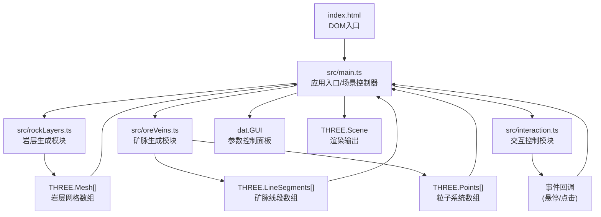

## 1. 架构设计



## 2. 技术栈说明

- **前端框架**: 原生 TypeScript + Three.js
- **构建工具**: Vite 5.x
- **3D引擎**: three@0.160.x + @types/three
- **参数控制**: dat.gui + @types/dat.gui
- **类型系统**: TypeScript 5.x (strict模式)
- **模块格式**: ESNext
- **开发服务器**: Vite Dev Server (端口 8080)

## 3. 模块数据流向

### 3.1 主入口 (src/main.ts)
- **输入**: 用户配置参数对象
- **处理**: 
  1. 初始化 THREE.Scene、PerspectiveCamera、WebGLRenderer
  2. 创建 OrbitControls 控制器
  3. 配置 AmbientLight + DirectionalLight
  4. 调用 rockLayers.generateLayers(params) 获取岩层 Mesh 数组
  5. 调用 oreVeins.generateVeins(rockMeshes, params) 获取矿脉和粒子
  6. 调用 interaction.setup(domElement, scene, camera, callbacks) 注册交互
  7. 配置 dat.GUI 控制面板并绑定参数变更回调
  8. 启动 requestAnimationFrame 渲染循环
- **输出**: 实时渲染的 3D 场景

### 3.2 岩层生成模块 (src/rockLayers.ts)
- **输入**: `LayerParams { width, depth, totalHeight, layerCount, noiseAmplitude, opacity }`
- **处理**:
  1. 定义5层预设岩层颜色配置
  2. 为每层随机生成厚度(20-60单位)
  3. 使用 Perlin-like noise 算法生成层间断层面高度偏移
  4. 创建 PlaneGeometry 并修改顶点 Y 坐标实现起伏
  5. 为每层添加半透明 EdgesGeometry 网格辅助线
  6. 构造 MeshPhongMaterial 支持透明度平滑过渡
- **输出**: `{ meshes: THREE.Mesh[], layerInfo: LayerInfo[] }`

### 3.3 矿脉生成模块 (src/oreVeins.ts)
- **输入**: `VeinParams { rockMeshes, density, minRadius, maxRadius }`
- **处理**:
  1. 根据密度系数计算矿脉数量(20-30条 × density)
  2. 为每条矿脉随机选择矿物类型(金/银/铜)及颜色
  3. 在岩层空间内采样5-10个3D控制点
  4. 使用 CatmullRomCurve3 生成平滑弯曲路径(张力0.5)
  5. 使用 TubeGeometry 或 LineBasicMaterial 生成矿脉线条(直径0.5)
  6. 每条矿脉生成200个沿路径运动的粒子(THREE.Points)
  7. 计算矿脉长度用于储量估算
- **输出**: `{ veins: VeinData[], particles: THREE.Points[] }`

### 3.4 交互模块 (src/interaction.ts)
- **输入**: `InteractionConfig { domElement, scene, camera, targets, callbacks }`
- **处理**:
  1. 监听 mousemove/mousedown/wheel DOM 事件
  2. 使用 THREE.Raycaster 进行射线-物体求交
  3. 悬停矿脉时高亮材质为纯白色
  4. 点击矿脉时触发 onVeinClick 回调传递矿脉信息
  5. OrbitControls 拖拽时触发 onUserInteraction 回调停止自动旋转
- **输出**: 通过回调函数传递交互事件数据

## 4. 文件结构定义

```
project-root/
├── package.json              # 依赖配置与启动脚本
├── vite.config.js            # Vite构建配置(入口index.html, 端口8080)
├── tsconfig.json             # TypeScript严格模式配置
├── index.html                # HTML入口(Three.js容器 + GUI锚点)
└── src/
    ├── main.ts               # 应用入口: 场景初始化/渲染循环/GUI/粒子更新
    ├── rockLayers.ts         # 岩层几何体生成: noise断层面/网格辅助线
    ├── oreVeins.ts           # 矿脉曲线生成: CatmullRom/粒子系统/储量计算
    └── interaction.ts        # 交互控制: 射线检测/悬停高亮/点击弹窗
```

## 5. 数据模型

### 5.1 岩层参数

```typescript
interface LayerConfig {
  name: string;
  color: string;
  thickness: number;
  yStart: number;
  yEnd: number;
}

interface LayerParams {
  width: number;        // 500
  depth: number;        // 500
  totalHeight: number;  // 300
  noiseAmplitude: number; // 0-15
  opacity: number;      // 0.2-1.0
}
```

### 5.2 矿脉数据

```typescript
type MineralType = 'gold' | 'silver' | 'copper';

interface VeinData {
  id: string;
  type: MineralType;
  color: string;        // #FFD700 / #C0C0C0 / #B87333
  curve: THREE.CatmullRomCurve3;
  mesh: THREE.Line | THREE.Mesh;
  length: number;
  branchCount: number;
  depth: number;        // Y坐标(从地表算起)
  estimatedReserve: number; // 储量百分比
  particles: THREE.Points;
  particleOffsets: Float32Array; // 每个粒子沿曲线的偏移量0-1
}
```

### 5.3 GUI配置参数

```typescript
interface GUIParams {
  opacity: number;           // 0.2-1.0
  noiseAmplitude: number;    // 0-15
  veinDensity: number;       // 0.5-2.0
  autoRotateSpeed: number;   // 0-0.02 rad/s
}
```

## 6. 性能优化策略

- **几何体优化**: 岩层使用 PlaneGeometry(50x50分段)，顶点数约51×51×5=13000，远低于10万上限
- **矿脉分段**: CatmullRom曲线分段≤50段，TubeGeometry径向分段≤8
- **粒子总数**: 30条矿脉 × 200粒子 = 6000，严格控制不超上限
- **材质复用**: 同色岩层共享 Material 实例，矿脉按类型共享3个材质
- **动画优化**: 粒子位置使用 BufferGeometry.attributes.position 更新，避免重建几何体
- **射线检测**: 仅对矿脉对象数组进行 Raycaster 检测，排除岩层和粒子
