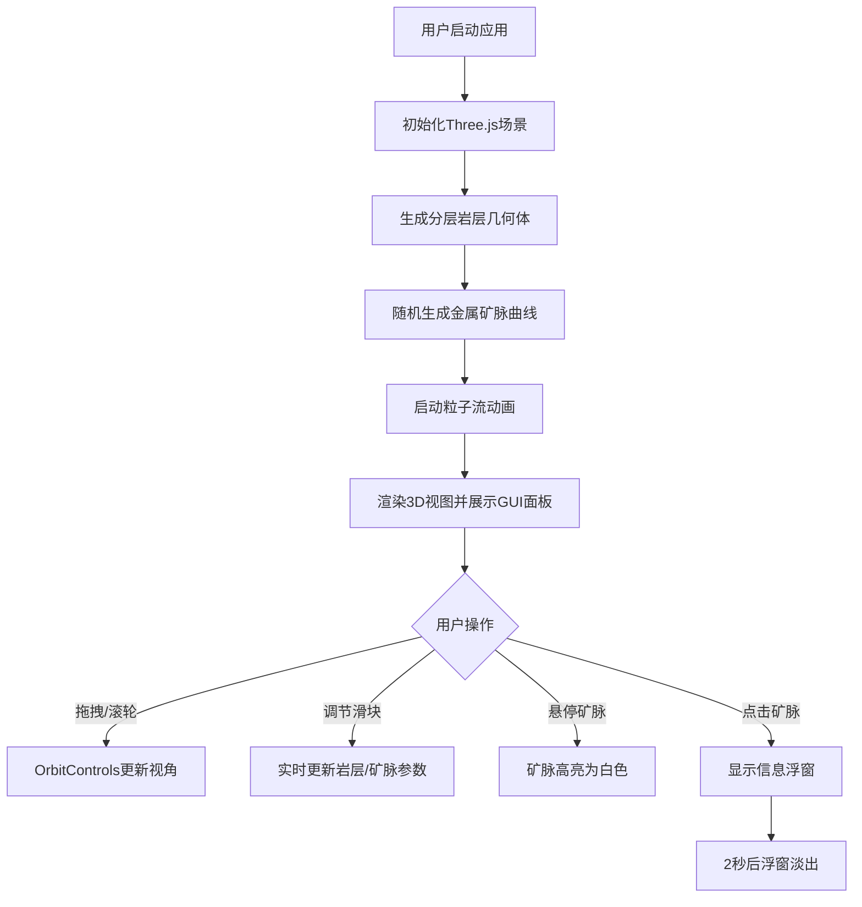

## 1. 产品概述

面向地质学家与勘探教学场景的交互式3D地下岩层与矿脉分布可视化工具，用于展示不同深度岩层的纹理、断裂带与金属矿脉的立体分布关系。通过沉浸式三维交互体验，帮助学习者直观理解地质结构与成矿规律。

## 2. 核心特性

### 2.1 用户角色

| 角色 | 使用场景 | 核心功能 |
|------|----------|----------|
| 地质学家/教师 | 勘探教学、学术演示 | 岩层参数调节、矿脉分布观察、交互讲解 |
| 学生/学习者 | 自主学习、理解地质结构 | 自由旋转视角、缩放观察、点击矿脉获取信息 |

### 2.2 功能模块

1. **3D场景主视图**: 地下岩层立体截面、矿脉分布、粒子流效果
2. **左侧参数控制面板**: 透明度调节、断层强度、矿脉密度、自动旋转速度
3. **矿脉信息弹窗**: 矿物类型、深度、估算储量百分比

### 2.3 页面详情

| 页面名称 | 模块名称 | 功能描述 |
|-----------|-------------|---------------------|
| 主视图页面 | 3D地下岩层场景 | 500x500x300单位立体截面，5层不同颜色纹理岩层，层间noise断层面起伏 |
| 主视图页面 | 金属矿脉系统 | 20-30条金/银/铜矿脉，CatmullRom曲线生成，悬停高亮，点击弹窗 |
| 主视图页面 | 参数控制面板 | dat.GUI滑块控制透明度、断层强度、矿脉密度、自动旋转速度 |
| 主视图页面 | 交互系统 | OrbitControls拖拽旋转、滚轮缩放、射线检测、信息弹窗 |

## 3. 核心流程

用户打开应用 → 系统初始化3D场景（岩层+矿脉+粒子系统）→ 用户拖拽旋转/滚轮缩放观察 → 调节左侧参数实时更新场景 → 鼠标悬停矿脉高亮 → 点击矿脉弹出信息浮窗（2秒后淡出）

## 4. 用户界面设计

### 4.1 设计风格
- **主背景色**: #0D0D1A（深空科技感深色）
- **岩层颜色**: 土壤层#8B6914、砂岩层#C2B280、石灰岩层#E8E0C8、花岗岩层#B0A090、玄武岩层#4A4A4A
- **矿脉颜色**: 金#FFD700、银#C0C0C0、铜#B87333
- **辅助网格线**: #FFFFFF带15%不透明度，线宽0.5px
- **信息浮窗**: 毛玻璃效果，背景#1A1A2E带80%不透明度，白色文字
- **控制面板**: dat.GUI默认主题，半透明黑底#000000带70%不透明度，白色字体

### 4.2 页面设计概览

| 页面名称 | 模块名称 | UI元素 |
|-----------|-------------|-------------|
| 主视图页面 | 3D场景 | 全屏Three.js渲染器，深色背景，岩层半透明网格辅助线 |
| 主视图页面 | 参数面板 | 左侧悬浮dat.GUI面板，4组滑块控件 |
| 主视图页面 | 信息浮窗 | 鼠标位置附近弹出，毛玻璃卡片样式，显示矿物信息 |

### 4.3 响应式
- 桌面端优先，全屏3D渲染
- 自适应窗口大小，Three.js渲染器跟随窗口resize

### 4.4 3D场景指导
- **环境**: 纯深色背景#0D0D1A，无HDRI，使用DirectionalLight+AmbientLight组合
- **光照**: 环境光(0.4强度)+方向光(0.8强度，从右上方照射)
- **相机**: PerspectiveCamera，初始位置(600, 400, 600)，看向场景中心
- **相机运动**: OrbitControls，自动旋转可开关，拖拽旋转时自动停止自转
- **构图**: 地下岩层立体截面位于场景中心，矿脉贯穿其中，粒子沿矿脉流动
- **交互动画**: 岩层透明度切换0.5秒平滑过渡，信息浮窗2秒自动淡出
- **性能预算**: 粒子≤6000，岩层顶点≤10万，矿脉分段≤50
