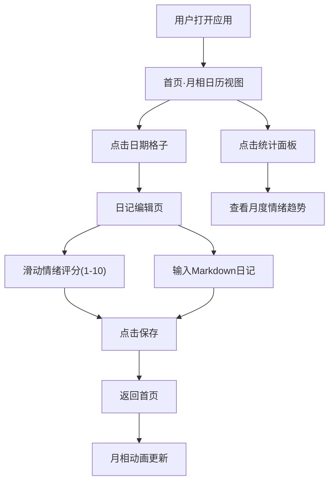

## 1. 产品概述

"月相日记"是一款融合情绪记录与月相美学的个人日记应用，让用户通过月相可视化直观感受一个月内的情绪潮汐变化。

- 核心目标：提供极简、富有诗意的情绪记录体验，用月相作为视觉隐喻连接用户内心世界与自然节律
- 目标用户：注重心理健康、喜欢极简美学、有日记习惯的年轻用户群体
- 产品价值：将抽象的情绪数据转化为优美的月相变化，降低情绪记录的心理门槛

## 2. 核心功能

### 2.1 功能模块

1. **首页·月相日历**：按月展示月相网格，每格显示对应日期的情绪月相，支持日期点击进入编辑
2. **日记编辑页**：情绪滑条评分（1-10）、真实月相信息展示、Markdown日记编辑器
3. **统计分析面板**：月度情绪趋势图、平均分、最高/最低分日期、情绪波动标准差

### 2.2 页面详情

| 页面名称 | 模块名称 | 功能描述 |
|-----------|-------------|---------------------|
| 首页·月相日历 | 月相网格 | 每行7天展示当月月相，情绪映射为亮度和颜色，点击进入编辑 |
| 首页·月相日历 | 主题切换 | 顶部导航切换白天/暗夜主题，带0.5s渐变动画 |
| 首页·月相日历 | 统计面板 | 右上角Tooltip气泡展示月度情绪统计和趋势面积图 |
| 首页·月相日历 | 骨架屏 | 加载时显示脉冲动画占位卡片 |
| 日记编辑页 | 月相信息 | 顶部显示日期和真实月相（农历+月相类型） |
| 日记编辑页 | 情绪滑条 | 1-10分评分，颜色从灰蓝到橙红到亮金渐变，触感反馈 |
| 日记编辑页 | Markdown编辑器 | 支持加粗、斜体、列表快捷按钮的文本编辑器 |
| 日记编辑页 | 保存/删除 | 保存返回首页更新月相，支持删除日记 |

## 3. 核心流程

用户打开应用 → 进入首页查看当月月相日历 → 点击某日期格子 → 进入日记编辑页 → 滑动情绪评分+输入日记 → 保存返回首页 → 月相动画更新 → 可查看右上角统计面板

## 4. 用户界面设计

### 4.1 设计风格

- **主色调**：靛蓝渐变系列（#6366F1 → #8B5CF6），强调色暖金（#FCD34D）
- **白天主题**：背景暖米色#FEF3C7，文字深灰#1E293B，卡片半透明白色毛玻璃
- **暗夜主题**：背景深空蓝#0F172A，文字浅灰#E2E8F0，卡片半透明深灰毛玻璃，月相带光晕动画
- **按钮风格**：圆角药丸形，hover时scale(1.02)+阴影增强，0.3s过渡
- **字体**：系统字体栈 -apple-system, BlinkMacSystemFont, 'Segoe UI'
- **布局**：自适应flex/grid，桌面端月相日历7列，移动端3列紧凑布局
- **图标风格**：极简线性图标，月相使用自定义SVG

### 4.2 页面设计概述

| 页面名称 | 模块名称 | UI元素 |
|-----------|-------------|-------------|
| 首页·月相日历 | 月相网格 | 7列grid布局，每个格子含月相SVG+日期，hover放大，transition 0.8s |
| 首页·月相日历 | 顶部导航 | 左侧Logo，中间月份切换，右侧主题切换按钮+统计入口 |
| 首页·月相日历 | 统计面板 | Tooltip气泡卡片，渐变面积图(SVG纯CSS实现)，悬停显示tooltip |
| 日记编辑页 | 月相信息栏 | 日期大号显示，农历+月相类型副标题，大月相展示 |
| 日记编辑页 | 情绪滑条 | 自定义range滑块，track渐变色，thumb带触感反馈动画 |
| 日记编辑页 | 编辑器 | textarea + 快捷工具栏（粗体/斜体/列表），底部保存删除按钮 |
| 通用 | 骨架屏 | 三个脉冲动画占位卡片，背景渐变灰 |

### 4.3 响应式设计

- 桌面端（≥1024px）：月相日历7列，编辑页横向布局
- 平板端（640-1023px）：月相日历7列，编辑页纵向布局
- 手机端（<640px）：月相日历3列紧凑，滑条和编辑器纵向排列，字体适当缩小

### 4.4 动效设计

- 月相过渡：CSS transition 0.8s ease-in-out 亮度和颜色变化
- 主题切换：所有元素0.5s渐变动画
- 交互反馈：hover/active时transform: scale(1.02) + box-shadow增强
- 暗夜光晕：月相周围box-shadow + animation pulse 2s infinite
- 加载骨架：脉冲动画背景渐变
