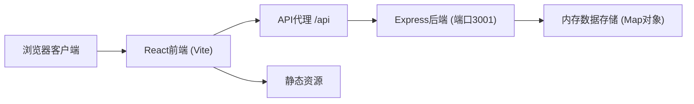
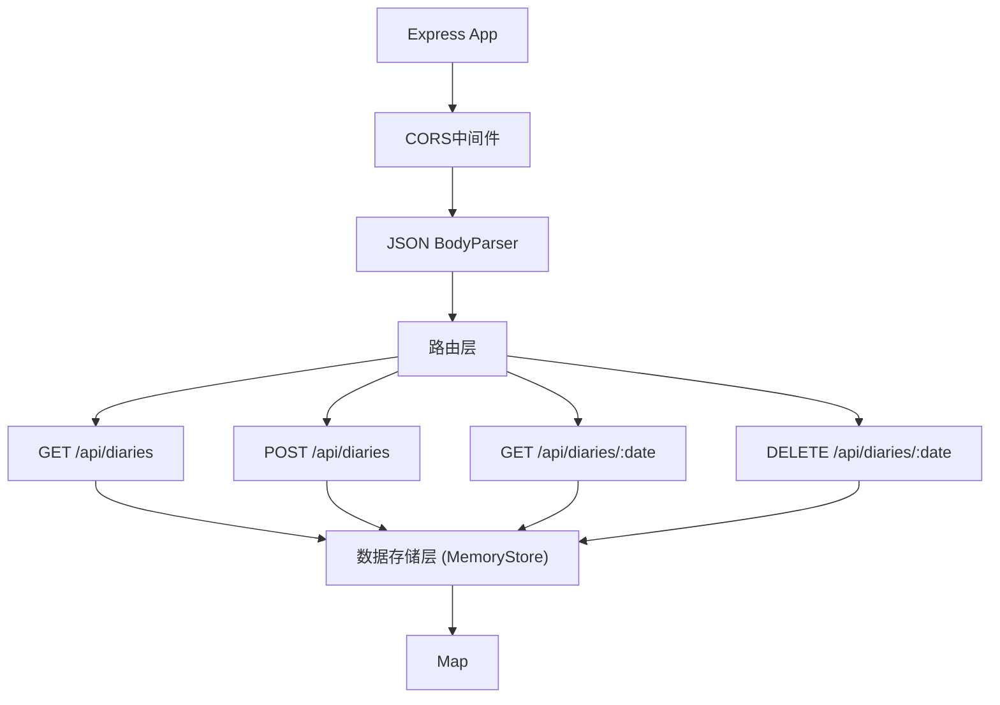

## 1. 架构设计



## 2. 技术描述

- **前端框架**：React@18 + TypeScript
- **构建工具**：Vite@5 + @vitejs/plugin-react
- **UI组件库**：@mui/material（仅核心组件） + @emotion/react + @emotion/styled
- **日期处理**：date-fns
- **后端框架**：Express@4 + cors
- **数据存储**：内存对象存储（Map），初始化示例数据
- **开发服务器**：Vite开发端口5173，Express API端口3001，通过Vite代理转发/api请求

## 3. 项目文件结构

```
├── package.json                 # 根依赖和脚本
├── vite.config.ts               # Vite构建配置+代理
├── tsconfig.json                # 前端TypeScript配置
├── index.html                   # HTML入口
├── server/
│   ├── tsconfig.json            # 后端TypeScript配置
│   └── index.ts                 # Express服务器+API
├── src/
│   ├── main.tsx                 # React入口
│   ├── App.tsx                  # 主应用+路由+主题
│   ├── components/
│   │   └── MoonPhase.tsx        # 月相SVG组件
│   ├── utils/
│   │   └── emotionMapper.ts     # 情绪映射工具
│   ├── pages/
│   │   ├── HomePage.tsx         # 首页月相日历
│   │   ├── DiaryEditPage.tsx    # 日记编辑页
│   │   └── StatsPanel.tsx       # 统计面板
│   └── hooks/
│       └── useTheme.ts          # 主题切换Hook
└── shared/
    └── types.ts                 # 前后端共享类型
```

## 4. 路由定义

| 路由 | 页面 | 功能 |
|-------|---------|---------|
| / | HomePage | 首页月相日历视图 |
| /diary/:date | DiaryEditPage | 指定日期的日记编辑页 |
| /stats | StatsPanel | 统计分析页面 |

## 5. API定义

### 5.1 类型定义

```typescript
interface Diary {
  date: string;          // YYYY-MM-DD 格式
  emotionScore: number;  // 1-10
  content: string;       // Markdown文本
  summary?: string;      // 摘要（前50字符）
  createdAt?: number;
  updatedAt?: number;
}

interface DiarySummary {
  date: string;
  emotionScore: number;
  summary: string;
}

interface MonthlyStats {
  month: string;
  averageScore: number;
  maxScore: { date: string; score: number };
  minScore: { date: string; score: number };
  stdDeviation: number;
  dailyScores: { date: string; score: number }[];
}
```

### 5.2 API端点

| 方法 | 路径 | 描述 | 请求/响应 |
|------|------|------|-----------|
| GET | /api/diaries?month=YYYY-MM | 获取该月所有日记摘要 | Response: DiarySummary[] |
| POST | /api/diaries | 创建/更新日记 | Body: { date, emotionScore, content }, Response: Diary |
| GET | /api/diaries/:date | 获取单日日记详情 | Response: Diary \| null |
| DELETE | /api/diaries/:date | 删除某日日记 | Response: { success: boolean } |

## 6. 服务器架构



## 7. 数据模型

### 7.1 内存存储结构

```typescript
class MemoryStore {
  private diaries: Map<string, Diary>;
  
  constructor() {
    this.diaries = new Map();
    this.initializeSampleData();
  }
  
  getByMonth(month: string): DiarySummary[];
  getByDate(date: string): Diary | undefined;
  upsert(diary: Diary): Diary;
  delete(date: string): boolean;
  private initializeSampleData(): void;
}
```

### 7.2 初始化示例数据

服务启动时自动生成当月10-15条随机情绪数据作为示例，便于展示效果。

## 8. 核心算法

### 8.1 情绪→月相映射算法

```typescript
// emotionMapper.ts
export interface MoonVisual {
  phase: number;        // 0(新月) - 1(满月)
  brightness: number;   // 0.2(阴沉) - 1.0(明亮)
  color: { start: string; end: string };
  glowIntensity: number;
}

export function emotionToMoon(score: number): MoonVisual;
```

- score 1-3 → 亮度0.2-0.4，灰蓝色调，新月/蛾眉月
- score 4-6 → 亮度0.5-0.7，橙红暖调，上弦月/盈凸月
- score 7-10 → 亮度0.8-1.0，金黄色调，满月

### 8.2 标准差计算（Welford算法）

```typescript
// 使用Welford在线算法避免两次遍历和大数精度问题
function calculateStdDeviation(values: number[]): number;
```

## 9. 性能优化

1. **虚拟滚动**：月相日历使用CSS contain + 条件渲染，仅渲染可见30天内元素
2. **CSS过渡**：月相变化使用硬件加速CSS transition（transform + opacity）
3. **防抖计算**：统计面板标准差计算使用requestIdleCallback
4. **代理优化**：Vite开发服务器代理/api请求避免CORS
