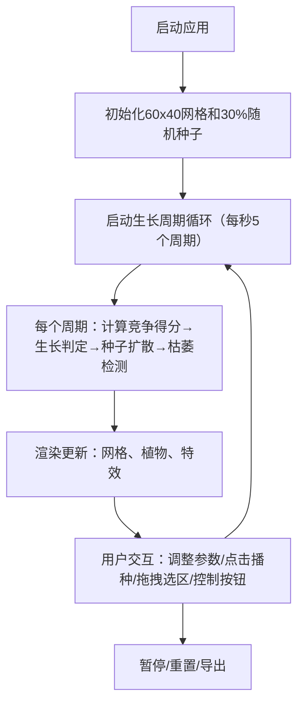

## 1. 产品概述
植物生态系统模拟沙盒 - 一个交互式浏览器应用，让用户直观观察不同环境参数（光照、水分、竞争强度）对植物群落动态变化的影响。
- 目标用户：生态学者、学生、对生态系统感兴趣的教育用户
- 产品价值：通过可视化模拟帮助理解植物群落演替、物种竞争、环境因素的交互作用

## 2. 核心功能

### 2.1 功能模块
1. **主画布区域**：60x40生态位网格，植物生长模拟与实时渲染
2. **控制面板**：光照系数、水分系数、竞争强度三个参数滑块
3. **统计面板**：植物总数、分类数量、Shannon生物多样性指数、模拟时长
4. **控制栏**：播放/暂停、重置、导出截图功能
5. **用户交互**：单格播种、区域选择批量播种/清除、点击波纹特效

### 2.3 页面详情
| 页面名称 | 模块名称 | 功能描述 |
|-----------|-------------|---------------------|
| 主页面 | 主画布 | 60x40方格网格（每格20px），植物种子/生长/成熟/枯萎全生命周期渲染 |
| 主页面 | 控制面板 | 三个滑块实时调整环境参数，带数值显示和渐变轨道反馈 |
| 主页面 | 统计面板 | 右下角实时统计数据，每5周期更新带渐变动画 |
| 主页面 | 控制栏 | 底部播放/暂停、重置、导出功能按钮 |
| 主页面 | 交互层 | 鼠标点击播种（波纹动画）、拖拽选区（蓝色半透明矩形） |

## 3. 核心流程
用户打开应用后，系统自动初始化30%随机种子分布并启动模拟。用户可通过左侧滑块调整环境参数观察生态变化，点击或拖拽进行人工干预，通过底部按钮控制模拟状态或导出结果。

## 4. 用户界面设计

### 4.1 设计风格
- 主色调：深色森林色系，背景#1A2E1A
- 强调色：绿色调#2D4A33和#A8E6A3
- 植物色：草#8BC34A、灌木#4CAF50、乔木#2E7D32
- 特殊效果：枯萎闪烁红色#FF4444，选区蓝色#4A90D980
- 按钮风格：圆角、悬停放大1.05倍+阴影加深、按下反馈2px

### 4.2 页面设计概述
| 页面名称 | 模块名称 | UI元素 |
|-----------|-------------|-------------|
| 主页面 | 主画布 | 自适应Canvas，背景#3A5F40，网格线#2D4A33半透明1px |
| 主页面 | 控制面板 | 宽220px，背景#1C2D1C半透明圆角8px，滑块渐变蓝→绿→黄 |
| 主页面 | 统计面板 | 背景#1A1A2E圆角10px半透明，数值0.3秒过渡动画 |
| 主页面 | 控制栏 | 高60px，背景#0F1A0F，播放/暂停/重置/导出按钮 |

### 4.3 响应式
- 桌面端：左侧控制面板（220px）+ 主画布 + 右下角统计面板 + 底部控制栏
- 移动端（<768px）：顶部横向控制面板（高80px，宽100%）+ 主画布 + 右下角缩小统计面板（80%字体）
- 画布始终自适应剩余空间，最小800x600px

## 5. 性能要求
- 模拟每秒至少5个生长周期更新
- 未暂停状态FPS稳定30fps以上
- requestAnimationFrame渲染循环
- 植物更新逻辑每帧不阻塞主线程超过16ms
- 使用离屏Canvas缓存静态网格线
